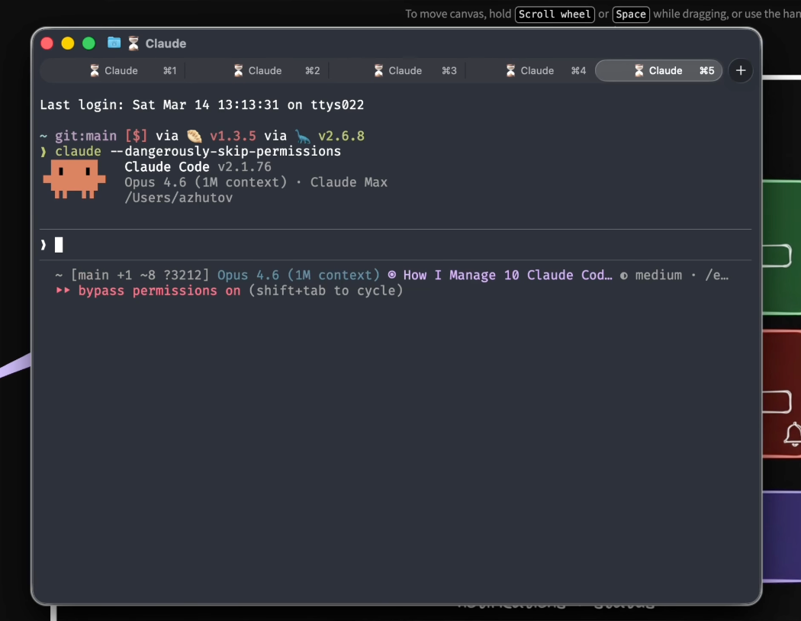
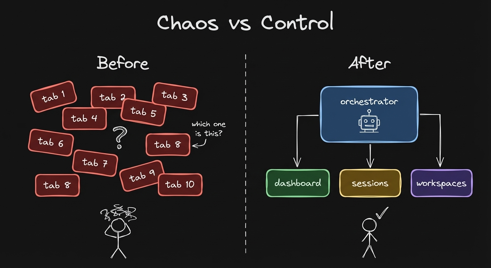
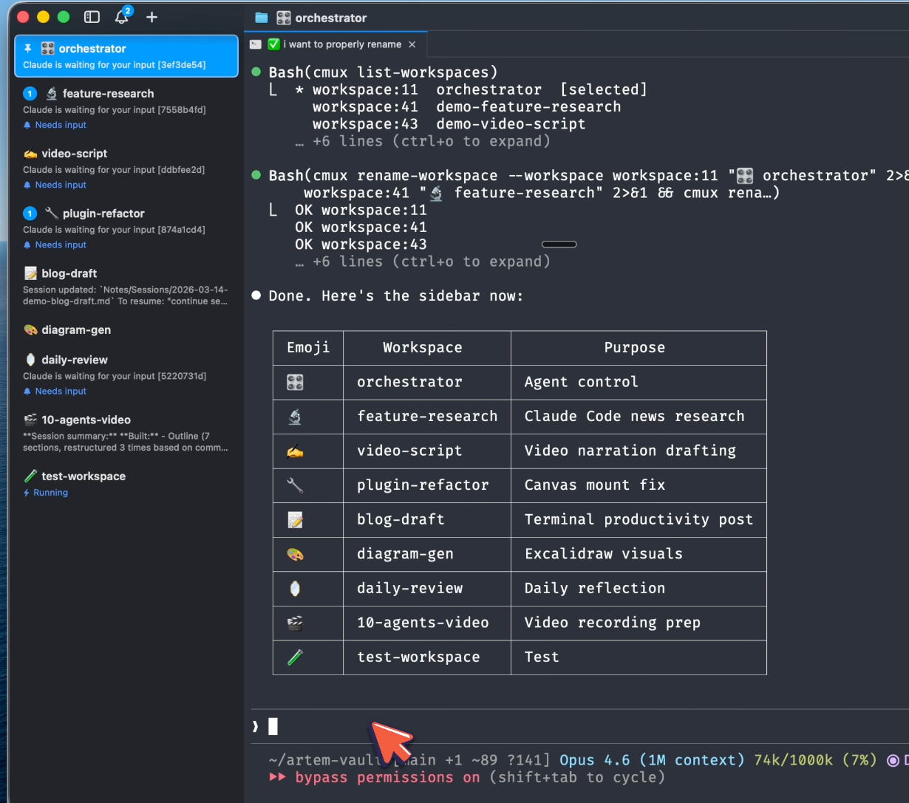
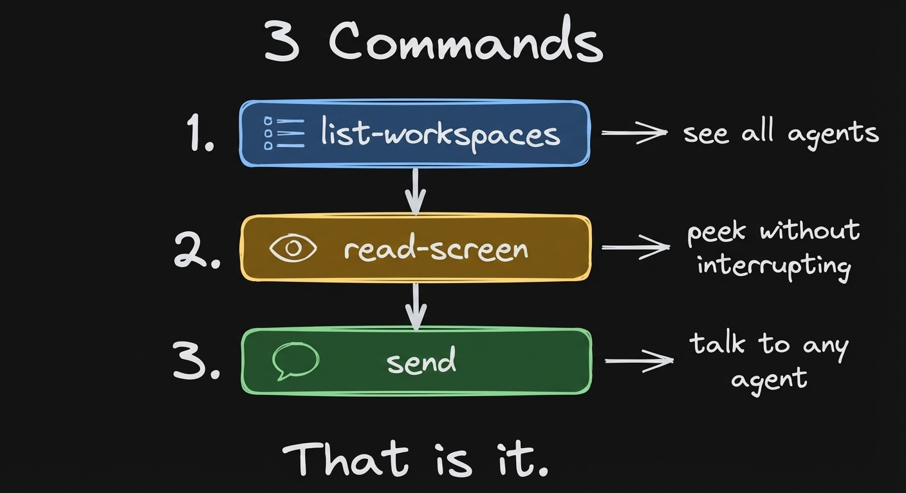
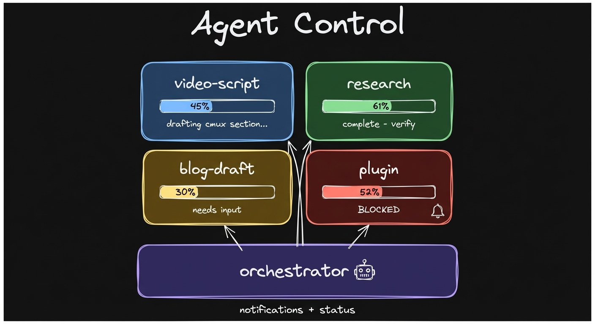
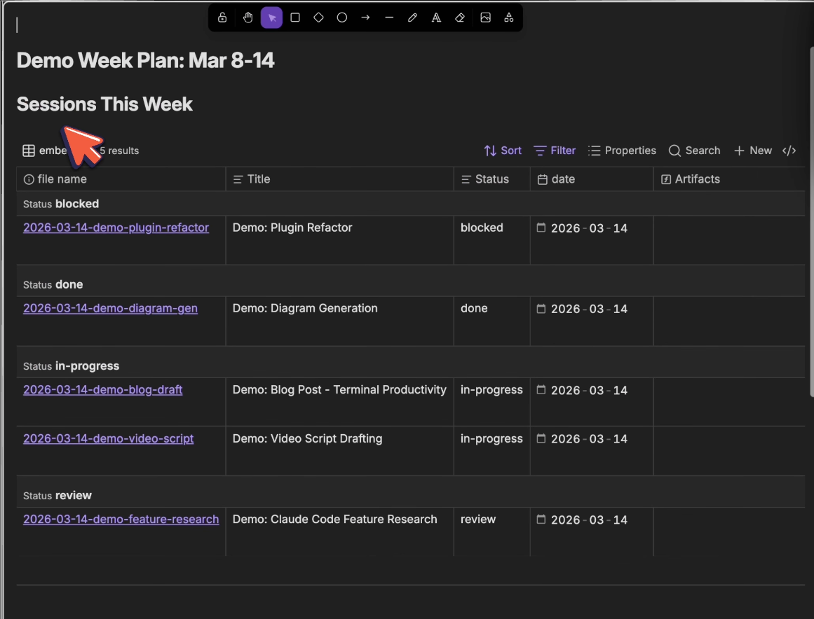
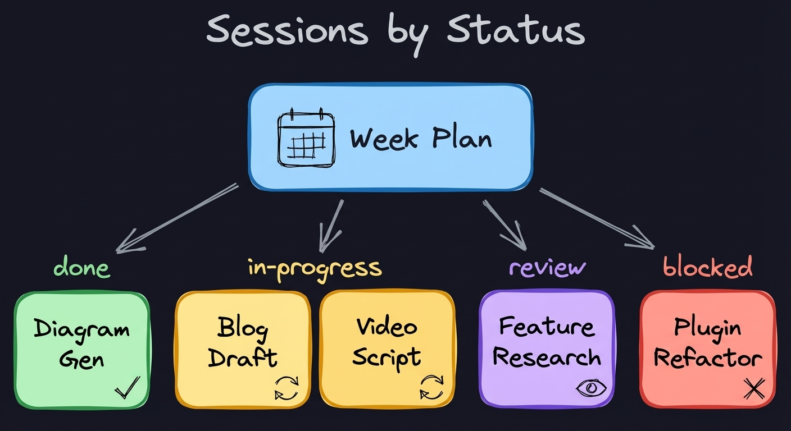
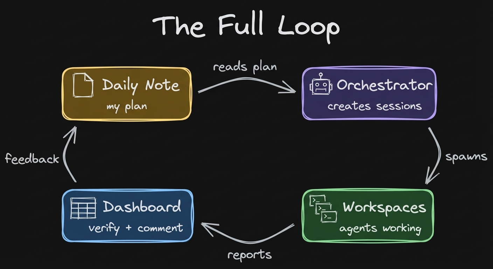
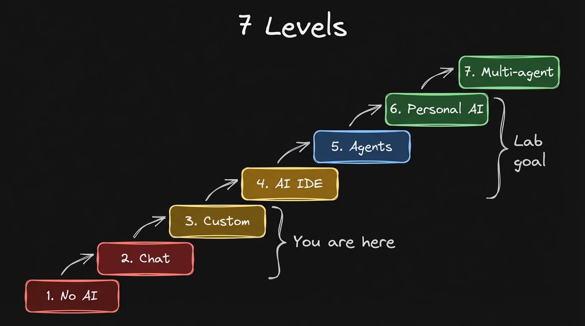

**cmux workspaces, an orchestrator, and an Obsidian dashboard that builds itself**

---

I run multiple Claude Code agents every day.
Doing research, drafts, video scripting, all at the same time, and I don't lose track of any of them.

But it wasn't always this way.

I opened Claude Code and started working.
Then I needed another agent to do another task.
I opened a new tab.
Then another, and another.
Quickly I had 10 tabs.


*Claude, M1, M2, M3, M4, M5. Which one was doing what?*

I didn't know what was happening on this tab, switching between all of them just kills my flow.
Sessions go stale and the context gets lost.

I had this exact problem.


*Tabs vs named workspaces*

## cmux: Isolated Workspaces, Not Tabs

The tool that changed this for me is cmux - a terminal workspace manager.


*Named workspaces with emojis. Orchestrator, feature-research, video-script, daily-review - each one isolated.*

It's not a new tab.
It's an isolated workspace.

Each workspace has a terminal, the ability to spawn other terminals inside of it, and hot keys to jump between them.

But the real power - cmux is programmable.
Claude Code can programmatically access the contents of any workspace.

```bash
cmux list-workspaces
```

The orchestrator sees all workspace names, not "tab 4."

It reads the screen of any workspace:

```bash
cmux read-screen --workspace workspace:1
```

No interrupting the agent.
Just seeing what it's doing.

And it can talk to any workspace:

```bash
cmux send --workspace workspace:1 "what was our progress today"
```

The agent in that workspace starts working on the task.
The orchestrator sleeps for 15 seconds, waits for the response, reads the screen.
You see the response from that agent.

This way Claude enables communication between agents across different workspaces.


*Three commands: list, read, send. That's it.*

## The Orchestrator: One Agent Manages the Rest


*Agent Control - what are my agents doing right now*

One Claude Code agent becomes the orchestrator - it spawns and controls the others.

I have one main orchestrator workspace.
Then I have a cmux skill that shows how to use cmux programmatically.

Say I just want to spawn a workspace to review my daily progress.
It creates a workspace named "daily review" with this prompt: read today's daily note, give me a summary of what's inside.

Now a Claude Code agent starts working on that task.
You see the pattern - you can have isolated workspaces for each of your tasks.

I talk to one agent.
That agent manages the rest.

## The Dashboard: How Not to Go Crazy


*Real Obsidian Bases dashboard - sessions grouped by status: blocked, done, in-progress, review*

But now the problem is - how do you keep track of all these sessions?

You use Obsidian and Obsidian Bases.

Every workspace has a session file in Obsidian.
The dashboard generates itself.

Each session has a `related` field that links to its dashboard.
The Obsidian Base queries all linked sessions automatically - status, date, title, related workspace.

You create a session, link it to the dashboard, it shows up.
No manual tracking.

When you spawn a workspace, the agent creates its own session file and links it to the dashboard.
The Base does the rest.

Nothing is "done" until you verify it.
You read the dashboard, check the output, add comments.
The orchestrator picks up your comments and relays them to the right agent.

Each session has a goal.
You have a progress field.
You have the outcome.
Here's also the definition of done.


*Sessions grouped by status - the dashboard queries them automatically*

## The Full Loop


*Daily note -> sessions -> spawn workspaces -> verify output -> comment -> orchestrator relays*

Here's how it all connects.

You have a daily note which you use to plan your day.
The orchestrator reads this plan and understands your intent for today.
Then you create sessions from there.
The orchestrator spawns workspaces for you to do the work.

You look at the progress.
You provide comments to the agent.
When the agent reads the file, it sees your comment.

You can verify what's happening.
You can comment on the work.
That's the whole workflow.

## Where Are You on the AI Ladder?



Most people using AI are somewhere on this spectrum:

- Level 1: You don't use AI
- Level 2: You use AI via chat (ChatGPT, Claude, Gemini)
- Level 3: You customized it with your context (Claude Projects, custom GPTs)
- Level 4: You work through an AI IDE (Cursor, Windsurf)
- Level 5: You solve work tasks using agents in the terminal (Claude Code, Codex)
- Level 6: You launched a personal AI agent
- Level 7: You're building multi-agent infrastructure (orchestration, cmux)

What you just read is Level 7.
Most people are at 2-4.

In the **Claude Code x Obsidian Lab** (starts March 17) we take you from wherever you are to Level 5-6.
Some of you will touch 7.

How to structure your vault so agents can read it.
How to spawn and orchestrate workspaces.
How to use Obsidian Bases to track your work without manual updates.
You build it with me over six weeks. [lab.artemzhutov.com](https://lab.artemzhutov.com)

## From Tabs to Workspaces

Before, I had this ghostly terminal with cursor chaos.
This concept of tabs was not really working.
I was feeling overwhelmed since summer.

And now we have cmux, which is much, much better.
It has these workspaces.
I added this concept of sessions and dashboards to it.
More scalable and more controllable, integrated with Obsidian.

## Let's Discuss

What would you do with 10 focused agents running from one terminal?

Join our Discord community: https://discord.gg/g5Z4Wk2fDk

## Resources

**Get the cmux skill + orchestrator setup:**
https://cmux-artemzhutov.netlify.app

**Watch the full demo:**
https://youtu.be/_gBw4j-UKBg

**Claude Code x Obsidian Lab** - starts March 17. Build your own agent systems from scratch, with live feedback.
https://lab.artemzhutov.com

---

Artem
