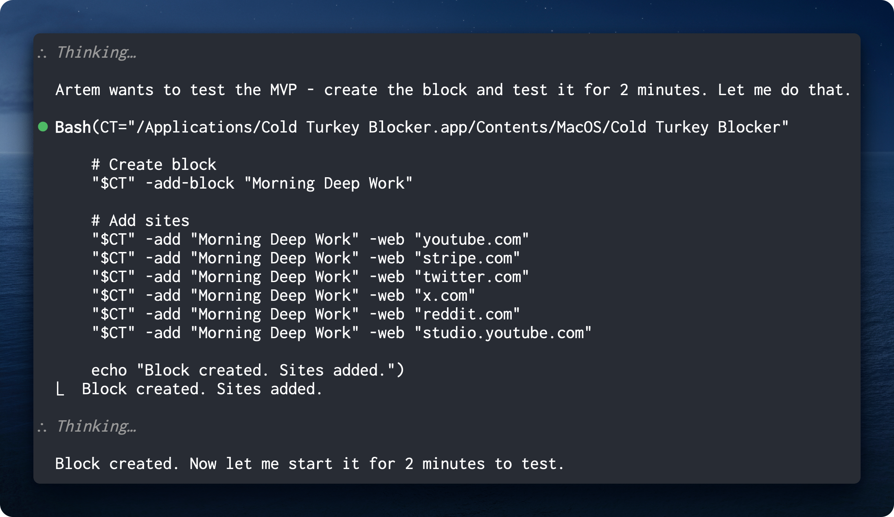
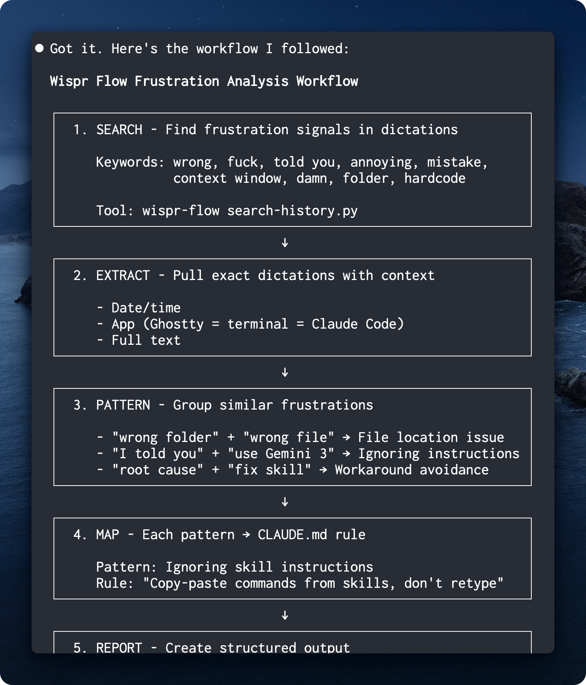
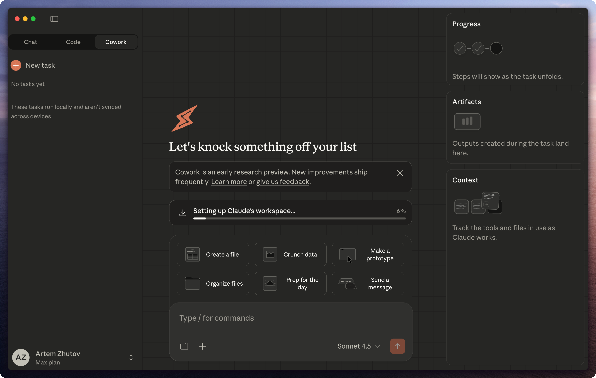
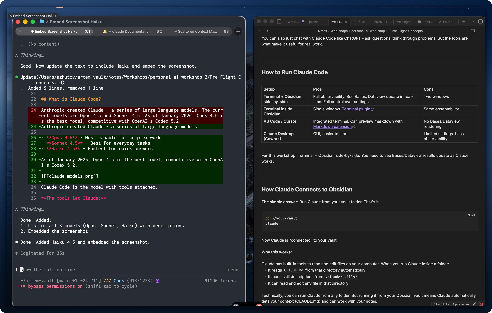
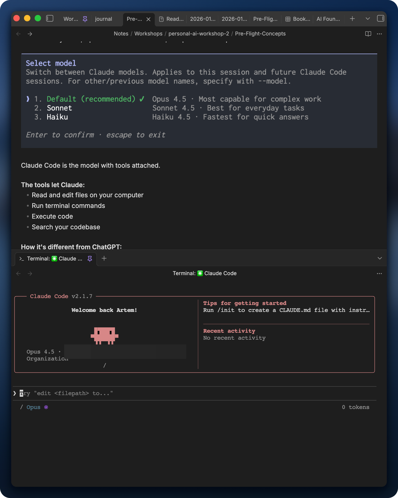
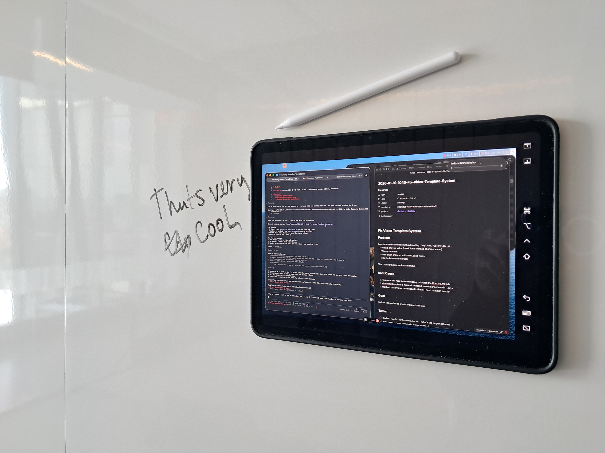
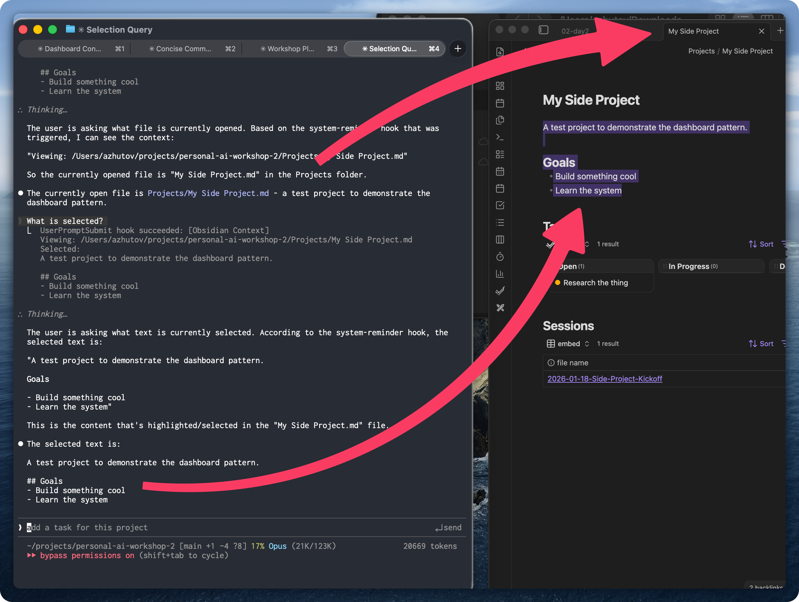

## Managing Attention with Claude

This topic really matters right now because there's too much stuff going on. Your attention is the most important currency. Everything is trying to distract you from your goals.

I didn't know how to solve this problem. For me it was a big issue: when I started my morning I would go to all these websites (Twitter, YouTube, LinkedIn), spend two hours there and feel wasted. Then I'd regret it.

To solve this I use [Cold Turkey Blocker](https://getcoldturkey.com/) that blocks websites and applications on my Mac. I taught Claude how to block all the websites like Gmail. I can just run `focus start 120` and for the next two hours my websites and apps are blocked.

It's been tremendous value and Claude can easily add websites to the block list.

## How to Pair with Your Agent

There was a blog post last week from Amp. They're building an agent harness similar to Claude Code where you can work with different models. I really loved their post and it changed the way I interact with Claude Code.

Here's an example from their post on how to give a task to your agent:

**Vague prompt:**
> Add dark mode to the settings page

**Specified prompt:**
> Add dark mode to the settings page.
> We store user preferences in localStorage under `user-prefs`.
> Match the toggle style we use in the notifications panel.
> Use Chrome devtools to check dark mode is implemented correctly, toggle it back to light mode and check that it works correctly too.
> Run the e2e tests when you're done.

Same task, different outcome. The difference is the context your agent knows.

The core principle: give the definition of done and engineer feedback loops. The prompt should be such that the agent understands when the task is done and can verify the result on its own. This saves you attention so you don't have to manage it on every step, telling it "do this now" or "do that".

This applies to Obsidian too. Instead of "update the front matter" (vague, no feedback loop), you could say "update front matter and verify accuracy using a Python script that everything has been updated and properly integrated."

[Read the full Amp guide](https://ampcode.com/how-to-pair-with-an-agent)

## Why You Should Swear More at Your Agent

I came to realize that swearing at your agent is a great way to tag a session where something went off track. It shows friction points where the system is not working as intended. This is a very valuable signal you can use to better design your system or interaction with the agent.

For me, when I say curse words to an agent, it means something is not great. During weekly review sessions I analyze my conversations using the Wispr Flow skill. It suggests improvements to your CLAUDE.md such that this won't happen next time.

That's a great way to tag conversations. I think Anthropic does it too: they flag conversations where you say curse words as high signal feedback to improve their system. So why shouldn't we use it for ourselves?

[Check out the Wispr Flow skill](https://github.com/ArtemXTech/personal-os-skills/tree/main/skills/wispr-flow)

## Cowork

This week Anthropic released Cowork - Claude's agentic capabilities in Claude Desktop, no terminal needed. A great move to make Claude Code accessible for users who are afraid of the terminal.

I tried it. Rough experience for me - I opened it in my Obsidian vault and it didn't recognize my skills. There was definitely a bug. Personally, I wouldn't switch. I don't see a reason to go from terminal where I have complete control to Cowork.

Cowork can render artifacts like in the web version, which might be cool. But all my artifacts are in Obsidian. I can ask Claude to open them, so I don't really have that need.

Still, it's a great experiment and I think this is the trend. Right now OpenAI is challenged to show something similar. Boris, the creator of Claude Code, said on Twitter that Cowork was fully created by Claude Code in just 2 weeks. OpenAI could build a similar app, but their models aren't as good at agentic tasks.

## Connecting Claude to Obsidian

With Cowork there are now multiple ways to connect Claude to Obsidian:

| Setup | Pros | Cons |
|-------|------|------|
| **Terminal + Obsidian side-by-side** | Full observability. See Bases, Dataview update in real-time. Full control over settings. | Two windows |
| **Terminal inside Obsidian** | Single window. [Terminal plugin](https://github.com/polyipseity/obsidian-terminal) | Same observability |
| **VS Code / Cursor** | Integrated terminal. Can preview markdown. | No Bases/Dataview rendering |
| **Claude Desktop (Cowork)** | GUI, easier to start | Limited settings. Less observability. |

For working with Obsidian, I recommend terminal + Obsidian side-by-side. You need to see Bases/Dataview results update as Claude works.

| Side-by-side | Terminal plugin |
|--------------|-----------------|
|  |  |

## MCP Tool Search

There was a new update to Claude Code this week. It addresses the issue with having many MCP server configurations where tool definitions consume a significant portion of the context window. They added MCP tool search that dynamically loads tools on demand instead of defining all of them beforehand.

It's configurable and activates automatically when MCP tool descriptions consume too much of your context window.

[Read the MCP docs](https://code.claude.com/docs/en/mcp#scale-with-mcp-tool-search)

This is useful for people who want to connect Claude Code to many external tools like Notion, Linear, GitHub. Personally, I tried many MCP tools but never used any of them for real. Nowadays I just use command line tools and write skills around them.

Also, they killed ultrathink. Claude now thinks with max budget by default. The habit will stick for a while.

## Walking Dictation Setup

I had this new idea about how to interact with Claude Code. I have my MacBook, an iPad, and I sometimes like to walk around in my office and just dictate my thoughts. It's great for content ideation and brainstorming.

I wanted a workflow where I can interact with Claude Code while moving around, not stuck at a desk.

I discovered something: I can put an iPad on a whiteboard and mirror screen from my Mac. I have a hardware trigger for Wispr Flow and a wireless mic, so I can be anywhere in the room. Wispr Flow transcribes my voice at a click of a button. I have another trigger for long press that sends the message to Claude.

Here's a short video of the setup in action: [Watch on YouTube](https://www.youtube.com/shorts/EWc_JK7UNlo)

It's truly transformative.

## Claude Code Extension for Obsidian

I developed an extension for Claude Code that lets it see your Obsidian vault, your active file, and selected text. It helps you stay on the same page with Claude without having to tag files manually.

Select a paragraph in your blog post, ask Claude to tighten it - no copy-paste needed. Open a meeting note, ask to extract action items. The interaction has less friction when Claude already knows what you're looking at.

Plan to share more about this in the next video.

## Workshop Recap

This week I ran a workshop. We had attendees from different backgrounds: people keen on using Obsidian, people who used it for interview preparation, people with backgrounds in finance, developers, consultants, and folks working in cybersecurity with teams.

A common theme emerged: people have to re-explain their context each time to Claude. Integrating Claude Code within their teams with Obsidian, working on side projects with Claude Code. How to manage your context is a big issue. How to find and structure information for Claude Code.

It's really hard to meet a person who uses Claude Code in real life. It's a very small community. It was great to engage with people at the workshop and propose working solutions to problems we share.

## Let's Discuss

What have you tried? What works, what's not?

[Join our Discord community](https://discord.gg/g5Z4Wk2fDk)

## Resources

**Skills repo** - Browse the skills I mentioned (Wispr Flow and more)
[github.com/ArtemXTech/personal-os-skills](https://github.com/ArtemXTech/personal-os-skills)

**Workshop** - Stop re-explaining your life to AI. 2 days live, hands-on, leave with your system running. February 7-8.
[workshop.artemzhutov.com](https://workshop.artemzhutov.com)

**Lab** - Turn your Obsidian into notes that do the work. No code. 6-week program, beginner-friendly. Starts January 27.
[lab.artemzhutov.com](https://lab.artemzhutov.com)

---

Artem
