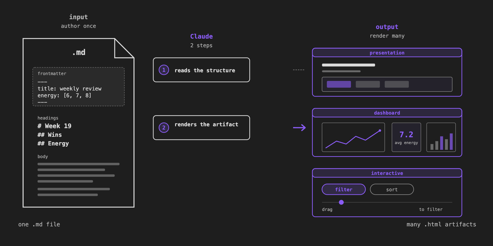
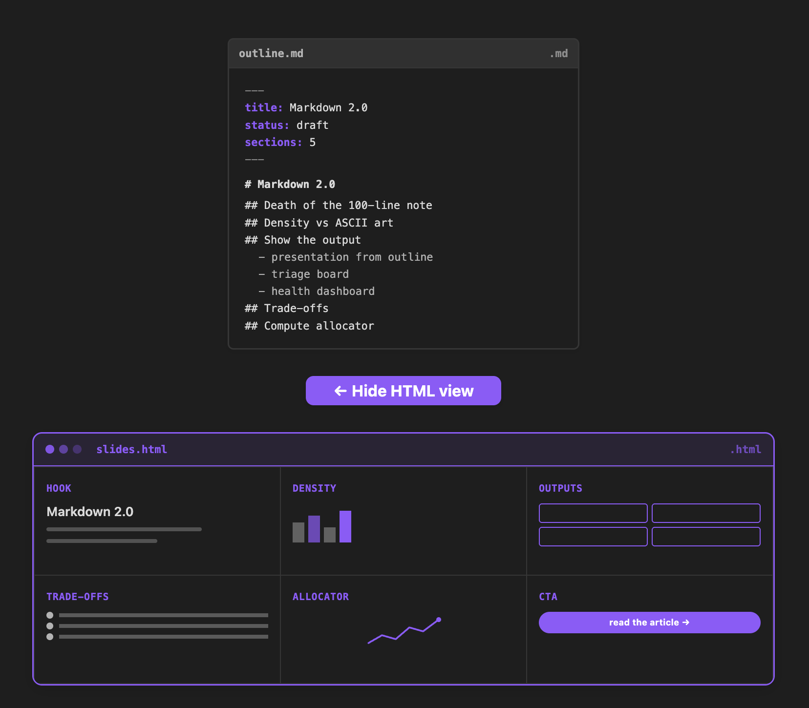
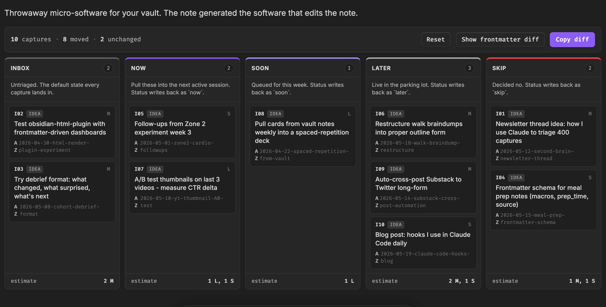
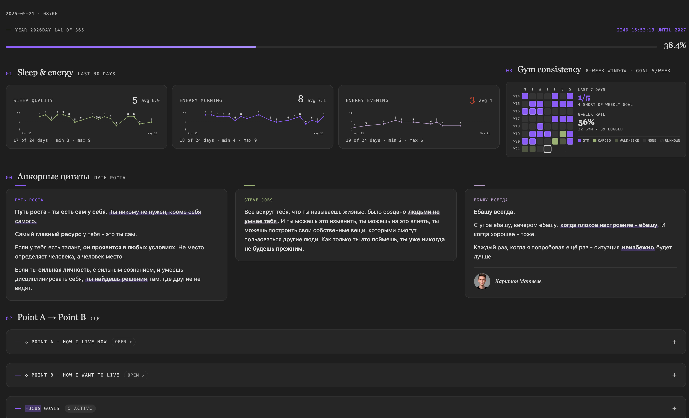
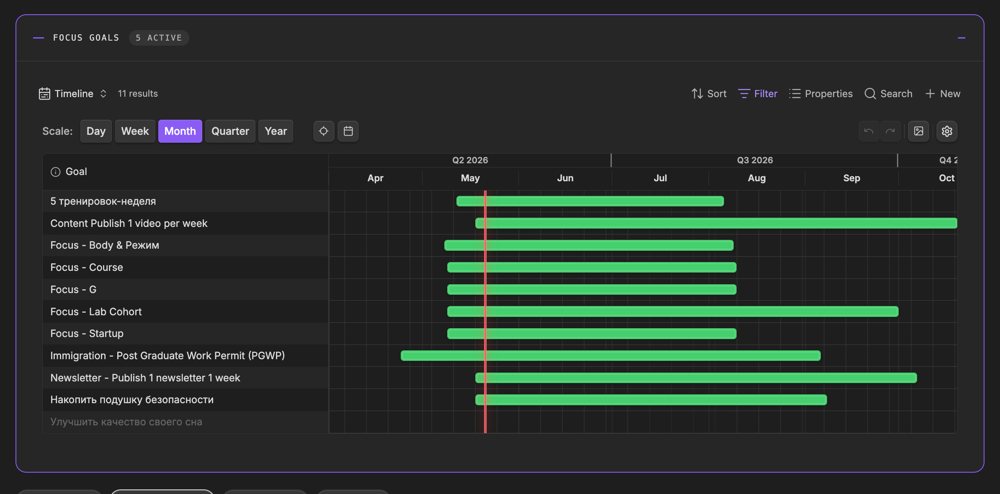
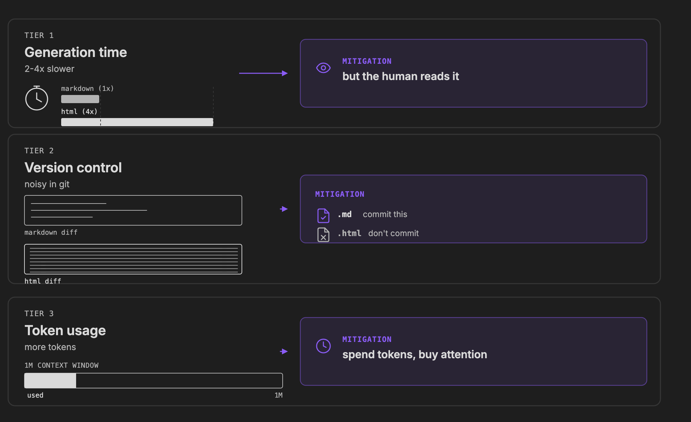

**I switched from Notion 1.5 years ago. Then Thariq's article came out and changed how I use Obsidian.**

---

Hey, it's Artem 👋

I've been living in Obsidian for the last one and a half years, ever since I switched over from Notion. Back then I was doing daily notes, plans, goals, ideas in Notion. The one thing I really missed when I left: Notion lets you build nice dashboards out of the box. Interactivity, just there.

For the entire one and a half years, I was using Obsidian as a text editor. Just markdown. And I found those files very hard to read. As your notes, your plans, your ideas become more complex, markdown becomes a very restricting format. Hard to engage with 😅.

Then a couple of weeks ago, a new post came out from Anthropic. [Thariq](https://x.com/trq212/status/2052809885763747935) (one of their engineers) went viral with [an article](https://thariqs.github.io/html-effectiveness/) about why he stopped using markdown entirely. Over the last couple of weeks I've been exploring how to integrate HTML into Obsidian. I came up with some great ideas. It actually started working for me, and I was blown away by a few discoveries I made along the way.

I'm applying the exact same philosophy to Obsidian. I'm calling it **Markdown 2.0** ;)

And here's the wild part: my Obsidian dashboards are now better than what Notion gave me. Claude built me a custom gym + sleep + alignment dashboard that we both open every morning. I'll show you below 👇

## What you'll get from this issue

By the end of this, you'll have three things rendered from notes you already have:

1. **A presentation from any outline.**
2. **A triage board for your ideas.**
3. **A live dashboard from your frontmatter** (like the health dashboard + gym tracker I use every day).

## The principle: information density

The core argument for HTML instead of markdown is information density. Rather than just walls of text, you can have tables, illustrations, code snippets, plots, diagrams, all within a single contained file.

## What this unlocks

**Slides from any outline.** I use HTML inside Obsidian to create my slides. This diagram was created based on my outline, which was just a markdown file. If you look under the hood, it's just a markdown file. My input was just an outline. The point is, this is dynamic HTML code living inside my Obsidian. I can press a button and the rest of the slide appears. I actually constructed the presentation for this week's video this way, from the outline.

**Notes can actually be interactive software.** You can build micro-software for you. Drag and drop, kanban-style dashboard. Then you can copy the diff and send it to your agent to do those changes for you. Press a button on a slide and it renders the next point. Everything behind that is just this piece of code. Claude or other AI agents can read and render it at no problem.

**Dashboards from your daily notes.** The most exciting part for me is the dashboards. I'm pulling the information from my daily notes about my sleep score. I record it every day. My energy in the morning. My energy in the evening. My bedtime. My caffeine time. I track my vitals. I have specific goals for my health. I can see all of them at a glance. I also have my active sessions here, experiments which I do, are related to my goals. I dive into this more deeply in the next section. You can think of those dashboards as **dynamic memory** for Claude 👇

## The killer use case: dynamic memory for Claude

The dashboard I open every morning is the **Command Center**. One view where me and Claude start the day.

The first iteration was an HTML file. It looked very beautiful. The problem is it's outside of Obsidian, so it's not connected. Those goals were not dynamic. I couldn't modify anything there.

So I integrated it inside Obsidian using **the Dataview plugin** ([github.com/blacksmithgu/obsidian-dataview](https://github.com/blacksmithgu/obsidian-dataview)). In Dataview settings: enable inline queries, enable JavaScript queries. Those two should be enabled. Then you can embed arbitrary code inside your Obsidian note and it actually executes against your vault.

Now I have my goals on the dashboard, and I can edit those goals, I can edit the start date and end date. If I change my sleep quality from 8 to 2 in my daily note, the plot updates in real time.

These dashboards are actually more flexible than Notion. Here's the timeline view I built for my focus goals 👇

Plugin: [Timeline for Bases](https://github.com/TfTHacker/timeline-for-bases) by TfTHacker.

To review this every morning, you can just ask Claude to read my dashboard. It reads this command center JS file, sees that it has embedded queries and bases views, and now it's actually pulling the data from those bases views. This way you can be aligned with Claude. You see the same information, and Claude sees the same information.

I think of this as a **dynamic memory** 🧠. Goals come and go. Whenever the goals from the past disappear from this view, all your context stays fresh. You don't need to explain your goals every session. What is your point A, how do you currently live? What is your point B, where do you want to go? Everything is self-contained.

You can get started in just 5 minutes and build your own dashboard.

## Tradeoffs

Here are some tradeoffs of HTML versus markdown.

**Generation time.** Whenever we use Claude or an agent to write HTML to visualize, it's going to take approximately 2 to 4 times longer. It's gonna spend more tokens. It's gonna take longer to generate those outputs. I actually like that ;) You generate this and you actually engage with the output. It's much easier for me to scroll an HTML file like this one and quickly understand what's going on. I believe the tradeoff is worth the cost.

**Version control.** If you're using Git with your Obsidian to back it up, whenever you have HTML it's very hard to review, because you have all of those tags. That becomes not really great for a human to review the edits.

**Token usage.** It's going to take tokens. But the models have an increased context window. One million context window is affordable at the scale. You can also use sub-agents to generate those diagrams. I typically use one sub-agent per diagram. This way the main context window stays lean and you can work for a longer time.

## Fastest way to start

**1. Read [Thariq's article](https://thariqs.github.io/html-effectiveness/).** It's actually quite short and very insightful, very engaging. The article itself is an HTML artifact, so you'll feel the difference while you're reading it.

**2. Ask your agent to visualize your notes in HTML.** Just ask it to create an HTML dashboard and open it for you. Once you have that, you'll see that your style is not as beautiful as this one, for example. What you can do then, you can just copy a link and tell Claude, I want to apply the same to my dashboard. If you like some style, some design, you can just take a screenshot and let Claude copy it.

**3. Plug in Anthropic's [frontend-design skill](https://github.com/anthropics/claude-code/blob/main/plugins/frontend-design/skills/frontend-design/SKILL.md).** It gives Claude a strong taste profile out of the box, instead of generic AI aesthetics.

## Watch the videos

- **[Markdown 2.0: Notes Are Software Now](https://www.youtube.com/watch?v=5PlXWwkDJPQ)** — the principle and three concrete things you can render from notes you already have.
- **[Build your Claude Code Command Center in Obsidian](https://www.youtube.com/watch?v=_dVSjwsgXAo)** — the one dashboard me and Claude open every morning. Dynamic memory for your agent.

That's it for this one. Build a dashboard, open it tomorrow morning, tell me how it feels.

See you in the next one,
Artem
