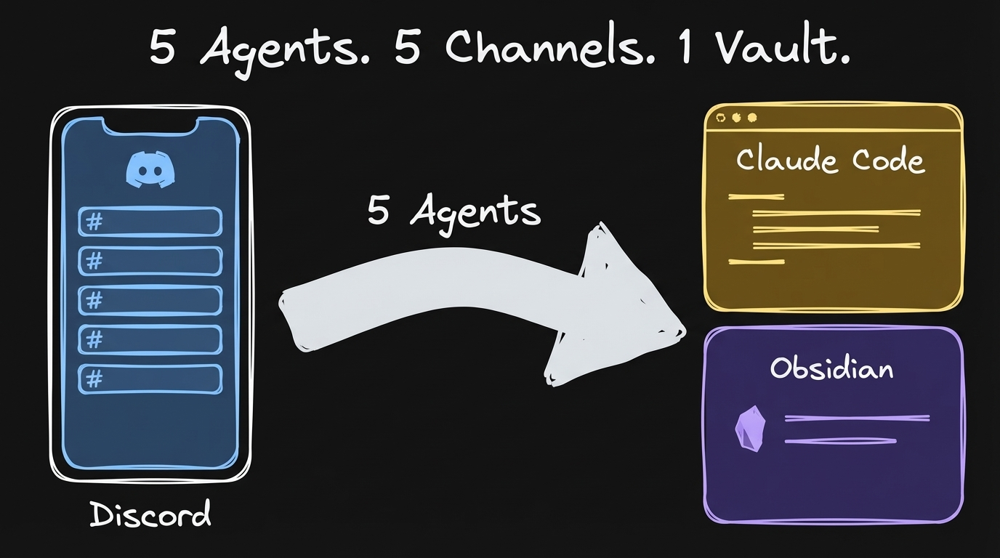
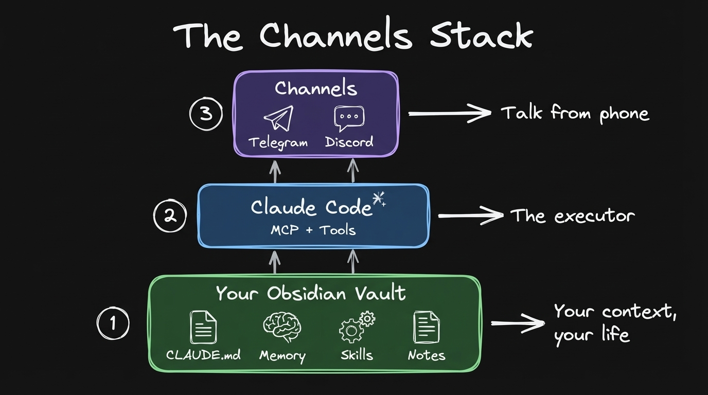
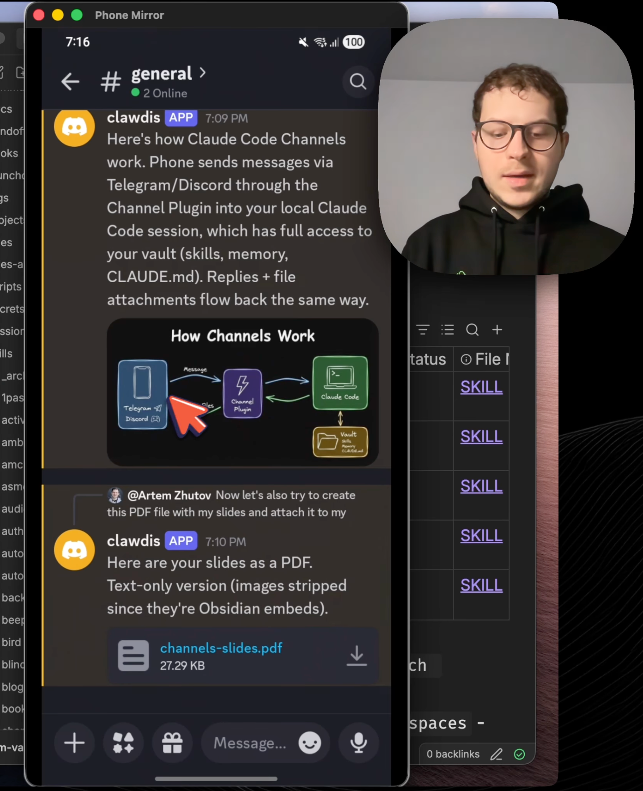
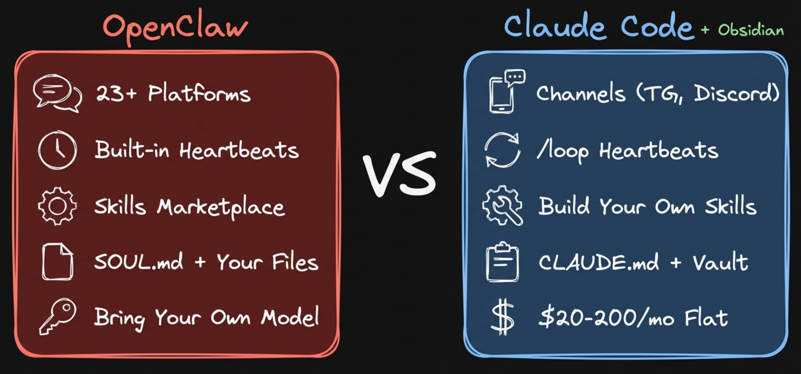
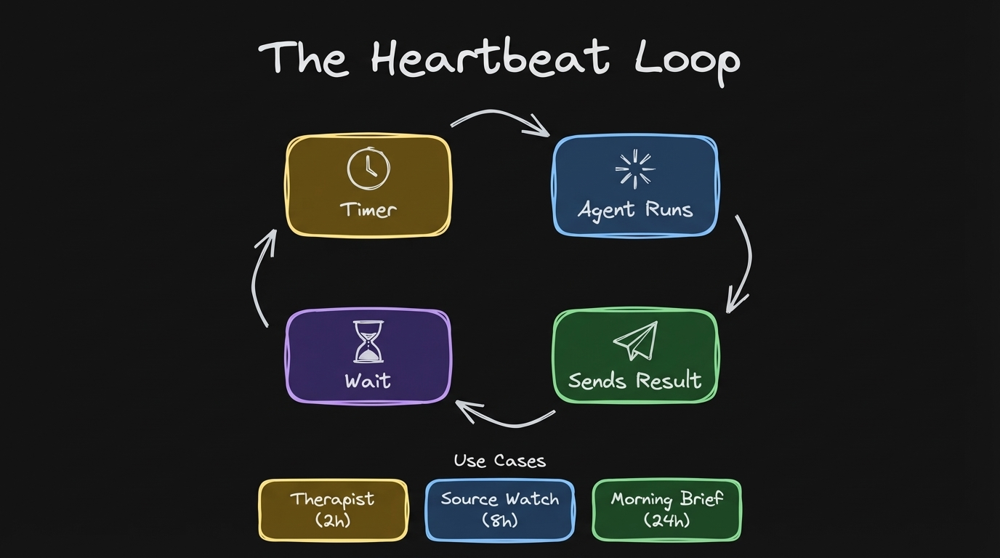
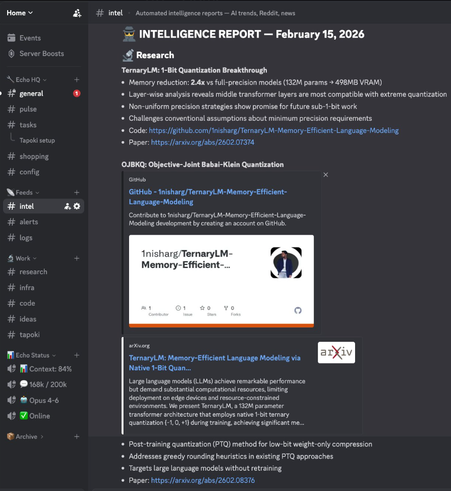
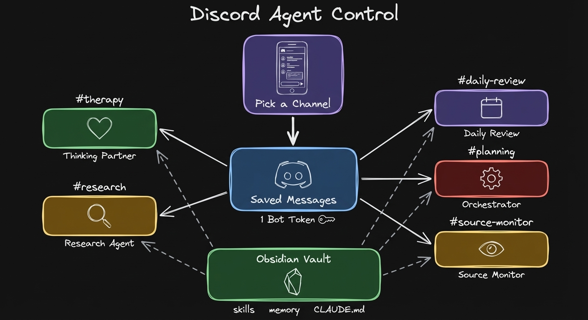

**How I turned Discord into a control center for my AI agents.**

---

Anthropic just shipped channels. I've been waiting for this for a very long time.

I run Claude Code from my Obsidian vault every day. All of my context is there. My preferences in CLAUDE.md. My memory files that persist across sessions. Skills I packaged from previous work. Notes going back years. The one thing which was missing is reach it from my phone. And now I can.

I ran OpenClaw for that before. It worked, but I was always SSHing into my Mac Mini to fix it. It was very hard to manage. I spent more time maintaining OpenClaw than actually using it from my phone. And the subscription was kind of a gray area with terms of service. Now with channels it's officially supported. Full transparency.



## What Channels Actually Is

Channels plugs your phone into an existing Claude Code session. You start Claude Code with a channels plugin. Your phone pushes messages into Claude Code. Claude processes them with full filesystem access, tools, skills. Reply goes back.

No new setup. No rebuilding context somewhere else. Whatever you already built in your vault, channels gives you phone access to all of it.


*Layer 1: Your Obsidian vault. Your context, your life. Layer 2: Claude Code. The executor. Layer 3: Channels. Talk from your phone.*

## What I Ran From My Phone



I opened Discord on my phone. Asked: "generate a diagram to understand how the channels work."

The agent received the message. It reads my project files, understands what I'm working on, generates a diagram using the excalidraw skill. The image appears in Discord. That's the thing. You can attach images, diagrams, PDFs back to Discord messages.

Then: "create a PDF file with my slides and attach it to my Discord."

The agent generates the PDF. Attaches it to the message.

I also asked it to analyze Reddit sentiment in the Claude Code subreddit. The agent extracted all the Reddit posts. Read them. Crunched the data for four minutes. You need to be patient with those agents to teach them the way you want results to be produced. But the results came back with exact Reddit threads with analysis and quotes. Real threads you can click and go to.

With just your vault and CLAUDE.md, you can ask it to search your notes, summarize a file, answer questions about your day. All from your phone.

## OpenClaw vs Claude Code

I ran OpenClaw. Here's the honest difference.

OpenClaw is more mature in terms of platform support. 23+ platforms. WhatsApp, Signal, all of those different channels. It also has built-in heartbeats. Proactive agents that check stuff and report back on a schedule.

What I typically do is I do some work and then I package something as a skill, which I understand, which I can open in my Obsidian, I can look through it, I can tune it. Brings to me much more observability. I can open any file, note, I can see exactly what's happening in the skill, what's written there. It gives me the sense of control that I can read those files, I can see what the agent would be doing.

Here's the thing about observability: running Claude Code with Obsidian helps me understand what the agent does. I can see exactly the files. Running OpenClaw without Obsidian, or Claude Code without Obsidian, makes it very hard to understand what the agent is doing. A lot of people run OpenClaw without Obsidian. With Obsidian, you see every edit, every file the agent touched.

When the agent is working through channels, it's a bit harder to observe. OpenClaw has built-in streaming to tools. For Claude Code channels, you can ask the agent to send messages to Telegram or Discord to update about progress. One limitation: you can't really stop the agent mid-task. You can only guide it by sending another message.


*OpenClaw: 23+ platforms, bring your own model. Claude Code: Telegram and Discord, flat $200/mo subscription, state-of-the-art models.*

The pricing: the amount of usage which you are getting out of the $200 subscription is heavily subsidized. You burn in tokens like a couple grand easily. With OpenClaw, you bring your own model. You can use OpenAI models or open models, but their vibes are just not great for a personal assistant. Anthropic models like Opus follow instructions better, more natural conversation. That's kind of the problem with bringing your own API key.

The most important thing is having your context. Your preferences, your skills, your playbooks. Without that, the agent is generic. It can't be personal by definition. You run a session, and at the end you've done some work. Now you want to package it as a skill. That's going to be your playbook which you can run whenever you want. And because everything runs locally, you have access to your whole conversation history, every session, every decision, every correction. This makes the agent better and better over time.

The memory architecture is different too. OpenClaw has a layered system. SOUL.md as your personality and principles. MEMORY.md for curated long-term facts. Daily journal logs. A facts database with entity lookups. Semantic search across sessions with embeddings. It's sophisticated.

Claude Code has CLAUDE.md plus auto-memory that writes and updates memory files on its own across sessions. Simpler, but it works because you control the files directly. You can open them, read them, edit them in Obsidian.

Both can run from your Obsidian vault. That's the key. Running either one from your vault is what enables real personalization.

For heartbeats, we can get something very similar within Claude Code by using the built-in /loop skill. You can tell it the interval. Hours or minutes. And then you can tell the prompt, or you can tell it to run some specific skill.

Try this one. Copy-paste into Claude Code:

```
/loop 2h "Check in with me. Ask how I'm doing, what I'm stuck on, what's on my mind. Be supportive and curious, not pushy."
```

That's the therapist style interaction. Every 2 hours, it asks about your state. Or every 24 hours at 7 AM, scan of my latest notes, extract ideas from previous day, send me morning brief using Telegram or Discord.


*Loop pattern: scheduled intervals, agent task, reply to channel.*

## Discord is the Future

I think Discord is the future for our agents.

I've seen a person from Twitter who was doing something like that with his OpenClaw setup, which was quite impressive to be honest. A general chat, a pulse channel where you get reports from Reddit, logs, different channels for different agents. Channel-based scope for agents with their own context.


*Someone's OpenClaw Discord setup. Per-channel agents with isolated context. This is what inspired me.*

I want to set up something similar. The default Discord channels plugin gives you one agent, one session. No context isolation between channels. But I've been testing an upgraded Discord plugin that filters messages per channel, so each channel routes to its own Claude Code session.

### The Experiment I'm Running

On my own Discord server right now. One bot token, upgraded plugin, multiple agents each filtered to their own channel. Research, therapy, daily review, source monitor, orchestrator.

Each agent gets its own persona file. You write who they are, how they should behave, what tools they focus on. Then you spawn them and they just live in their channel, waiting for messages.


*5 agents, 5 Discord channels, 1 Obsidian vault. Pick a channel, talk to that agent.*

### The Orchestrator

It's the Discord server as a control center for your agents. You open Discord on your phone, pick a channel, talk to that specific agent. All of them running from the same vault, same skills, same context.

The orchestrator agent is the one that sees everything. I can ask it about any other Claude Code session. "What is the weekly plan agent doing right now?" It reads what's happening in that session and reports back. It can spawn new agents, check on running ones, relay messages between them. I covered the cmux orchestrator pattern in a [previous video](https://www.youtube.com/watch?v=_gBw4j-UKBg).

### Why This Beats the Old Way

What makes it stick for me is that I can create those agents just in time, whenever I need them. It automatically creates a Discord channel for the agent and you can just spawn it. Previously with Telegram and multi-bot OpenClaw setups with isolated context, it was a huge pain. I had to get access to each bot, create a bot in Telegram, then try to make it run, then SSH from Claude Code to Mac Mini to fix it. I spent one hour doing that and it still doesn't work and I'm afraid to touch it.

Now it's much easier. You can have those assistant agents. You just run them. And you can also get back to the terminal as well to see what's happening.

I actually tested this while writing this newsletter. The default Discord integration gives you one channel, one agent. That's what Anthropic ships as the official plugin. What I tested is the multi-channel setup. The orchestrator agent in its own channel, receiving my messages from the gym, pulling the YouTube transcript, drafting the newsletter, going through multiple rounds of edits. All remotely, while I was not in front of the computer. Then I came back and continued working in the same Claude Code session.

## Try It

**Telegram setup (2 minutes):**
1. `claude plugin install telegram@claude-plugins-official`
2. Create a bot with [BotFather](https://t.me/BotFather), copy the token
3. `claude` -> `/telegram:configure <token>`
4. `claude --channels plugin:telegram@claude-plugins-official`

**Discord setup:**
1. `claude plugin install discord@claude-plugins-official`
2. Create application at [Discord Developer Portal](https://discord.com/developers/applications), enable Message Content Intent, copy bot token
3. `claude` -> `/discord:configure <token>`
4. Generate OAuth2 URL with bot permissions, invite to server
5. `claude --channels plugin:discord@claude-plugins-official`

Full setup walkthrough in the video: [watch from 7:00](https://youtu.be/9G6IPxSXU8s?t=420)
Official docs: [Claude Code Channels](https://docs.anthropic.com/en/docs/claude-code/channels)

For dictation on the go I use [Wispr Flow](https://wisprflow.ai/r?ARTEM31). Much better than default Android dictation.

## What's Next

Two weeks ago we had /loop. Last week /dispatch. Now we have channels. I think that's kind of the full piece to build your own OpenClaw with Claude Code.

And here's what closes the whole loop: I sync my vault between my MacBook and my Android phone through Obsidian Sync. Claude Code makes edits in Obsidian. Those changes appear on my phone almost instantly. I can review what the agent did right from my phone. Command from phone, agent works, edits show up in your vault on your phone.

It's really exciting times to be alive, honestly.

Full video walkthrough (22 min): [Claude Code Channels Replaced My OpenClaw Setup](https://youtu.be/9G6IPxSXU8s)

## Let's Discuss

If you had 5 Discord channels with 5 different agents, what would you put in them? Reply to this email. I'm genuinely curious.

Join the conversation: [Discord community](https://discord.gg/g5Z4Wk2fDk)

Artem
