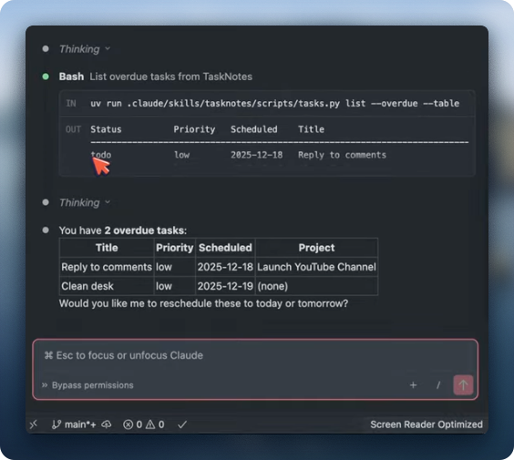
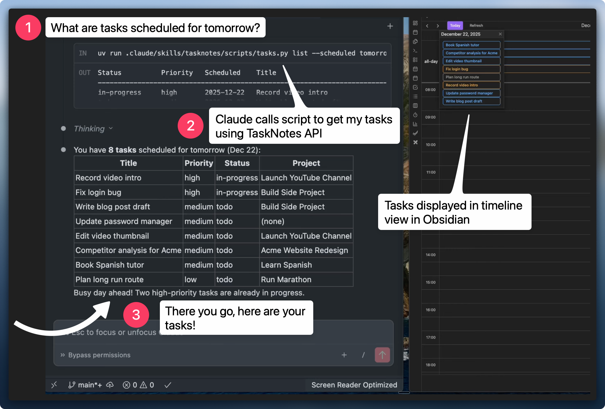
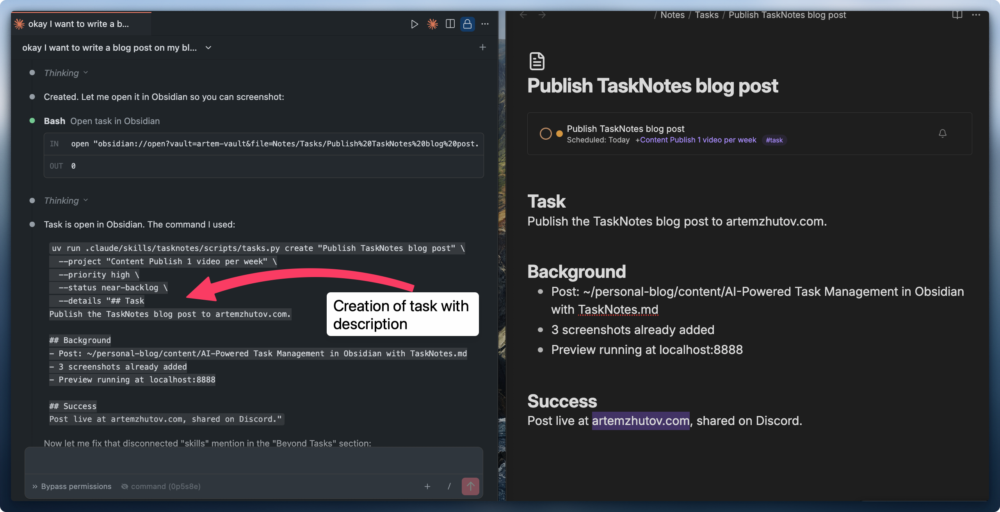
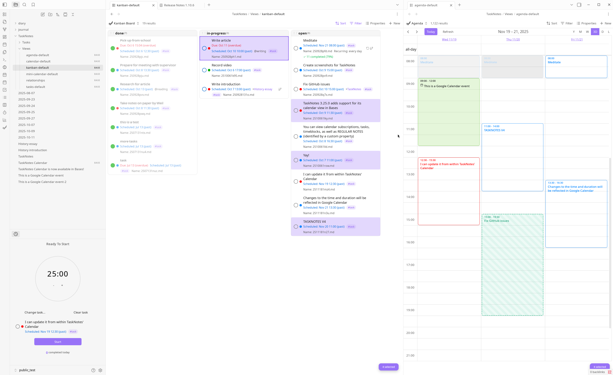
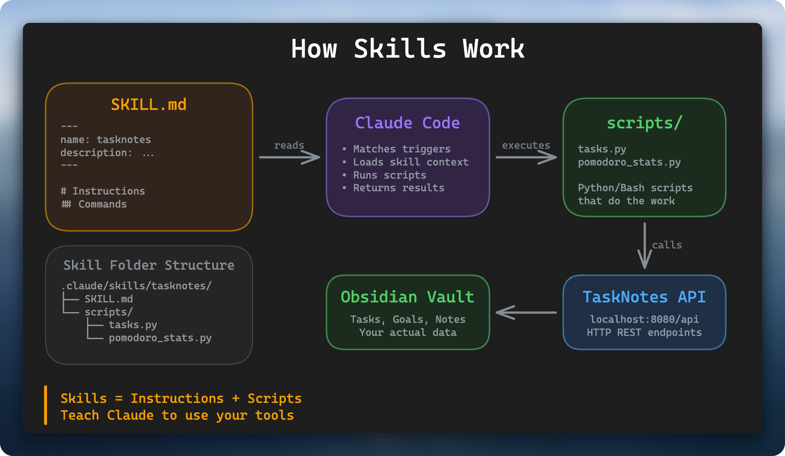

I ask Claude "what's overdue?" and it knows. TaskNotes is an Obsidian plugin that renders tasks as kanban boards and calendar views. Skills let Claude query and manage them directly. It's like having a personal executive assistant for task management.

[Watch the video walkthrough](https://youtu.be/ePFAVGcPh7U)

---

## What This Looks Like in Practice

I'm asking Claude: "I have 2 hours, what can I work on?" It knows what's overdue, what's scheduled, my energy levels. It's my context working for me.


*Claude querying my tasks directly from the terminal*

The same tasks appear in Obsidian's calendar view:


*TaskNotes calendar view, same data, visual overview*

ChatGPT works in a browser. You have an interaction, it doesn't remember, you start fresh every time. Claude works locally on my computer. It can read my local files, access my calendar, my reminders, and actually do things, not just chat. Your data stays on your machine. You build context over time, the system learns, you refine your workflows. Everything compounds.

When Claude creates tasks, it adds descriptions with full context from our conversation:


*Claude creating a task with description, all the context needed to pick it up later*

Those tasks are self-contained. I ask Claude to write descriptions in such a way that they don't require external context beyond what's written there. I can pick up any task later just by mentioning it.

---

## TaskNotes: Kanban and Calendar Views

[TaskNotes](https://github.com/callumalpass/tasknotes) is an Obsidian plugin that renders tasks as Kanban boards or calendar views. I can group by project, by status, have different views.


*TaskNotes plugin: Kanban board and calendar in one view*

Why TaskNotes? It's hard for me to maintain current tasks just in my memory. TaskNotes gives me a dashboard where I can look and understand what's going on. It's a polished plugin, production ready, with a well-documented API. I can programmatically interact with tasks and query them using natural language. Claude handles the complexity.

I've been using it since summer. Started with the CLI version, now Claude navigates it directly through the HTTP API.

The powerful part: I can add descriptions to tasks. When I ask Claude to work on something, it has all the context from our conversation. Everything compounds.

For Pomodoro timers I use [Session](https://www.stayinsession.com/), a native Mac app and works great. But TaskNotes has a built-in pomodoro timer too if you want everything in Obsidian.

---

## How It Works: The Skill Architecture

Here's a simple diagram to understand what happens when you ask Claude a question:


*How skills work: Claude uses skills to interact with your vault*

Claude operates in your Obsidian vault folder. It understands your intent. If I ask Claude to do something related to task management (adding, scheduling, removing, listing tasks), it uses that skill. The skill is the layer that connects Claude to my vault and my tasks.

A skill is a markdown file that describes how to handle requests. Skills are injected into Claude's context window. They become part of its active memory. When I ask Claude to do something with tasks, it understands from my intent and the skill description that it should use this skill. It reads the skill and proceeds with handling my request.

This is progressive disclosure of context. We don't upload everything into Claude's memory. We make efficient use of the context window. The skill teaches Claude how to use the scripts, how to interact with TaskNotes and my Obsidian vault.

```yaml
---
name: tasknotes
description: Manage tasks via TaskNotes plugin API. Trigger phrases
  include create task, show tasks, mark done, what should I work on.
---
```

```bash
$ uv run .claude/skills/tasknotes/scripts/tasks.py list --table

Status          Priority   Title                              Project
--------------------------------------------------------------------------------
near-backlog    high       Publish TaskNotes blog post        [[Content Publish 1 video per week]]
near-backlog    high       IELTS Practice (1500-1600)         [[Pass IELTS for PGWP]]
near-backlog    middle     Training (1800)                    [[5 workouts per week]]

# Other commands
uv run .claude/skills/tasknotes/scripts/tasks.py list --status in-progress
uv run .claude/skills/tasknotes/scripts/tasks.py create "Task title" --project "Goal Name" --priority high
uv run .claude/skills/tasknotes/scripts/tasks.py update "Notes/Tasks/task.md" --details "Context here"
```

Here are all my tasks linked to a project with priorities and their status. This is what Claude sees. Now it can filter, sort, and reason about this data.

The skill serves as documentation. Set it up once, it works forever. Claude is an exceptional programmer. Opus 4.5 handles these complex queries reliably.

I was trying to get this up and running since summer, but TaskNotes was still under development. The API and kanban boards weren't quite there yet. Now with version 4, the developer has been working really hard to bring it to the current level. The main shift came with skills and the improvement of the models. They've become exceptional at following instructions. It's an exceptional plugin, very useful. It adds an observability layer to your tasks with kanban boards and timeline views.

---

## Beyond Tasks: Transforming Context into Artifacts

We might be having a session working on some problem, discussing something with Claude. Based on our discussion, we can create a list of tasks. Assign them to a project or goal. Schedule them. All within the context of the chat.

Because Claude has full access to your computer, you can build code, prototypes, new skills, all locally within your Obsidian vault, with your context. You can transform your context into valuable artifacts: blog posts (like this one), new skills for your assistant, proposals, analysis, whatever you need.

---

## Get Started

I've packaged all the skills into a single repo. All the stuff I develop on my YouTube channel, rather than having separate repos for each. Installation instructions included, should be straightforward to try.

[TaskNotes skill on GitHub](https://github.com/ArtemXTech/personal-os-skills/tree/main/docs/tasknotes)

I have a Discord community where we share workflows like this. Small group of people curious about how to use these new tools.

[Join the Discord community](https://discord.gg/g5Z4Wk2fDk)

I also share these workflows on [YouTube](https://www.youtube.com/@ArtemXTech).

Your context is your superpower. Make it work for you.
