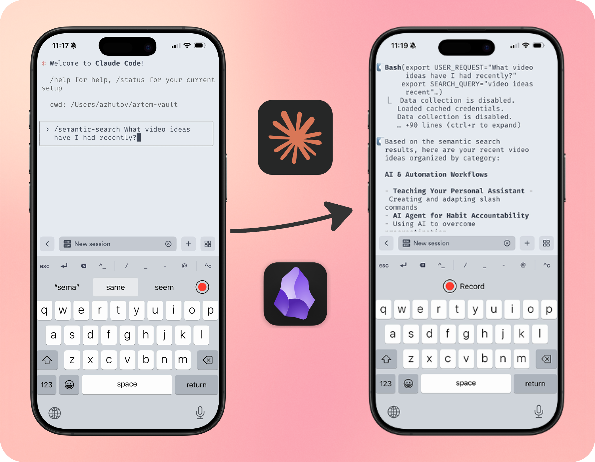

Hey everyone! Today's video is a little different. I've been exploring a simple way to talk to my Obsidian notes from my phone while walking. Something I actually use every day.

If you like videos, here’s the walkthrough. If you prefer reading, this post is fully self‑contained—everything you need is below.

- Watch: [Talk To Your Obsidian Notes on the Go (Claude Code Mobile Setup)](https://youtu.be/aZZaqmcq-1Q)


_Claude Code semantic search_

## What you’ll get

- A voice‑first way to access your Obsidian notes from anywhere
- Two core workflows: `/daily-note` and `/semantic-search` for Claude Code
- Session continuity via tmux (start on desktop, continue on phone)
- Planning mode, file/folder references, and running multiple sessions in parallel!

## How it works (at a glance)

1) Your phone connects to your desktop privately over Tailscale
2) On the desktop, a tmux session keeps your Claude Code agent running inside your vault.
3) From the phone, you SSH in with Termius and dictate via Super Whisper (or Whisperflow). The agent reads and writes to your vault with structure.

![[./assets/image2_workflow_diagram.png]]
_Claude Code mobile setup workflow_

---

## Step‑by‑step setup (copy‑paste friendly)

### 1) Secure connectivity with Tailscale

Install Tailscale on your desktop (download from [Tailscale](https://tailscale.com/download/)) and phone ([iOS](https://apps.apple.com/us/app/tailscale/id1470499037) or [Android](https://play.google.com/store/apps/details?id=com.tailscale.ipn)). Sign in with the same account on both.

On the desktop, confirm your device and IP:

```bash
tailscale status
```

You’ll use the desktop's Tailscale IP (e.g., 100.121.117.61) as the SSH host on your phone.

Security note: Tailscale creates a private, encrypted tunnel. You are not exposing your desktop to the public internet or opening router ports.

Enable SSH on macOS (System Settings → General → Sharing → Remote Login → On).

### 2) Keep your agent alive with tmux

On the desktop, start a persistent session and run your agent:

```bash
tmux new -A -s claude-mobile 'claude'
```

Later, reattach from anywhere:

```bash
tmux attach -t claude-mobile
```

### 3) One‑tap connect from phone with Termius

Create a host in Termius:

- Host: your desktop's Tailscale IP (e.g., 100.121.117.61)
- User: your macOS username
- Auth: password (what I use) or SSH key

Optional startup snippet so you land inside your vault and ensure the agent is running:

```bash
cd "/Users/YOUR_USER/Obsidian/YOUR_VAULT" && tmux new -A -s claude-mobile 'claude'
```

![[./assets/image3_termius.jpeg]]
_Termius setup_

### 4) Voice input on phone

**iOS options:**
- Super Whisper (iOS + macOS): fantastic for long dictations with custom prompts/models. You can also run whisper models locally, on your iPhone. In the roadmap developer is working on synchronization between Mac and iOS.
- Whisperflow (iOS): extremely fast for quick captures, however it doesn't handle well long dictations. It starts hallucinating. You don't have control over the prompt, model etc.
- Native keyboard (iOS): is not compatible with the terminal input

**Android options:**
- FUTO Voice Input: on-device Whisper with good accuracy. Records in ~30s segments.

Flow: Connect in Termius → focus the terminal → switch to your dictation keyboard → record → process → press Enter to send.

### 5) Planning mode from mobile (optional)

Claude Code planning mode often toggles with Shift+Tab. From mobile, you can send that via a tmux key binding.

In `~/.tmux.conf` on your Mac

```tmux
bind-key p send-keys Escape "[" "Z"
```

Thanks to this [reddit comment](https://www.reddit.com/r/ClaudeAI/comments/1lmd084/comment/n0k90ty/?utm_source=share&utm_medium=web3x&utm_name=web3xcss&utm_term=1&utm_content=share_button) for the idea.

---

## Core workflows (what I actually do)

### 1) Daily note with calendar context

Run:

```bash
/daily-note
```

The agent loads your daily note template, pulls today’s calendar for context, then asks for intention and one goal. Your answers are written back to the vault. Two‑way sync means it’s instantly visible in phone Obsidian.

Here's the custom slash command implementation: [gist](https://gist.github.com/ArtemXTech/793b7cee390eabce7488f8fe8e082ed8). Save this as `daily-note.md` in your `.claude/commands/` folder within your vault directory.

### 2) Ask your vault (semantic search)

Ask real questions rather than hunting filenames. Examples:

```bash
/semantic-search what was my focus over the last 3 days?
/semantic-search help me collect context for my project X
```

You’ll get a short synthesis for you questions, grounded with your notes!
Custom command implementation: [gist](https://gist.github.com/ArtemXTech/f065d3b328ecf2b263a83d06e108ad63).

### Advanced extras (when needed)

- Planning mode: toggle via the tmux mapping to clarify intent before executing
- File/folder references: ask the agent to use specific paths for grounded answers
- Parallel sessions: open another Termius connection and `tmux new -A -s <name>` to juggle multiple tasks. You can swipe left and right to switch open terminal

---

## Final thoughts

This isn’t about making the phone do everything. It’s about keeping momentum when it matters. The desktop stays the place to execute; the phone becomes the place to steer, reflect and plan.

Try asking your vault about patterns in your notes—you'll be surprised what connections emerge. Share what you discover.

Thanks for reading!

---    

_I help people_ **_do their best work_** _by building_ **_personal AI agents_**_—mindfully and transparently. On_ [_YouTube_](https://www.youtube.com/@artemxtech)_, I share real experiments so you can_ **_delegate_** _what drains you and_ **_amplify_** _the work you love._
