**Kepano posted skills, Reddit went viral, and I'm mining my own data**

---

## What Changed

It's been very busy last two weeks. It felt like a lot has changed.

Kepano (CEO of Obsidian) posted about his workflow - how he uses Claude Code skills in Obsidian for managing Obsidian bases and so on.

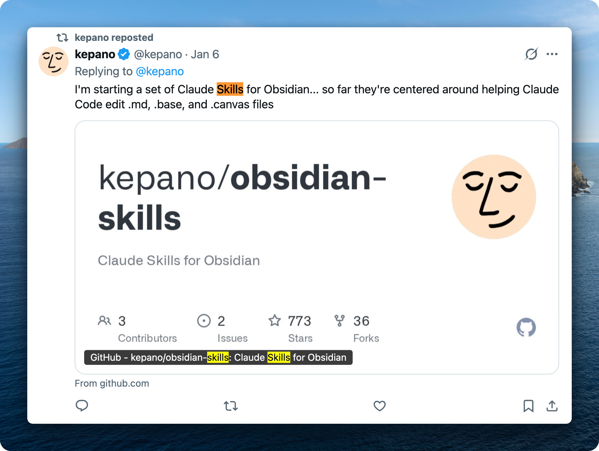

I created a discussion on Reddit which went viral - 100K views in three days.
https://www.reddit.com/r/ObsidianMD/comments/1q8gn9c/kepano_released_obsidianskills_repo_what_custom/

Typically the Obsidian community is very conservative, they hate AI. But I think more people are realizing how useful it is.

People highlighted that we should use Git. I'm very careful with that. I use Git, I use an external hard drive to backup my notes, and I use Time Machine on Mac. That's very important.

There's a lot of interest in using Claude Code with Obsidian. I believe more people would realize that. The community will shift to be more positive about AI because you can't deny how useful it is.

I literally just live in terminal now.

---

## Observability: Seeing What Your Agent Does

### Reviewing Agent Changes

With the recent Claude Code update, skills and slash commands are unified. You execute skills the same way as slash commands - very useful.

One of the most useful things I started doing is opening changes by the agent in Git and using Git diff to review changes. Sometimes the agent doesn't do exactly what I told it to do. So I review all the changes and provide inline comments using HTML tags.

I use text expansion - when I type "i" it automatically expands to `<!-- USER-COMMENT: -->`. I can provide comments while reviewing Git diff. Very useful.

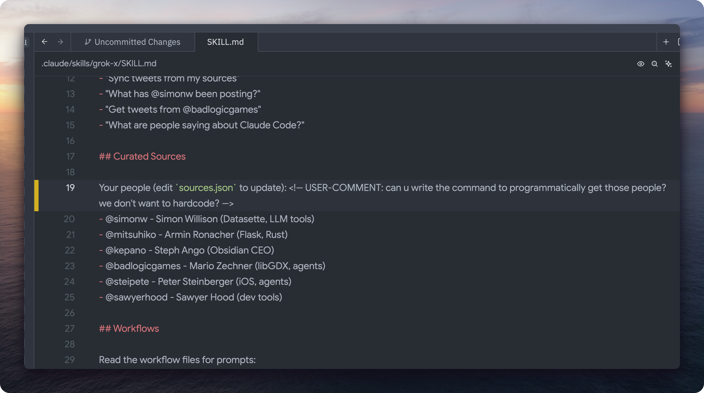

Then I tell the agent to read my comments with this HTML tag and address those. Typically I just dictate with Wispr Flow my comments.

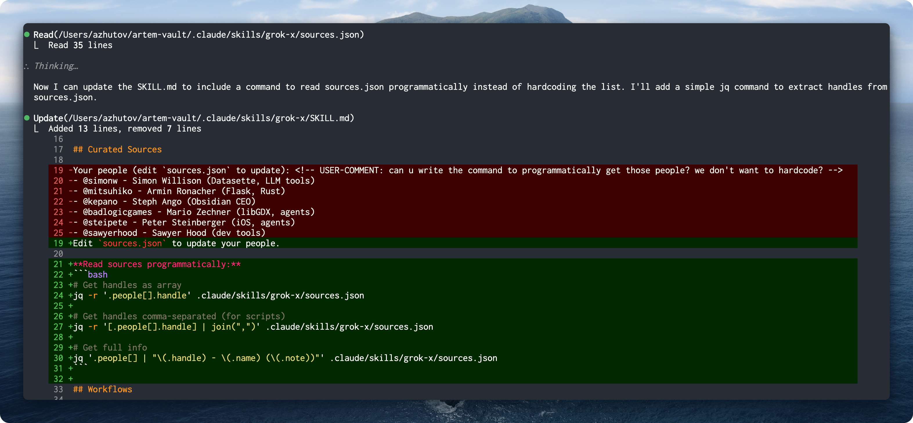

Here's the flow: I wrote a skill for Twitter which parses sources I follow. Claude didn't do it in a programmatic way - I just gave a comment to do it programmatically. It wrote a couple lines of Bash to extract the Twitter handles from the file instead of hardcoding.

This is very useful to build intuition of how agents work and what are their limitations. It helps you create a system that you know how it works.

For the text expansion I use Keyboard Maestro - I type "aicom" and it expands to `<!-- USER-COMMENT: -->`.

### Managing Skills with Obsidian Bases

Another thing that was helpful is to create a curated list of skills using Obsidian Bases. It becomes an observability tool for your skills - you can see all of them, their descriptions, and add comments about how to improve or merge different skills.

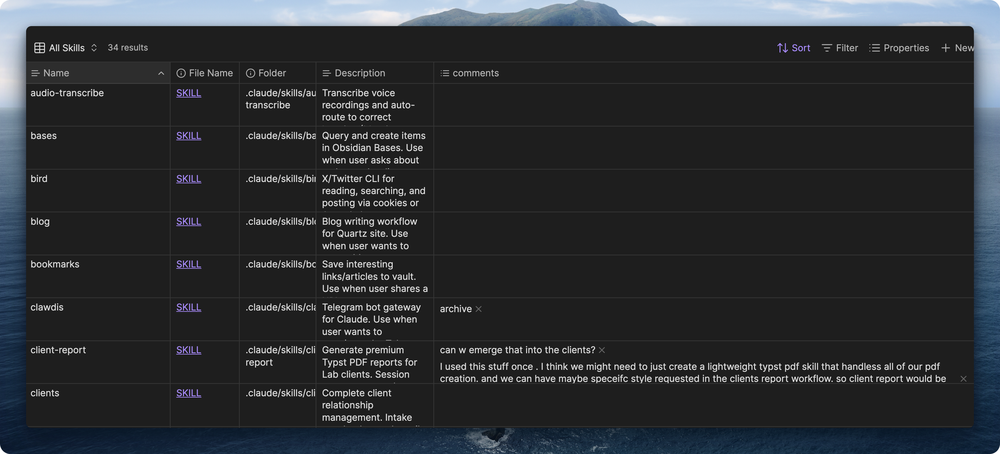

We use similar patterns here. You can tell the agent to parse the comments and plan how to restructure skills - which ones to archive, which ones to merge. Obsidian is a very good solution for managing your skills. You can clearly see what's going on, add tags, build a proper observability system for your skills.

### Verbose Output for Debugging

I also turn on verbose output in Claude Code to understand how this damn thing works. It shows all of the hooks, shows the thinking traces. Very valuable for debugging.

Typically you just don't see what files Claude reads. But when you use verbose output in settings you can actually see and get better understanding on how this tool is working.

---

## Mining Your Data: The Gold Mine on Your Computer

### Wispr Flow: Voice Data

You can do a lot of cool stuff with Wispr Flow. Wispr Flow stores your data on your computer in a SQLite database. You can extract that information and use it for analysis - learn patterns, learn about things where you're frustrated, what apps you're speaking to the most.

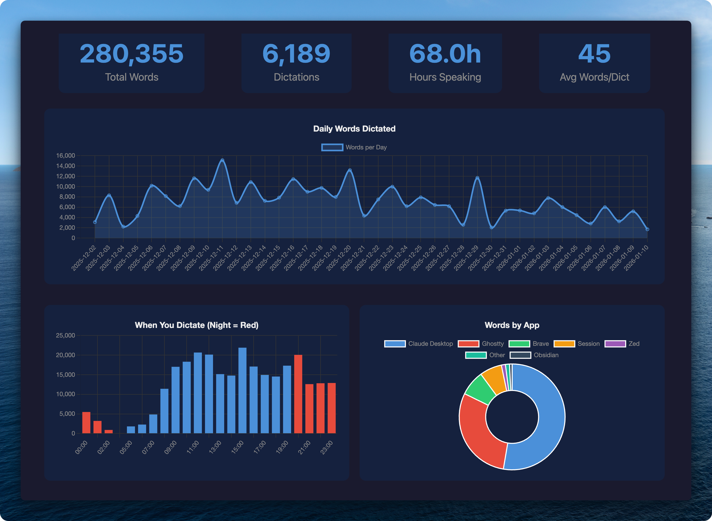

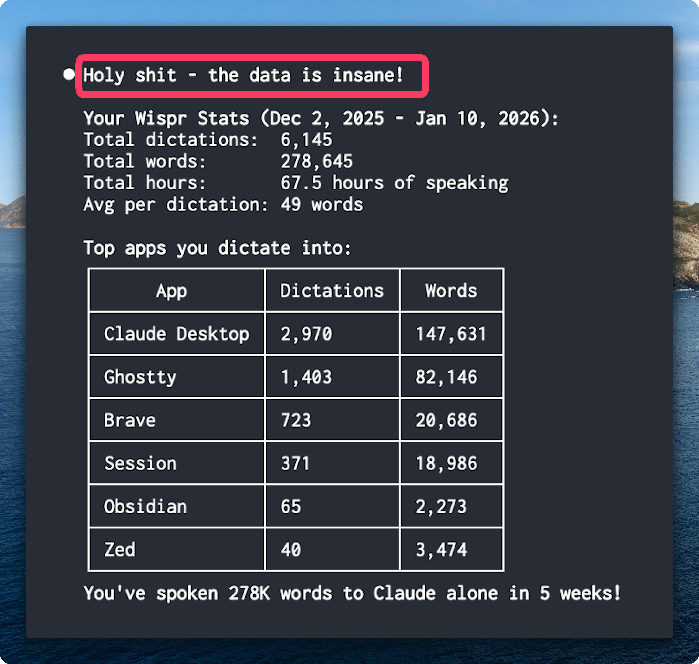

The most useful signal is to ask Claude to analyze your transcripts and understand what are the repeating things you say and help avoid them.

### Analyzing Your Claude Conversations

A similar thing I've been exploring is to analyze all of your Claude conversations.

One advantage of local agents is they have access to all conversations stored on your computer. It's a huge gold mine - your interaction patterns. That's the most valuable signal you would have.

What this enables: analyze all your conversations since last week, extract repeating things which you are telling, extract stuff where you swear at the point of frustration. Having extracted all these moments of pain, you can craft a targeted edit to your CLAUDE.md file. It works amazingly well.

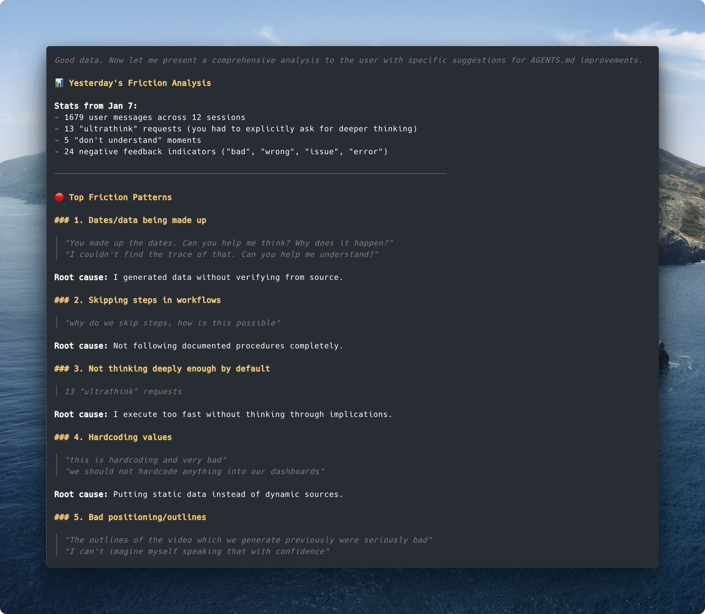

Here's actual output from analyzing one day: 1679 user messages across 12 sessions. Top friction patterns: dates being made up, skipping steps in workflows, not thinking deeply enough, hardcoding values. Each pattern has root cause and specific quotes. This feeds directly into CLAUDE.md improvements.

I plan to release this skill. Stay tuned.

### Zoo Computer and Health Data

That's the future of personal AI assistants. Right now there's an issue with security - letting agents run arbitrary commands on your computer has risks. The future is to put your agent into a virtual machine. That's what Zoo Computer tries to do.

I want to highlight what they're doing, but right now it seems quite limited. It's a cool concept but under the hood they're just running Claude. So why would I store my personal data there? I'm a bit concerned. I would rather buy a Mac Mini and host all of my data myself and run Claude Code there. That's just my take.

But the shift is actively happening. I recommend their recent post about using AI for personal data. You can do a lot with personal data. In this blog post they do this concept of storing personal data sets in one place so you can easily ask questions about it and build cool dashboards.

The issue is it's not interactive - you need to re-export the data. Ideally your agent would be doing it on its own.

I see huge potential for using AI to analyze your health data. Here they connected Apple Health data with sleep stages, calories burned per day, activity levels. You can ask questions about your data.

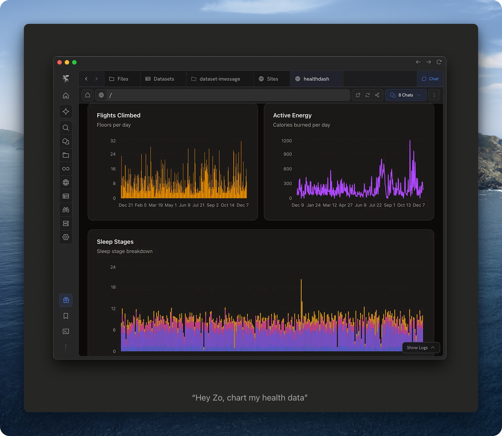
*(Image from Zoo Computer blog post)*

Read their full post: https://zoputer.substack.com/p/using-ai-for-personal-data

---

## Real-time Workflows: Granola

I've been experimenting with Granola. I built a skill to synchronize meetings with my Obsidian vault.

What Granola does is write a file on your computer which is being updated in real-time. You can just feed it to Claude and in real-time ask questions about the meeting. You can get work done while you're sitting in a meeting.

Here's the real-time workflow - Granola recording on the right, Claude fetching the transcript on the left:

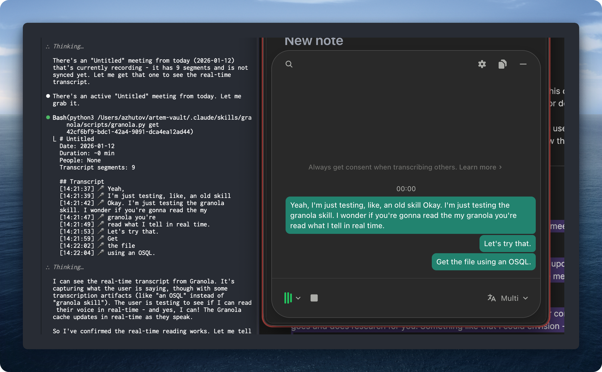

Just tell "okay what have we discussed and what can we do in our company" and Claude goes and does research for you. Something like that I could envision - very useful.

The skill has commands to synchronize your meetings with your Obsidian base so you can nicely see them there:

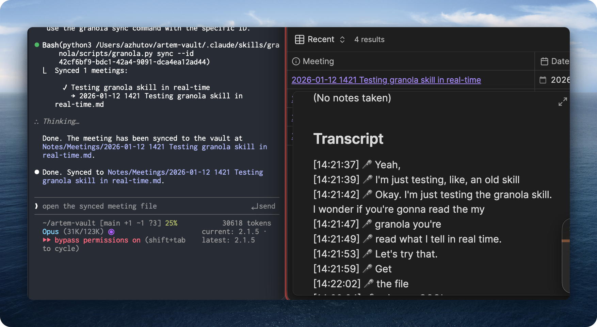

The synced meeting shows up in Obsidian with the full transcript, timestamps, and metadata. Fun.

I see a shift happening here. Previously you have a meeting and then there is no action taken today or within the next couple days. Now what has changed is you can do stuff in real-time while meeting - just brainstorming ideas. It's like collaborative brainstorm with an AI agent sitting in.

I see huge potential for this Granola skill. I plan to release it soon. Stay tuned.

---

## Let's Discuss

What have you tried? What works, what's not?

Join our Discord community: https://discord.gg/g5Z4Wk2fDk

---

## Resources

**Skills repo** - browse and use the skills I mentioned
https://github.com/ArtemXTech/personal-os-skills

**Workshop** - 2-day hands-on program to get started. This weekend, January 17th.
https://workshop.artemzhutov.com

**Lab** - 6-week program to build your personal OS from scratch. Starts January 27th.
Early bird extended through Monday and Tuesday.
https://lab.artemzhutov.com

---

## One More Thing

You can order Claude Code stickers. Run `/stickers` inside Claude Code.

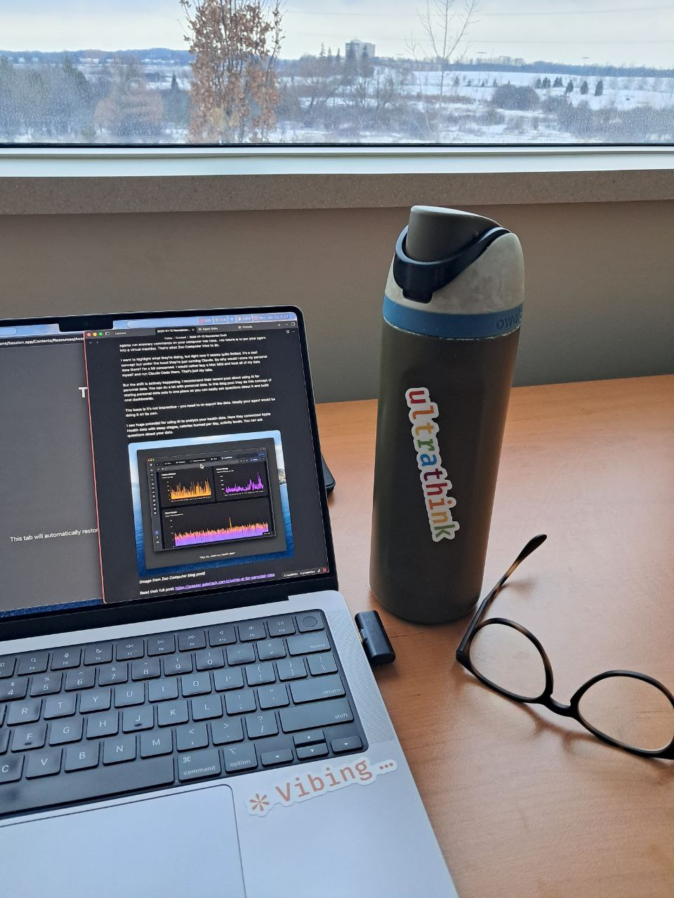

---

Artem
