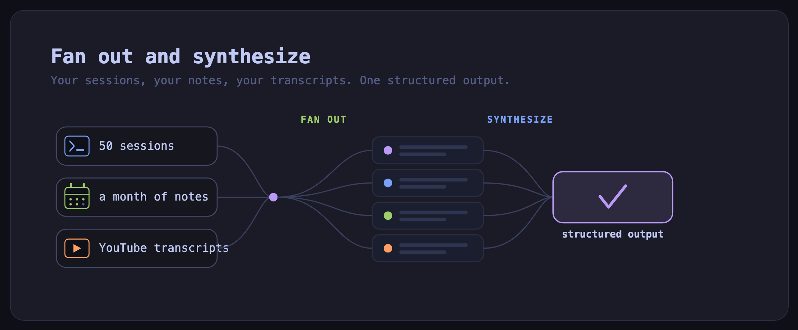
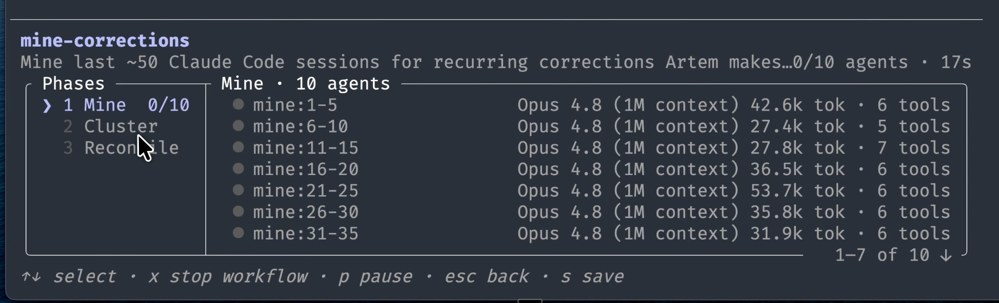
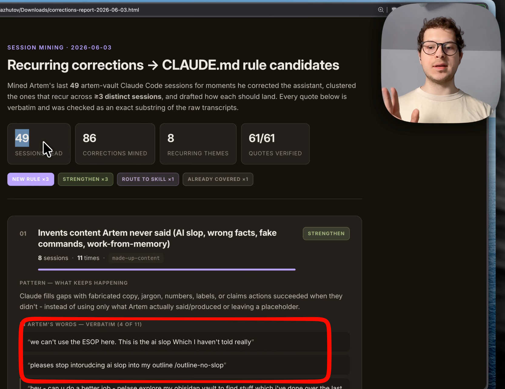
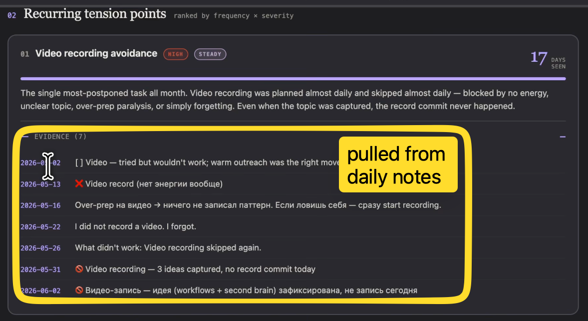
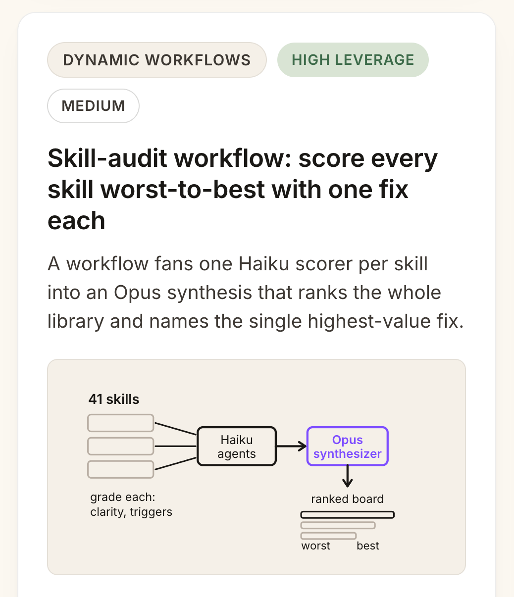
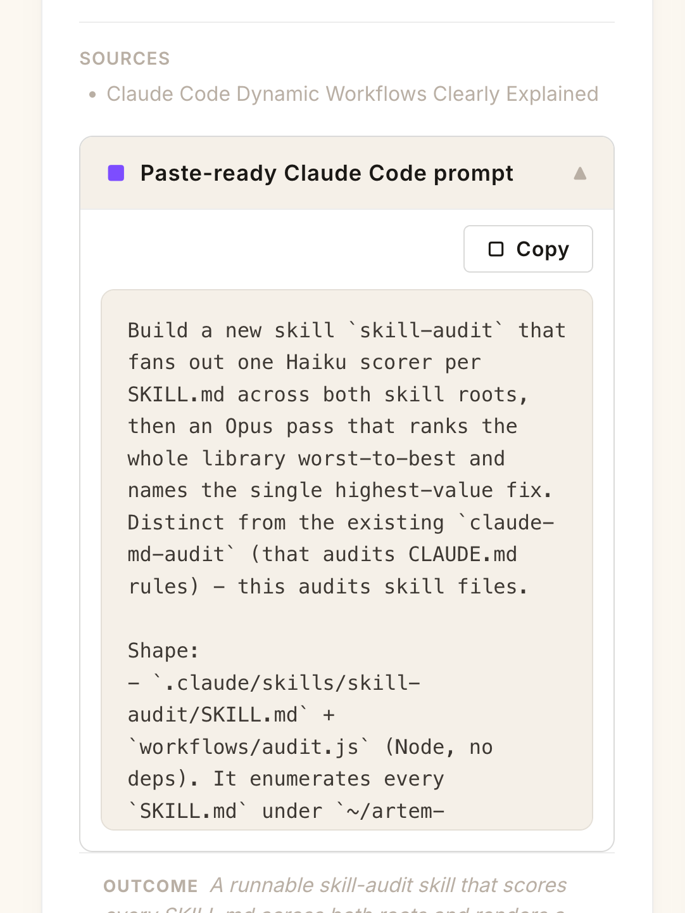
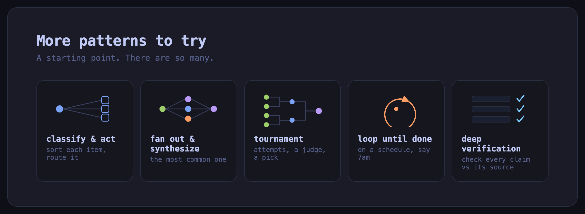

**This might be bigger than skills.**

---

Hey, it's Artem :)

Anthropic released a new feature called Dynamic Workflows.
At first I thought it was only for coders, but it's really not.
It's the biggest update in Claude Code since skills and subagents, and it changed the way I use my Obsidian vault.

You think this one's just for people who write code?
So did I.

If you are using Claude Code to run your life, all the knowledge you captured is sitting there.
Your sessions, your notes, your everything...
But now you can actually apply dynamic workflows reliably to extract insights and do meaningful work with it.

*Fan out and synthesize: point a workflow at your sessions, your notes, your transcripts, and get one structured output back. The most common use case across my Obsidian.*

Full video walkthrough here: https://www.youtube.com/watch?v=nlFJWYRSBiA

---

## What a dynamic workflow actually is

You can think about dynamic workflows as a script which orchestrates agents.
Claude writes those JavaScript programs to orchestrate different sub-agents.
So you don't hand-write the JavaScript. Claude writes the script for you.

The one building block is an agent. It has a model specification and an agent type.
Out of all of these agents, you can construct programs of two types.
You can execute those agents in parallel, or you can have a pipeline.
In our workflow we have a first phase as a draft, and then when all of those agents are finished, it goes into the second phase to check.

*The HTML report the workflow produced: 49 sessions analyzed, 86 corrections mined. Every quote is verified against the actual session, with my real verbatim corrections shown next to the proposed CLAUDE.md edit.*

---

## Why use dynamic workflows at all

There are a few problems which have been around with Claude Code and existing sub-agents.

One of them is agent laziness. If you hand Claude a big task, say analyzing 50 items in a security review, or your daily notes, or analyzing videos, it can stop the task before actually finishing it completely.

With a workflow, this is not really possible. What we are doing is actually executing a program, and it's deterministic. We are spawning all the sub-agents with isolated context, and there's an actual deterministic program that runs to make sure all of the items have been addressed.

Another problem is if you're working within the main Claude Code agent, it tends to have this self-preferential bias to prefer its own findings. With sub-agents, because each one has its own isolated context window, they're on their own, and that allows you to remove this bias.

The final point is a goal drift. Claude tends to drift about its initial goal which was set if you run a session over many, many turns. That comes from this problem of context thread, and because we have those sub-agents with isolated context, we can actually solve this issue.

---

## Mine your last 50 sessions for the corrections you keep making

I just asked Claude to set up a workflow and go through my last 50 sessions and turn them into recurring rules.

The prompt I used:

> go through my last 50 sessions and mine them for the corrections I keep making and turn them into CLAUDE.md rules

It's going to run 10 parallel agents to extract corrections, then there's going to be an agent to analyze those corrections, and then there are going to be final sub-agents to reconcile those against the existing CLAUDE.md.
While it's working, I asked it to produce an HTML report for me to review the corrections.

It came back with the findings. It created for me an HTML file with the recurring corrections and proposed edits to my CLAUDE.md.
We analyzed 49 sessions and had 86 corrections.

*A dynamic workflow running live in Claude Code. The three phases on the left run in order: mine, then cluster, then reconcile. In the mine phase, ten agents run in parallel, each Opus 4.8 with its own isolated context window, each working its own slice of the sessions.*

Now, you can think of those corrections as not itself valuable in a way, but I believe the value here is the fact that I can see the parts which are constantly repeating.
One of the themes which I'm repeating is about the words Claude fabricates, about AI slop, wrong facts. And here is a proposal for a CLAUDE.md rule.
I don't think putting those into CLAUDE.md is the best solution. I would package this into skills and make sure the skills reduce those mistakes.

You can go through all of them. And it's very, very fun to read your actual comments and text back to Claude, what to do or not to do :)

---

## Mine your last month of daily notes for what you keep postponing

You can apply the same pattern to analyze not only your sessions, but also your daily notes in Obsidian.

Here is my ask:

> go through my daily notes and extract the insights and patterns which keep repeating

We found we have 31 daily notes. It's going to run a Haiku sub-agent per note, and then there are going to be Opus sub-agents to synthesize a cluster across all of these notes.
Those Haiku sub-agents are very, very fast. They're almost finishing it in real time.

Here is my report. It finally came out.
Just wow. It's actually incredible. I just scrolled through it and it's eye-opening for me.
What I really love here is that Claude also provides evidence from the actual daily notes, the date and what bullet point it was.
Just mind blown, to be honest :)

*The daily-notes report: recurring tension points ranked, each one backed by evidence pulled straight from my daily notes, with the date and the exact bullet point it came from.*

Now with that workflow, you can analyze your daily notes at scale in a reliable and predictable format.
Each time, if you want to do this next month, you're going to have the same workflow and the results are going to be reproducible.

---

## Mine a NotebookLM notebook for ideas you can actually implement

I gave this to a NotebookLM notebook. This notebook contains my daily digest videos.
I asked Claude to first get the transcripts from NotebookLM for those videos, then run a detailed analysis for the ideas which I can implement in my Obsidian vault, and then give me actual prompts to set up each idea.

Claude is on the task, extracting the transcripts. After extraction there is a synthesize sub-agent, then there's going to be one sub-agent to create a paste-ready prompt for me to implement those ideas, and then the final stage is to render this as an artifact.
I'm very curious what it would come up with. That's something that I've never done before.

We are back, and here's the result: vault ideas from NotebookLM.
This one is very interesting. I really love it: a skill-audit workflow.

*One idea card from the board. A skill-audit workflow: a Haiku sub-agent scores each skill against a rubric, ranks them worst to best, and then an Opus synthesis names the single highest-value fix.*

You have a Haiku sub-agent, you have a rubric to score your skills, then rank them worst to best, then propose the fixes. And then you have this final Opus agent to run the score and create the HTML.
This one is something I would actually try.

And here is the prompt. The idea comes with a copy-paste prompt for me to paste into Claude and implement this idea.

*Every idea ships with a paste-ready Claude Code prompt. Copy it, paste it into Claude, and the workflow is yours.*

---

## Where this goes

I'm starting to realize that it's actually very, very big.
You can analyze any input. It could be a video, it could be your working sessions, it could be your daily notes, really any input, and get a structured output in the way you want.

Then you make a decision based on this report on what to do next. And you can make it even more actionable, just one prompt away. There is an actual prompt for you to paste into Claude to do this fix and implement this idea.

There are so many scenarios we haven't looked at.
We touched on classify and act.
We touched on fan out and synthesize. That's the most common use case across my Obsidian.

You can run a tournament pattern where you have attempts, maybe synthesizing video ideas, and then you have a judge for how good each idea is, you do the scoring, and then there is a final pick for that tournament.

Another scenario is loop until done. I imagine it could be on a schedule. If that's a daily digest, you can run it on a daily basis, say 7am: go to YouTube, get transcripts, create this report for me.

Another idea is using it for deep verification. Say you have a report or an article, then you have a claim extractor that gets each claim, and then you have a workflow which goes through each claim, analyzes the source, checks the source, do it across every claim, and then you get a final verified report.

*A few more patterns to try: classify and act, fan out and synthesize, tournament, loop until done, deep verification. Just a starting point, there are so many.*

There's also a question about how to pair it with skills.
What I found over the last week: I don't want to have a separate workflow. I keep everything self-contained within the skills.
Say if I have this deep-verify skill, I have a skill.md file, and you can add this workflow inside of it, which is a JavaScript file that encodes this workflow. Within this skill, I can ask Claude to run this workflow to check each claim in its own sub-agent.
That's what I found works the best. I don't want to contaminate or blend my skills with the workflow. I just want to work with one entity, which is skills, and then I bring the workflows into the skills.

I believe that's just a starting point for us to play with this new technology. There are so many use cases, it's very, very big.

Now that you know how to create and use workflows, I recommend you check out the video about NotebookLM.
I'll see you in the next one.

---

## Resources

Full video walkthrough - the complete build, live.
https://www.youtube.com/watch?v=nlFJWYRSBiA

Dynamic workflows, from the team that built them - Thariq's writeup.
https://claude.com/blog/a-harness-for-every-task-dynamic-workflows-in-claude-code

---

