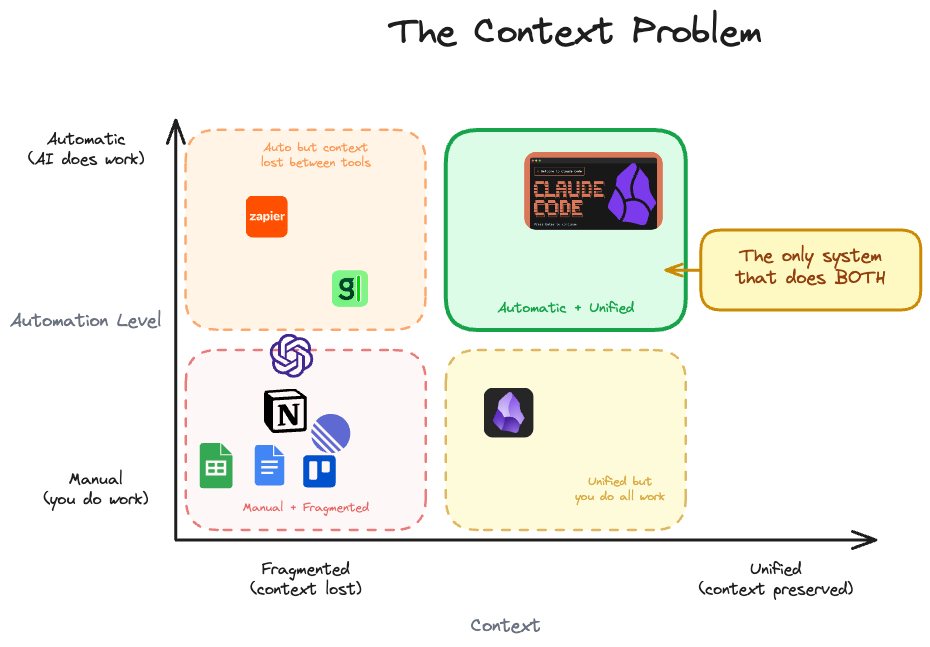
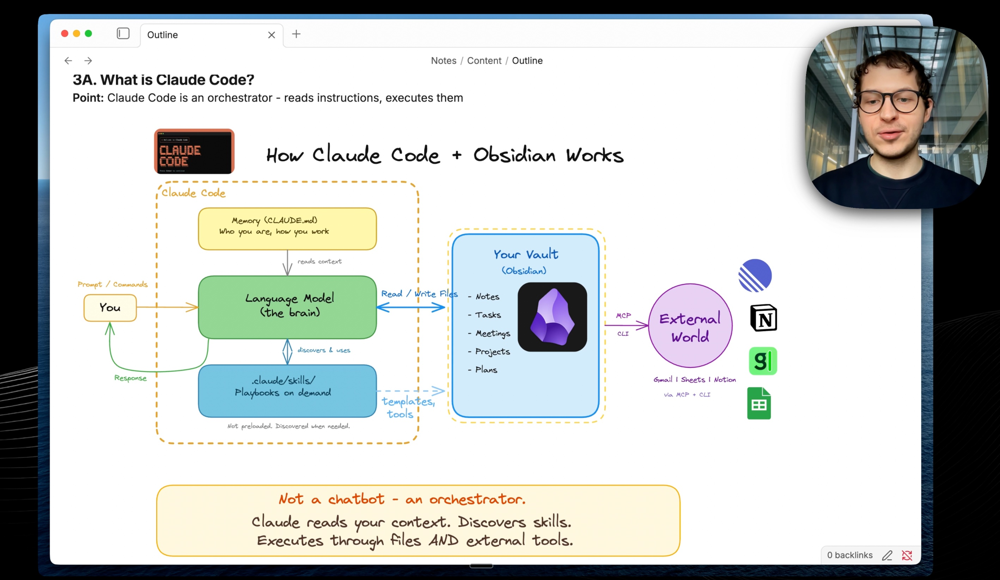
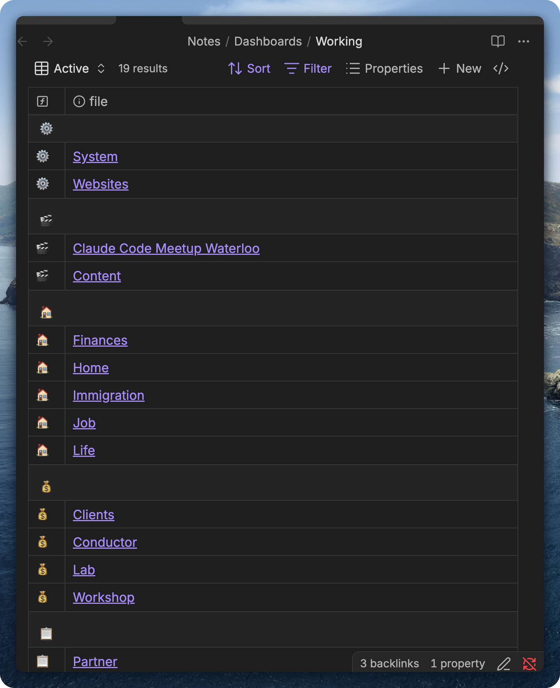
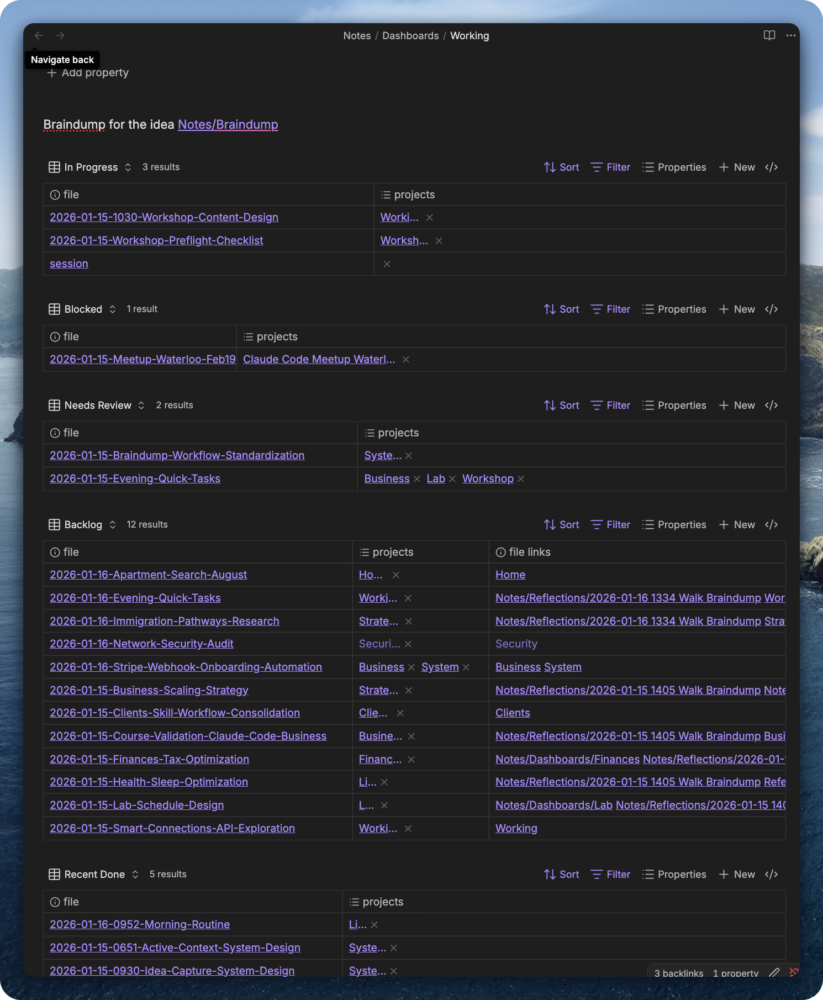
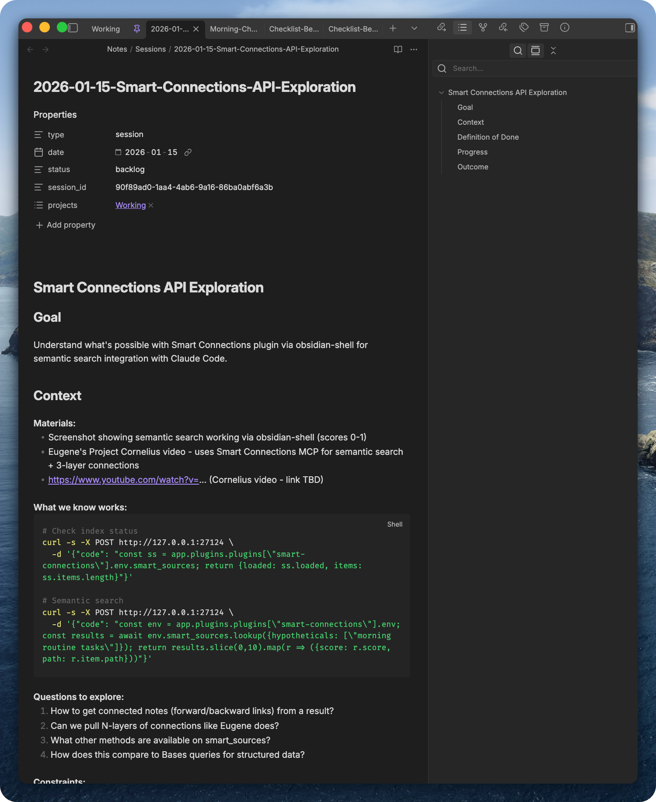
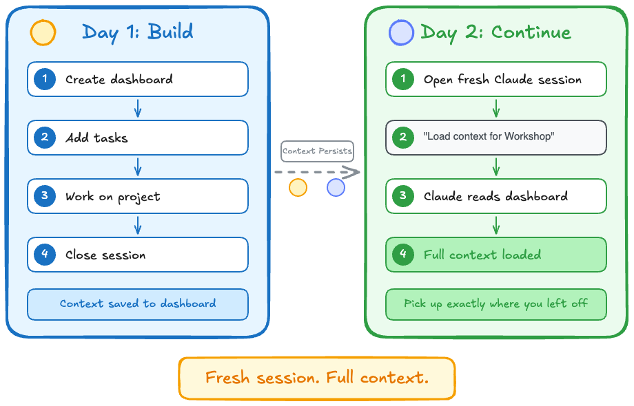

*Stop explaining your context to AI every time.*

## New Video: How to Make Claude Code Remember Your Projects

The moment I saw how Obsidian Bases work, how easy it is to filter your notes and build different views, I thought: what if we connect the agent to Obsidian Bases? That seemed like a huge unlock. I was frustrated by not having reproducible workflows.

The video is about how to stop explaining context to AI every time you start a conversation. How to create sessions files. How to build dashboards that let you load project-specific context in a context efficient way.

When we combine Claude Code and Obsidian, we get a system with high autonomy and unified context. That's what makes it powerful.

ChatGPT has some autonomy but the context is scattered. You need to copy-paste from ChatGPT.

The solution is to put all your stuff in one place, one folder. Claude Code can search through your projects, your notes - that works up to a point.

The real solution is to structure your data using frontmatter and use Obsidian Bases to display it. Then make Claude read those Obsidian Bases so you can have workflows: "What are your active projects?" "What are your clients?"

It becomes a dashboard with all the context you need.

You can use dashboards for anything: learning something, job application tracker, client management. Knowledge workers, people working with clients, managing different workflows.

https://youtu.be/jRjFYq-SEUk

---

## The Dashboard Pattern

The unlock is you can see exactly what data gets loaded into Claude Code. It reads the Obsidian files the same way you see them in Obsidian from Bases. That's huge. You get reliable data loading rather than relying on Claude Code search, which is not efficient.

You can build a dashboard for any type of information as long as you can put it into an Obsidian Base. And you can put literally anything into a Base: bookmarks, clients, blog posts, content, working sessions with Claude. All of that has a dashboard.

*19 dashboards - each one is a context I can load*

Here's my Working dashboard. It tracks active sessions with Claude Code and sessions in backlog.

What I put there is accumulated context. When I go for a 30-minute walk, I record myself, my ideas. I'm not focused on one topic, just jumping around. Then I transcribe it and have a braindump skill that distributes my ideas across dashboards. Sessions in the backlog get more context filled in. New sessions emerge with all context prepared for the agent, ready to work.

*Working dashboard - In Progress, Blocked, Needs Review, Backlog*

Here's what a session in backlog looks like:

*Session file - goal, context, code snippets, questions to explore*

### Switching Context

In terminal I just say "switch to [project]". Claude reads the dashboard, queries linked sessions and tasks, shows me the full picture.

Here's how context persists across days. Day 1: you build - create dashboard, add tasks, work on your project, close session. Context saved to dashboard. Day 2: you open a fresh Claude session, say "load context for Workshop", Claude reads the dashboard, full context loaded. You pick up exactly where you left off.

*Fresh session. Full context.*

The pattern:
1. Dashboard has embedded Obsidian Bases views
2. Claude reads the dashboard, sees the embedded views
3. Claude queries the Bases, presents the context
4. I know exactly where I left off

The dashboard is self-documenting. Claude can read what you see.

This pattern is both agent and human-friendly. You can see exactly what goes into Claude's context. It's not full files, just a table view. Claude sees the embedding of the Obsidian Base, knows how to query it, and gets the same frontmatter you see. Tables are in JSON format.

It's context-efficient because you only feed the table view, not the full files. Scalable. And the beauty is Claude reads my previous sessions working with this project. It knows exactly where I left off.

### This Works for Anything

The concept is general. You have notes, you want to query them, organize them, see what's relevant. Build a dashboard.

Resources - articles, bookmarks, references. Show untagged items, by category, by status.

Meetings - meeting notes, transcripts. Show by person, by project, what needs follow-up.

Content - ideas, drafts, posts. Show by stage: idea, draft, ready, published.

Clients - leads, conversations, next actions. Show who needs attention.

Whatever you track, you can build a dashboard for it.

This is what we're exploring in the [Claude Code + Obsidian Lab](https://lab.artemzhutov.com) starting this week - hardware engineers, software developers, business owners learning to integrate AI with their workflows.

The most important mindset shift: engineer actions around your notes. Not just where to put an idea, but what happens to it later. For example, I have an idea and I want to understand how it goes into my newsletter so I don't write a newsletter from scratch. The ideas are already there.

Previously notes were just sitting there for years, doing nothing. Passive store of information. Now we embrace a new mindset where notes are context for agents and they help us do our work better.

---

## Personal Tools = High Leverage

You can reverse engineer any software now. Just ask Claude to explore the folders.

Example: Granola saves transcripts locally in a cache on your computer. I asked Claude "how does Granola work?" and we explored the folders together. Within 10 minutes we wrote a Python script to sync those transcripts to Obsidian. I captured it into a skill: https://github.com/ArtemXTech/personal-os-skills/tree/main/skills/granola

For Substack, the pain was you write content in Obsidian, then you need to transfer it to your blog, then to Substack. Substack requires specific formatting. The annoying part is getting the formatting right, avoiding doing the work twice. I just want stuff in my clipboard. Solved it now: the agent creates an HTML page with my blog post locally, I copy and paste into Substack.

---

## Clawdbot: My experience

There's been a lot of hype around [Clawdbot](https://github.com/steipete/clawdis). It's a truly powerful tool. But here's my experience.

I tried it. Even bought a Mac Mini for it in late December. It didn't stick for my usage patterns. For me, the most productive setup is terminal with Claude Code on the left, Obsidian on the right. I don't really need to execute remote tasks from Telegram.

The main issue is observability. It's hard to see what the agent is doing. When people claim "I have this employee, this thing just produced my YouTube script" - that sounds crazy to me. I spend so much time to get my outline right, and the output the agent produces by default is just garbage.

I could see Clawdbot being useful as an intelligent inbox. Capturing braindumps, images, any data that goes into your Obsidian vault. It can reason about everything. But for creative output? Not there yet.

The solution: use predictable workflows you've tested before. Skills you trust. If you can make sure the agent runs those skills, you can see it's on track. But getting those skills working requires prior testing.

---

## Security: Be Very Careful

I tried Clawdbot and realized I didn't turn on the setting in Telegram to allow people to add the bot to public channels. That's one attack vector I was exposed to. I started caring much more about security, trying to close all my ports.

It's dangerous to run these tools without understanding the exposure. See [this thread](https://x.com/theonejvo/status/2015401219746128322) about Clawdbot security issues.

So I set up two YubiKeys and I highly recommend putting two-factor authentication on that stuff.

I did a full security overhaul inspired by [Karpathy's Digital Hygiene Guide](https://karpathy.bearblog.dev/digital-hygiene/). Set up 1Password, imported 273 passwords, disabled remote access software like TeamViewer, hardened SSH to key-only. The YubiKeys go on 1Password, Google, Apple, GitHub.

---

## Let's Discuss

What have you tried? What works, what's not?

Join our Discord community to discuss Obsidian and Claude Code integration: https://discord.gg/g5Z4Wk2fDk

Artem
