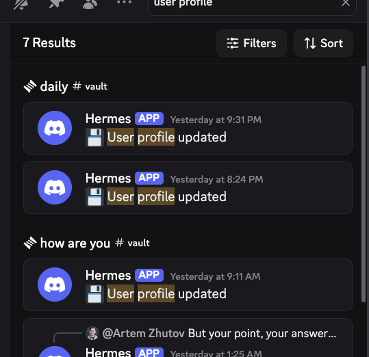
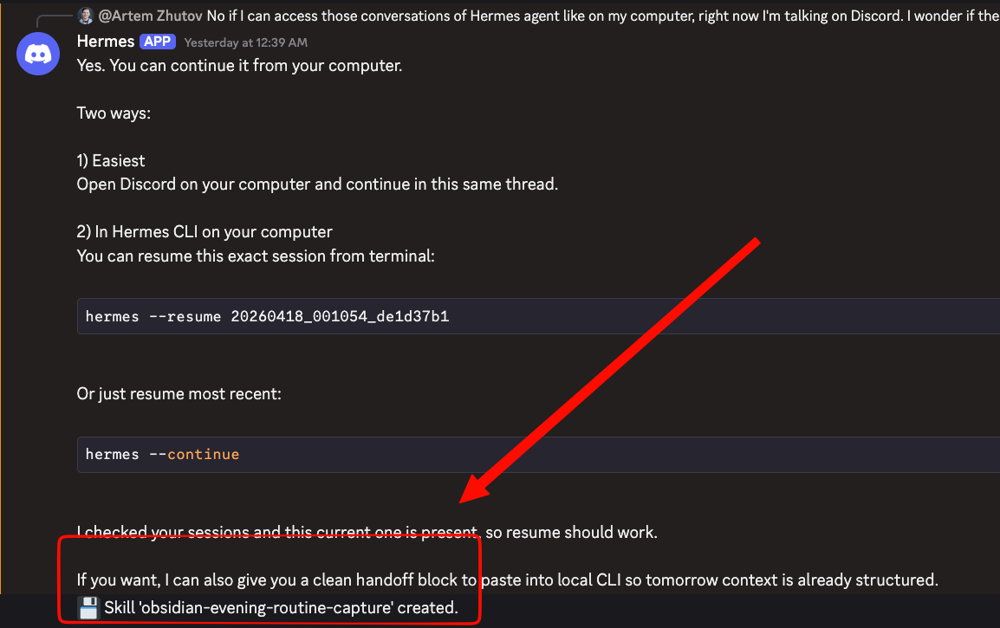
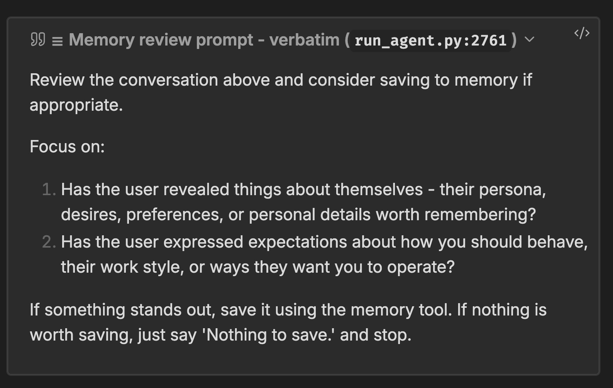
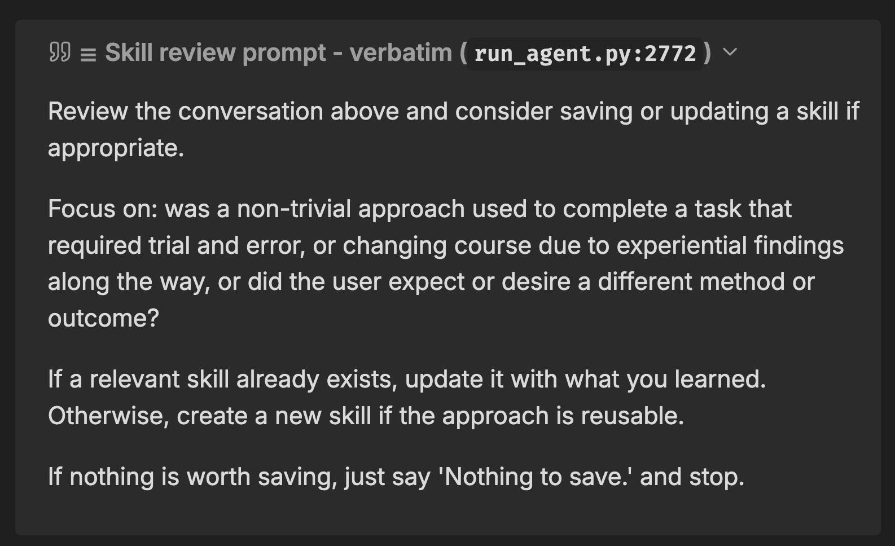
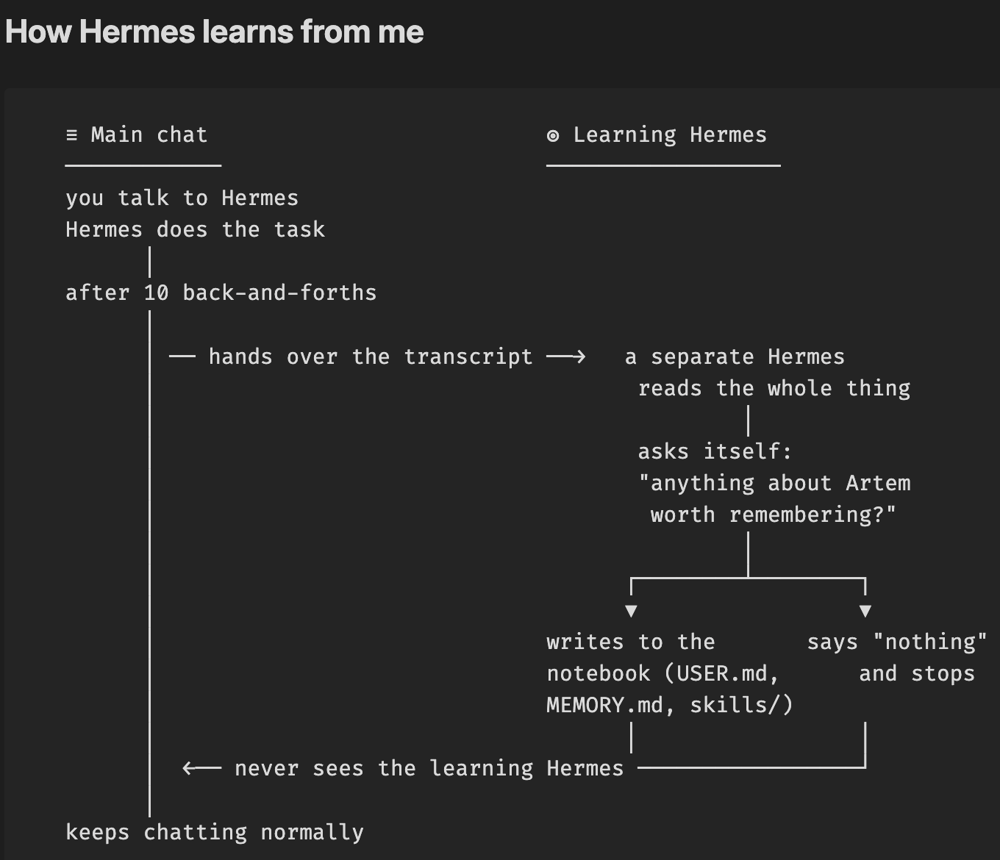
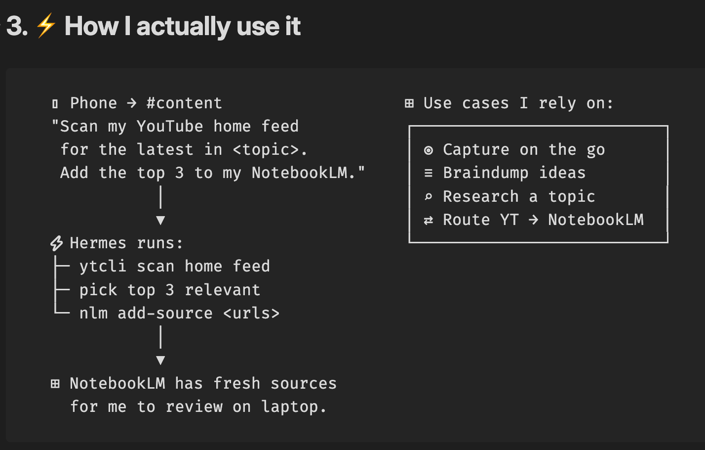
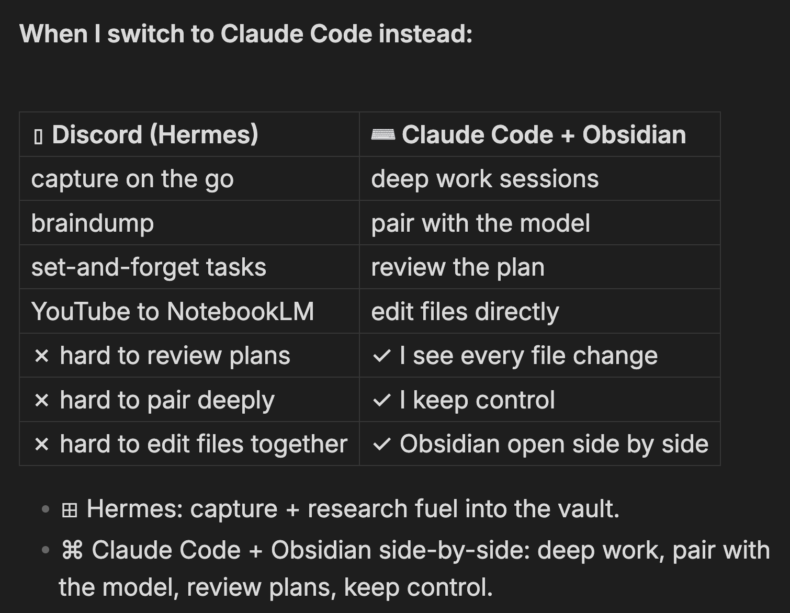

**After 10 turns, it updates my user profile. After 15 tool calls, it updates my skills. While I just chat.**

---

I didn't have a proper way to talk to my Obsidian on the go.

I wanted an agent I could set and forget. Reliable, with isolated Discord channels for different areas of my life.

As a bonus I didn't expect, this agent has been learning from me.

This is a Hermes agent. You can run the same setup yourself.

## The bonus I didn't expect

I've been running it for the last week. A few things happened I didn't expect.

It wrote 7 entries into my user profile on its own.

I was working with the agent on some task. On its own, it created the skill at the end of the workflow once I finished. I haven't seen that anywhere else in any agent. Truly novel.

What happened: I was searching for YouTube videos for sources, going to import them into NotebookLM. Once I finished, Hermes in the background captured the pattern and created a skill for me.

It happened again with my evening review. Here is the receipt:

I didn't even have to tell it anything to do that. We create skills on our own. Here the agent just does the job for us.

## How the learning works

Here is the key feature. The agent has a self-improvement loop.

Three triggers, running in the background:

1. After 10 user turns, a memory review agent updates my USER.md.
2. After 15 tool iterations, a skill review agent updates my skills.
3. When a session has been untouched for a couple of days, at 4 AM Hermes runs a final pass and learns from it.

I dug into the source code. The exact file is the prompt the agent uses for each pass.

Inside one cycle the loop looks like this. I chat with Hermes. Back and forth. After 10 turns, a separate agent (you can think of it as a learning Hermes) gets the transcript. It reads the chat. Asks itself: anything about Artem worth remembering? It writes to USER.md, MEMORY.md, or skills. If there is nothing worth saving, it stops. The main chat never sees the learning Hermes. I just keep going.

That is a key innovation. I haven't seen that anywhere.

## One persona per Discord channel

If you use Discord, there is also a config file where you can set up skills per channel.

If I want to do a coding task, I do it in a build channel. If I want to do content, I do it in a content channel. I specifically limit the set of skills per channel. Very handy to limit the scope and the focus.

There is also a great addition: you can set the personality of the agent.

For my vault channel (where I interact with my Obsidian), I prompt the agent with a persona. Where my daily notes go. Always use wikilinks. Here is my vault structure.

I think of it as a CLAUDE.md for my Discord channel. I define the scope of what is happening there to help the agent.

Very flexible. You can create a multi-agent setup. Discord channels, one for each area of your life.

## Where Hermes fits, and where Claude Code fits

From my phone, in Discord, I can ask: give me a list of my home feed videos.

I can be anywhere. Just on my phone, through Discord. I can run all of the skills I developed the last year. Just one command. In real time, I get my home feed videos.

I can ask anything about those videos. Put them into NotebookLM. Run them through my familiar workflows. That's a huge unlock.

Capture on the go. Braindump. Research. Things I can run reliably while I work on something else.

When I want to do real work (pair with an agent, review the plans, be very strict to avoid AI slop), I switch to Claude Code with my Obsidian side by side. Just a new tab. Claude Code, my Obsidian vault. Really be a human in the loop.

Hermes is my capture inbox and the start of fuel into my world.

## Try it

Watch the full walkthrough: [Hermes Agent + Obsidian on YouTube](https://youtu.be/L0hs3-xBjJE)

Install it yourself: [the Hermes Agent quickstart](https://hermes-agent.nousresearch.com/docs/getting-started/quickstart)

Really exciting times to start using it.

---

Cohort 3 of the Claude Code x Obsidian Lab starts May 5.

We integrate AI agents with our context in Obsidian to build a personal operating system. Five weeks of live sessions.

This cohort I have capacity for 10 people. Early bird price now, before it goes up next week.

[lab.artemzhutov.com](https://lab.artemzhutov.com)
