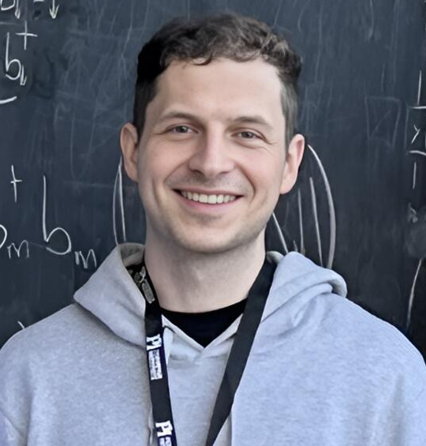
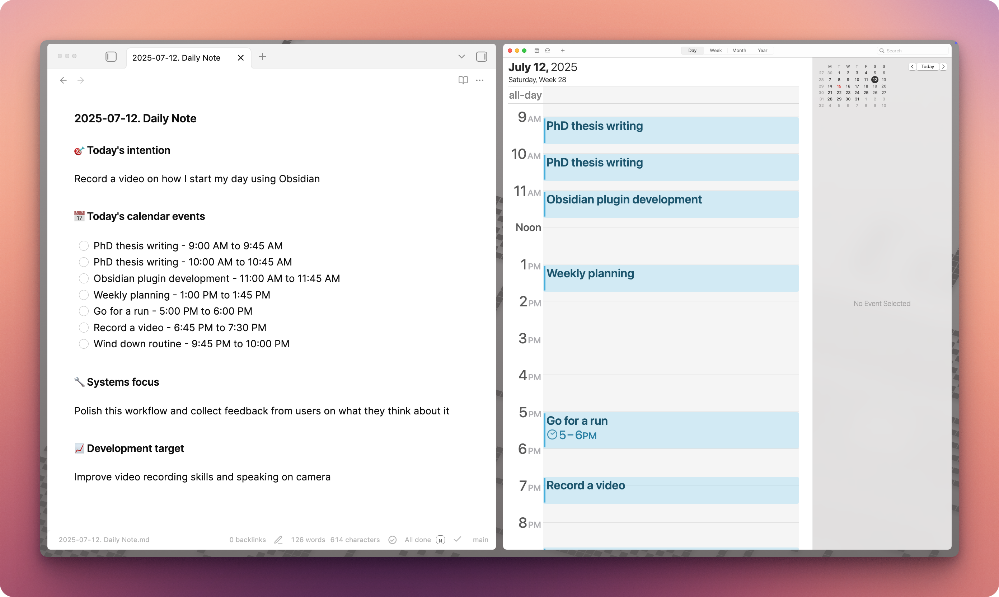

# Hi, I'm Artem

I'm a Physics PhD student at the Institute for Quantum Computing, Canada.

I build Obsidian automations.

<a class="btn btn-primary" href="/I-Built-a-Personal-AI-Assistant-for-My-Day-in-Obsidian">Read latest post</a>

<a class="icon-btn" aria-label="GitHub" href="https://github.com/ArtemXTech/"><svg viewBox="0 0 24 24" aria-hidden="true"><path class="fill" d="M12 2C6.48 2 2 6.7 2 12.5c0 4.6 2.87 8.5 6.85 9.88.5.1.69-.22.69-.49 0-.24-.01-.88-.01-1.73-2.78.63-3.37-1.22-3.37-1.22-.45-1.18-1.11-1.5-1.11-1.5-.91-.65.07-.64.07-.64 1 .07 1.53 1.07 1.53 1.07.9 1.61 2.37 1.15 2.95.88.09-.67.35-1.15.63-1.41-2.22-.26-4.56-1.17-4.56-5.21 0-1.15.39-2.08 1.03-2.82-.1-.26-.45-1.31.1-2.73 0 0 .84-.28 2.75 1.07.8-.23 1.65-.35 2.5-.35.85 0 1.7.12 2.5.35 1.91-1.35 2.75-1.07 2.75-1.07.55 1.42.2 2.47.1 2.73.64.74 1.03 1.67 1.03 2.82 0 4.05-2.35 4.95-4.59 5.2.36.32.68.94.68 1.9 0 1.37-.01 2.47-.01 2.81 0 .27.18.6.69.49C19.13 21 22 17.1 22 12.5 22 6.7 17.52 2 12 2z"/></svg></a>
<a class="icon-btn" aria-label="YouTube" href="https://www.youtube.com/@ArtemXTech"><svg viewBox="0 0 24 24" aria-hidden="true"><rect x="3" y="6.5" width="18" height="11" rx="3" ry="3"></rect><polygon class="fill" points="11,9 16,12 11,15"></polygon></svg></a>
<a class="icon-btn" aria-label="X" href="https://x.com/artemxtech"><svg viewBox="0 0 24 24" aria-hidden="true"><path d="M3.5 3.5h3.9l5.2 6.9 5.4-6.9h2.9l-6.9 8.6 7.5 8.4h-3.9l-5.6-7-5.5 7H3.7l7.4-9L3.5 3.5z"></path></svg></a>
<a class="icon-btn" aria-label="Substack" href="https://substack.com/@artemxtech"><svg viewBox="0 0 24 24" aria-hidden="true"><rect x="3" y="4" width="18" height="16" rx="3" ry="3"></rect><line x1="6" y1="8" x2="18" y2="8"></line><line x1="6" y1="11" x2="18" y2="11"></line><line x1="6" y1="14" x2="18" y2="14"></line></svg></a>

<section class="home-posts">
  <h2>Posts</h2>
  <article class="post-card">
    
    

      <time datetime="2025-07-15">July 15, 2025</time>
      <h3><a href="/I-Built-a-Personal-AI-Assistant-for-My-Day-in-Obsidian">I Built a Personal AI Assistant for My Day in Obsidian</a></h3>
      
How I automated my morning routine with a voice-driven AI agent that creates daily notes and manages my calendar using macOS Shortcuts, Obsidian, and Claude Code.

    

  </article>
</section>
