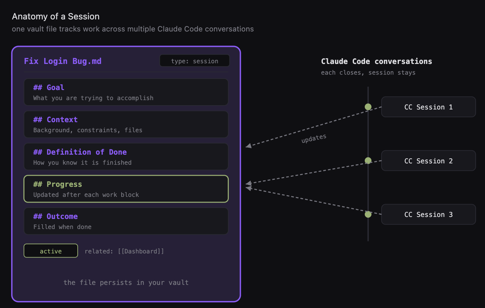
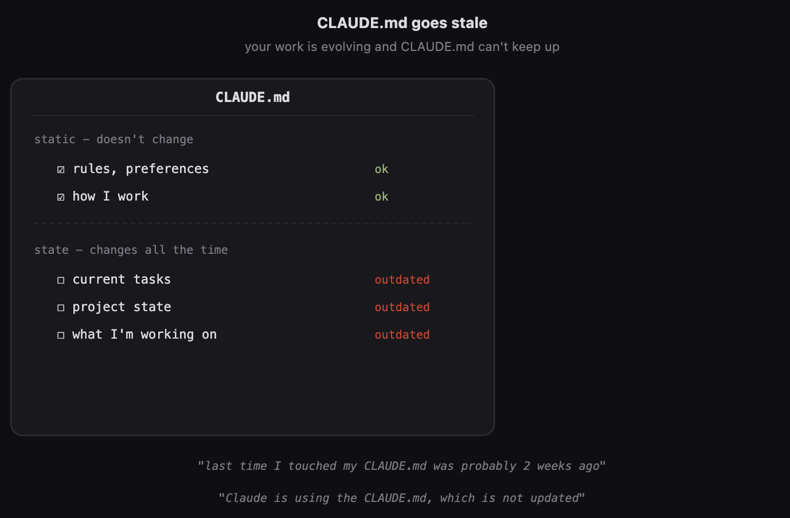
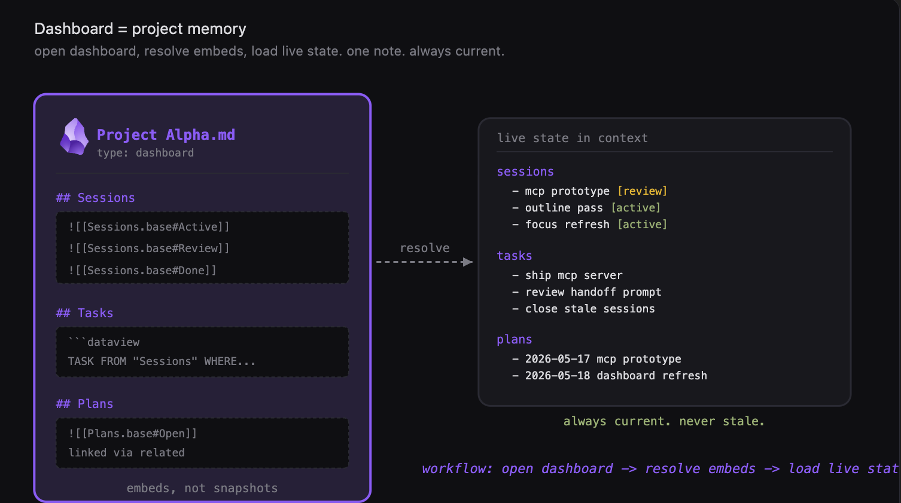
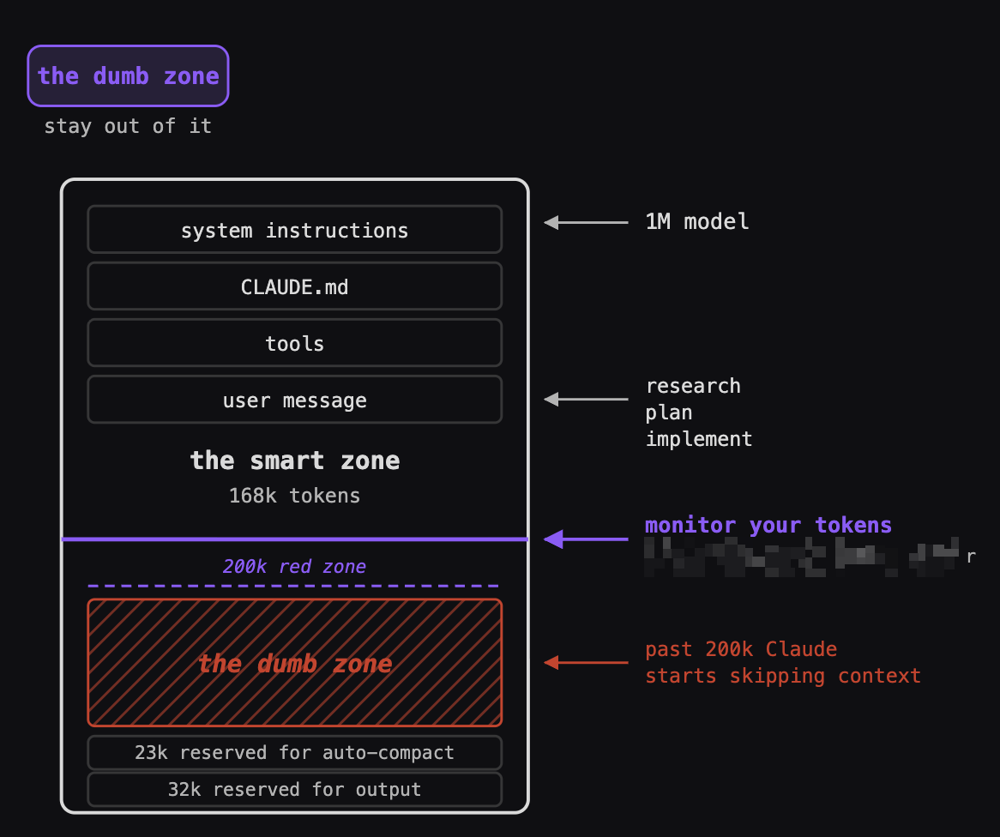
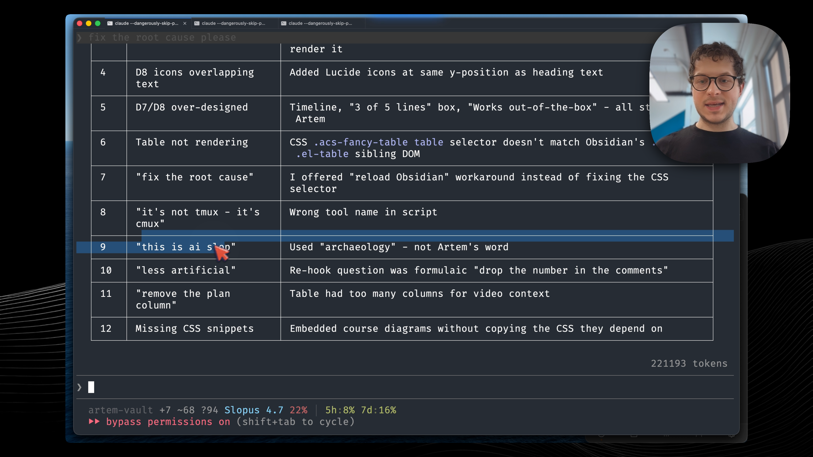
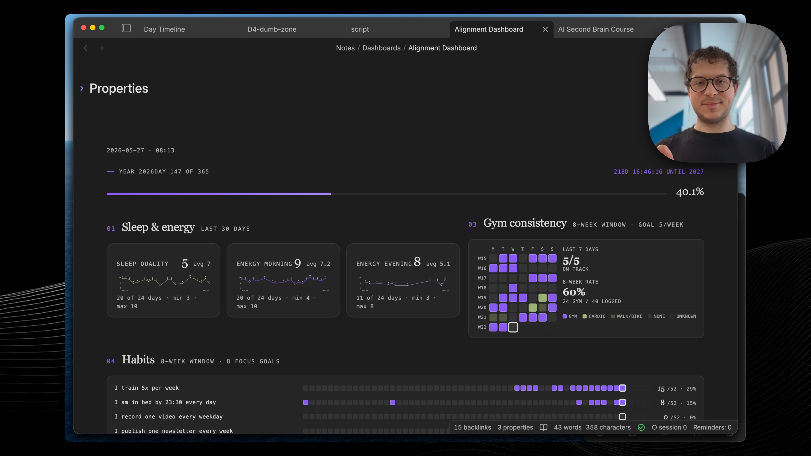

**Three things that fix the context reestablishment tax: session files, dashboards as dynamic memory, and handoff prompts.**

---

Hey, Artem here.

Every Claude Code session starts with 5 to 15 minutes of context establishment.
You manual through old conversations, finding where things left off.
Your most common prompt becomes "hey, what was I working on?"

Close a Claude Code window and the context is lost.
You need to reestablish it.
You do the same work again next time.
Okay, how do I find those two files?
Which files did they create, what decisions were made?
All of that you need to explain every session.
This really wastes so much energy...

You have a bunch of Claude Code sessions and there is no end to them.
No way to capture the state of the work on this project.
The next day you just close everything, it gets too crowded, and you start everything from scratch.

Sound familiar?

I'm going to show you three things: a session file that survives across your Claude Code conversations, an Obsidian dashboard that gives you a live project state instead of stale CLAUDE.md, and a handoff prompt that transfers exactly what matters to your agent.

Full video walkthrough here: [Watch on YouTube](https://youtu.be/t5urHpMrlF0)

---

## A session file that survives across conversations

*One session file in your vault tracks work across multiple Claude Code conversations. Each conversation closes, the session stays.*

A Claude Code session is just a single chat conversation.
You have the terminal, and once the context gets filled up - in my case I've spent more than 200k tokens in the session - the context window is full but my work is still not over.

A session file lets you keep track of multiple Claude Code conversations.

It's just a markdown file.
It contains a goal you want to achieve, the background context on this project, definition of done.
The core idea is to capture the progress as we work.

Once the context window fills up, we update our progress status in this note, then we transfer the context to another agent, another Claude Code session, to start fresh.
This way you can capture your work across sessions, multiple days.

I have this project - I'm developing a course right now.
I have those working sessions inside of this dashboard.
It displays what I was working on, and here we are capturing the progress, what I've done that session.

Those session files can span multiple Claude Code conversations, multiple days of work.
Each of your Claude Code sessions has its own session file with the ability to track the state of the project you're working on.

---

## Your CLAUDE.md goes stale - dashboards give you live state

Having a session file for your project is still not enough to capture the complete state of your project.

*Rules and preferences stay current in CLAUDE.md. But current tasks, project state, what you're working on - that goes stale quickly.*

This is where we introduce dashboards, which enable dynamic memory.

Those dashboards can contain the project state, work in progress, current tasks, sessions, context, working plans.
This is something that changes all the time based on the current state of the project.

The old way to manage your memory - things which don't change much, like your working style, who you are, what are your preferences, how do you like to interact with AI, what are your key constraints - that's CLAUDE.md.

But the dashboard contains overview of the project, sessions, plans, open tasks.
What I really love is they're using the data from the files which contain a link to this dashboard.
You can aggregate all of the sessions, all of the plans.
You can do it for any type of your projects, for any type of your files.

*Open dashboard, resolve embeds, load live state. One note. Always current.*

Here is how this works.
I provide this dashboard to Claude Code and tell it to read it.
I tell it, okay, let's load the state of this project.
It reads the markdown file.
It sees the embedded queries and then resolves them with Datacore.
Now the most important piece - we dynamically resolved those queries.
We have plans, we have all attached session files.
Now the agent can see everything that is happening there.
This way we just loaded our memory dynamically and can continue working where we stopped.

To sum it all up - you have a markdown note, you have embedded views, it could be Bases, it could be Dataview.
All of our sessions, with our tasks, with our plans.
We can ask Claude to resolve those queries, and in the end just get a table, loaded into the Claude Code context.
You can ask it to read the files or not to read the files, it's your decision.
But the main idea is that we are here aligned with Claude.
Claude sees exactly the same picture as I do.
I can continue working where I left off.
Very, very convenient.
I use it all the time.

I recommend you to audit your CLAUDE.md to see what's there and updated.
Move out all of your dynamic changes into dashboards, to make sure that you always have up to date memory.

---

## The dumb zone - what happens when context fills up

What happens if you hit your context limit?

*Past 200k tokens Claude starts skipping context. The smart zone is where your best work happens.*

Imagine that your one million context window is this whole box.
You have loaded your system prompt plus memory instructions, and you keep executing, you keep working with Claude until you hit what I define as the dumb zone - around 200k tokens, that's my rule.
If you're doing software engineering, the rule might be a bit more strict.
People say okay it's around 150k tokens, it's somewhere in that zone.

Claude starts cutting corners.
Just becomes lazy, becomes forgetful.
Continuing to work beyond that many tokens is just a waste.

The standard way is to do compaction.
There is this compact command that frees up context by summarizing the conversation so far.
This command is great and it solves this issue, but I have a few problems with that command.

One of the problems is I can't capture learnings right now with that command.
How do I transfer the context to another agent?
I want to write this information in my Obsidian into a session file.
That's the first piece which I'm missing.

The second piece is that this command is not flexible.
I can't change the prompt for compaction because it's a built-in command, I have no control over.
What if I want to start a new session, with a plan, what was done before, and the proposed next steps?

---

## Handoffs - you control the transfer

This is where a handoff prompt comes into play.

You have your Claude Code sessions.
Let's say you've been working with a Claude Code session and you hit 200k tokens.
That's the rule of thumb for me.
Models have a 1 million token context window.
The hard limit for me is 200k tokens.
What I do from there is I run this handoff command which captures what I've done in that session, what are the next steps, and what is the intent for the next session.

Before closing my session I also run a retrospective skill, which I showed in one of the previous videos, to capture the learnings.
In this session I was building the outline for my video, preparing the presentation, and there were a few moments which went wrong.
Claude made 12 corrections.
I'm saying okay, this is banned, this is AI slop.
We are analyzing what is the work which we have redone, and then we are proposing changes to our skills.
Here are the proposed diffs, which I agree with, I tell it let's apply those diffs.
This is extremely valuable so that next time, whenever I go through this workflow, I don't have to explain again that something needs to be done in this particular way.

*Running a retrospective before closing the session. 12 corrections - "this is AI slop" - each one becomes a permanent skill update.*

Now the agent generates a handoff file.
It schedules this auto-continue.
I'm not touching anything right now.
The agent just types in the next prompt and starts a new session.
It tells the other agent - okay, here's a handoff, follow the instructions, this is continuation from a previous session.
This is what was done, this is the current state, and here are the next steps.

So now we are in a fresh context window.
We started everything clean and we can continue our work this way.

If I want to park this, I would type "handoff park" - then we would update our progress in the session file in Obsidian, and this way we can capture the current state of the project.
Then whenever I want to continue on this project - even if it's a week later - I can just read it from the session file in Obsidian directly.

I use a terminal called cmux for this.
It's useful because the agent can actually programmatically interact with this terminal.
It can type to any terminal window which is open.
So I use cmux to restart my work automatically :)

---

## Try it

You don't need all three pieces at once.
Start with one session file for your most active project.
You'll feel the difference on your first "continue" - instead of re-explaining, you just work.

Now that you know how to never lose your context, you might also want to build a dashboard for your life.
I'm going to show you how to build one in the next video.

*My alignment dashboard - sleep, gym, habits, all in one place. This is the next video.*

---

## Resources

Full video walkthrough - I demo all three pieces live.
[Watch on YouTube](https://youtu.be/t5urHpMrlF0)

Join the community on Discord: https://discord.gg/g5Z4Wk2fDk

---

Artem <3
