**20 YouTube videos become cited notes, audio, and a knowledge graph in Obsidian**

---

You end up with 100 tabs, you never process, and then you just close everything and forget about it. You lose citations.

I tried connecting NotebookLM to my research months ago and gave up. Too slow. Adding sources manually in the browser, one by one, clicking through the UI. NotebookLM supports up to 300 sources - that's the number that makes it different from just asking Claude - but who's going to drag 300 files into a browser window?

Now it's different. I built a Claude Code skill that does everything from terminal. 20 YouTube videos become a knowledge graph I can walk through. [Watch the full walkthrough (33 min)](https://youtu.be/qiOu7Ptjxng)

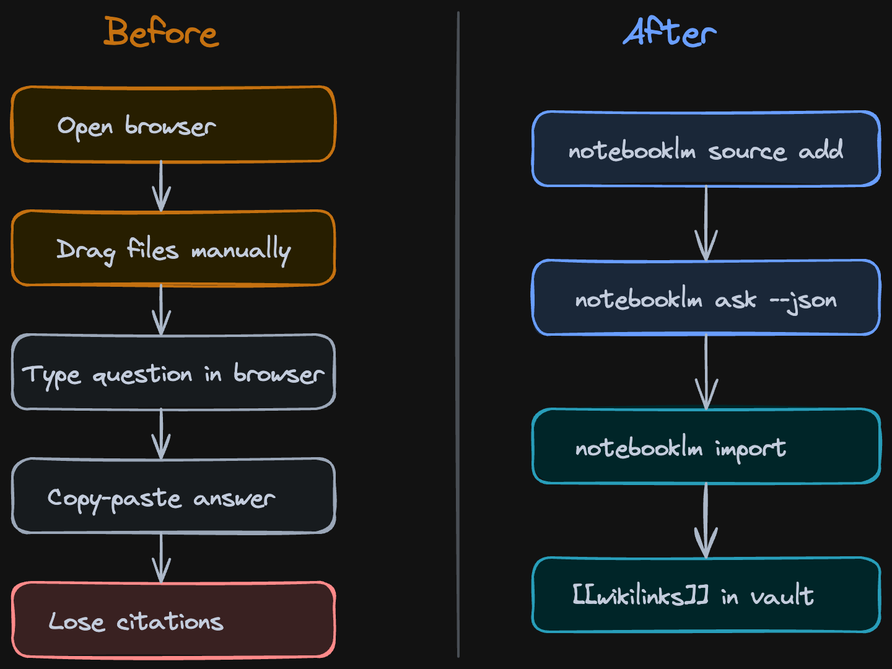
*Before: 20 browser tabs, copy-paste, lost sources. After: one terminal command.*

NotebookLM is Google's research tool. You give it sources - YouTube videos, PDFs, web articles, your own notes - and it reads all of them. When you ask a question, it gives you a cited answer pointing to exactly which source said what. No hallucination, because it only uses what you gave it.

The key difference from the browser workflow: I have much more granular control over the sources. Instead of NotebookLM's built-in suggestions that recommend whatever it thinks is relevant, I pick exactly what goes in. I can search YouTube from terminal, see the results, and choose which videos to add. This way you increase the signal-to-noise ratio.

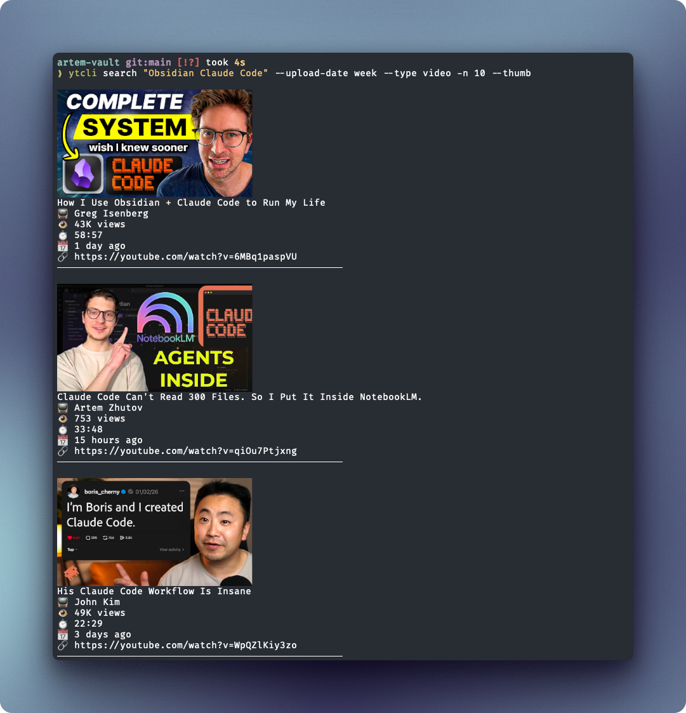
*Searching YouTube from terminal with ytcli - I pick the exact videos that become research sources*

You can set a custom persona per notebook - tell NotebookLM to respond concise and direct, or in whatever style fits your research.

---

## The Research Workflow

I wanted to research what other people are building with Claude Code and Obsidian. Instead of watching 20 YouTube videos at 2x speed and forgetting what video 2 said by video 6, I ran three commands:

1. Search YouTube for relevant videos
2. Create a NotebookLM notebook and add all 20 as sources
3. Ask questions and get cited answers

```bash
notebooklm ask --new --json "What are the gaps in these videos?"
```

One terminal. No browser tabs. Claude Code orchestrated the whole thing. [Watch: Live demo from terminal](https://youtu.be/qiOu7Ptjxng?t=238)

The citations are what make this useful. When NotebookLM says "three creators mentioned using Obsidian Bases for context management," it points you to exactly which video, which timestamp. I tested the citation accuracy: about 60% were strong matches to exact passages, 31% partial matches, 10-15% weak. Not perfect, but way better than my memory after watching 20 videos. [Watch: Citation accuracy audit](https://youtu.be/qiOu7Ptjxng?t=535)

Under the hood, every answer comes back as structured JSON - each claim has a marker like [1] or [2] that traces to a specific source and passage:

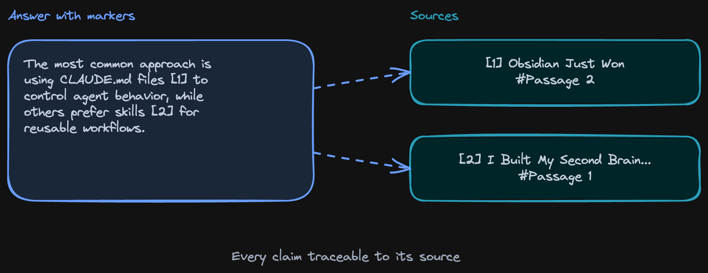
*How citations work: each claim traces back to the exact source and passage*

In practice, this means you can click through to the original video and timestamp:

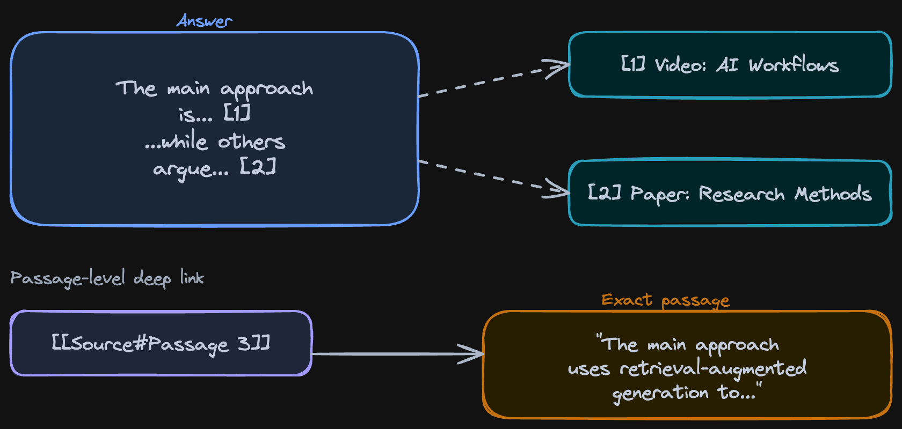
*Citation markers in practice - answers point to exact sources with passage-level deep links*

Every answer is grounded - you can trace claims back to the source. Good enough to trust as a research starting point, not good enough to cite in a paper without checking.

Here's what a cited answer looks like when it lands in Obsidian - the exact passage from the source, with a link back to the ground truth:

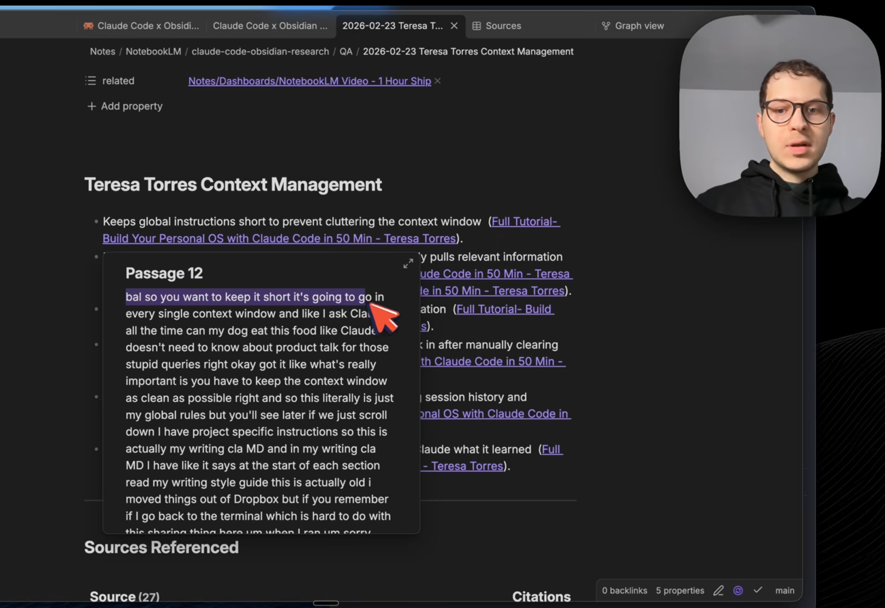
*A cited answer in Obsidian - exact passage from the source, linked back to the ground truth*

---

## The Knowledge Graph

Everything comes back to Obsidian. Not as a flat dump, but as a linked knowledge graph.

Each source becomes a file. Each topic becomes a file. Citations create wikilinks between them. So when I open "Claude Code" as a topic in my vault, I can see which 6 videos mentioned it, what they said, and follow the links to the exact passages. [Watch: Graph view and connections](https://youtu.be/qiOu7Ptjxng?t=705)

Research that used to disappear into browser tabs now lives in the vault, connected to everything else. And because it's all on your computer as markdown files - you own it. Claude can read it, you can search it, it's not trapped in the NotebookLM browser window.

Claude Code creates a research dashboard in Obsidian. Sources with YouTube thumbnails, topics that act as hubs on the graph, and citation backlinks showing exactly where each video is referenced in your Q&A answers. All in one view.

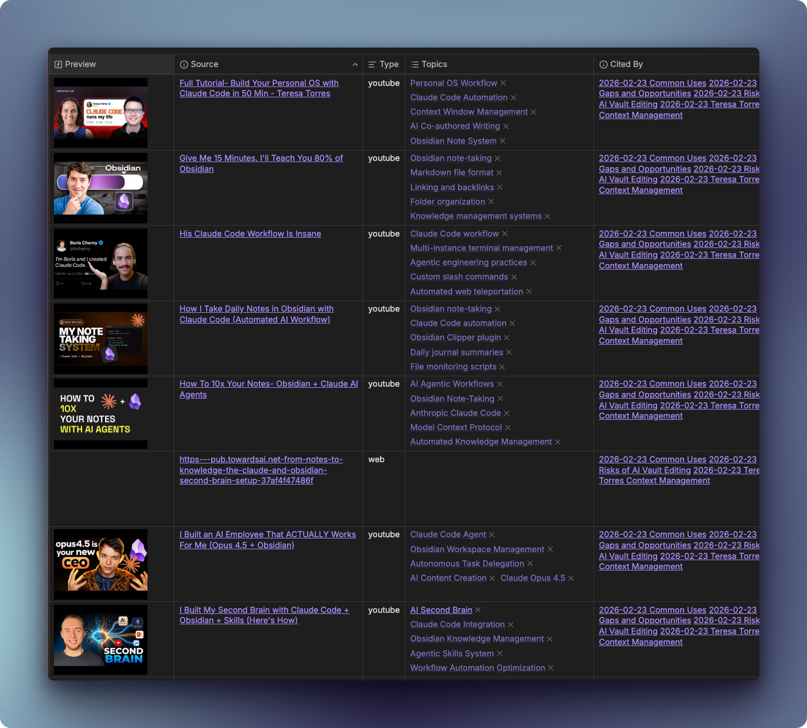
*Sources base in Obsidian - every video with thumbnail, topics, and citation backlinks*

Citations become wikilinks. When you open a Q&A answer, every claim links back to the source passage it came from:

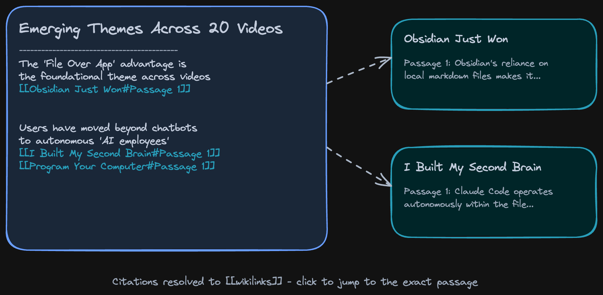
*Citations become wikilinks - each Q&A answer traces back to its source passages*

Open the graph view and you can see the whole network - sources, topics, and citations all connected:

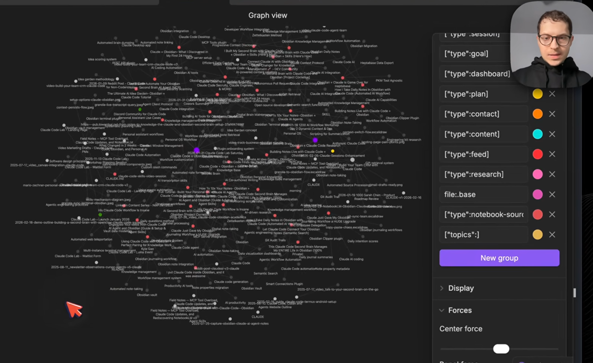
*Graph view in Obsidian - sources, topics, and citations all connected*

Here's the full pipeline from input to output:

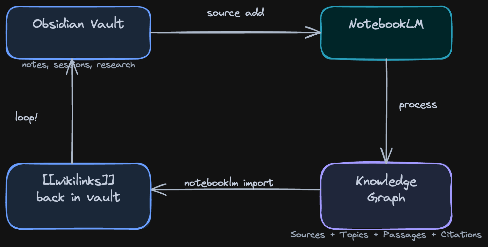
*The full loop: notes go in, a knowledge graph comes back*

Everything in this video was built live in the [Claude Code x Obsidian Lab](https://lab.artemzhutov.com) - this was Week 5: Workflows and External Automations. 6 weeks, one workflow per week, from zero to a working system.

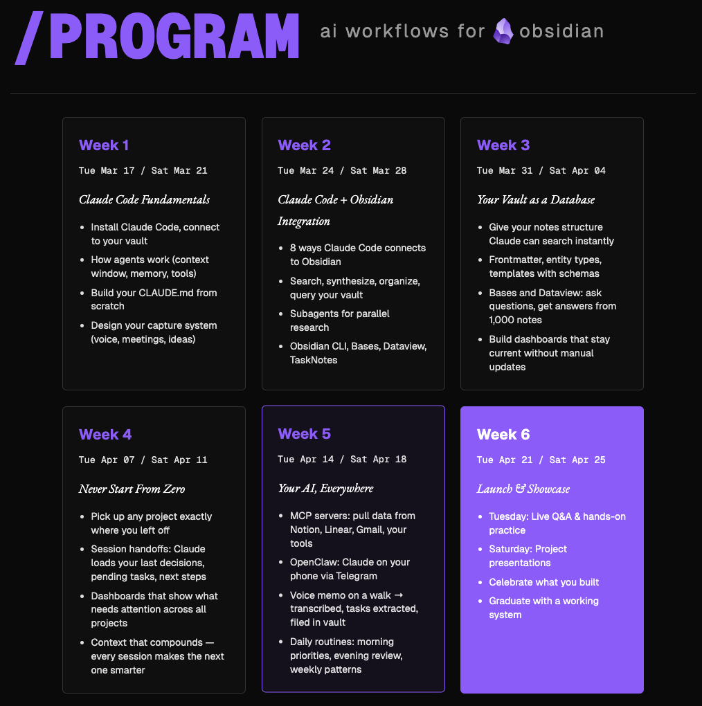
*Lab program: 6 weeks, one workflow per week*

Here's what Lab participants are building:
- **L., engineer** - autonomous CRM agent with LinkedIn crawling and a secured DMZ for prompt injection protection
- **A., content creator** - `/create-presentation` skill that turns Obsidian plans into slides automatically
- **M., developer** - per-project CLAUDE.md architecture with `/handoff` and `/resume` for project continuity
- **S., lecturer** - task notes synced to dual calendar (Google + Outlook) with Whisper phone transcription

---

## Audio Overviews

The knowledge graph is one output. Audio is another. NotebookLM can generate a podcast-style audio overview of all your sources - two AI hosts discussing your research, citing your material. Same sources, different format. [Watch: Audio overviews](https://youtu.be/qiOu7Ptjxng?t=1375)

I typed one command, it generated the audio, it landed in my vault, synced to my phone via Obsidian Sync.

```bash
notebooklm audio generate --topic "gaps in Claude Code + Obsidian workflows"
```

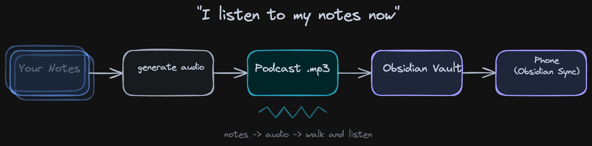
*Audio overview: two AI hosts discuss your research, citing your sources*

The podcast lands in your vault and syncs to your phone through Obsidian Sync. I was walking and listening to a summary of 20 videos - my own research, as a podcast, on my phone.

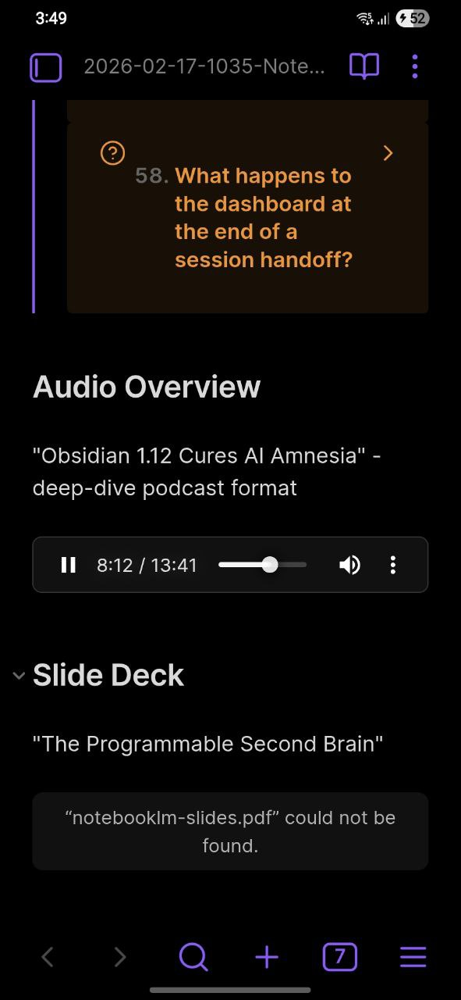
*Obsidian Mobile playing the audio overview - flashcards, audio, all synced from desktop*

I don't know if this is the future of research or just a fun trick. But I use it. When I have a notebook with 15 sources and I want the gist before diving in, I generate audio and listen while I do other things.

---

## What Else It Can Do

The video covers the full loop in 33 minutes, but the skill does more than YouTube research.

I uploaded 282 of my own daily notes to a single notebook. All of them, in 2 minutes from terminal. Now I can chat with my past self - "give me a weekly summary for Feb 10-16, what went well, what didn't" - and get cited answers pointing to specific days. Sleep maintenance wins, fitness consistency, late-night sabotage patterns - all pulled from my own journal entries with citations back to the exact daily note.

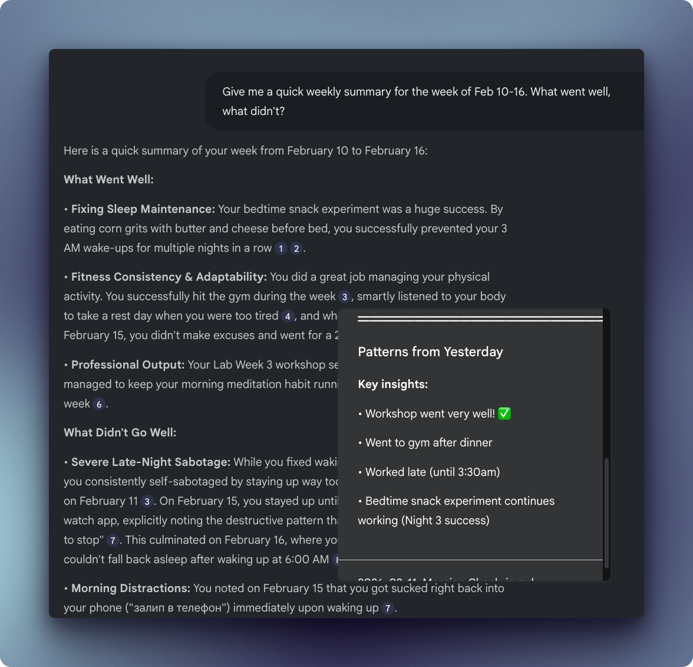
*Chatting with 282 daily notes from the last year - weekly summary with cited answers from my own journal*

That's the vault-as-source angle: your own writing becomes queryable.

Other things I tried:
- **Flashcards** - NotebookLM generates study cards from any source set. I got 58 flashcards from 20 videos, imported them into Obsidian. "What is the primary goal of project memory?" - flip - answer with citation.
- **Slides** - Generate presentation slides from your research. Same cited sources, different output format.
- **Academic research** - Search arXiv for papers on your topic, feed them into NotebookLM, get grounded citations. Full observability over what's going on - responses are not made up.
- **Podcast research** - Lex Fridman episodes, 4 hours each. Feed a bunch of these in, ask specific questions across all episodes.
- **Company onboarding** - Put your company docs into NotebookLM. New hires ask questions from terminal instead of bothering the team.
- **Market research** - Feed competitors' blog posts, YouTube videos. Get cited analysis.

---

## Try It

The skill is free and open source. Setup takes about 15 minutes - you need Claude Code, an Obsidian vault, and a Google account.

After that, three commands get you from "I want to research X" to a knowledge graph in your vault with cited answers, audio overviews, and flashcards.

https://github.com/ArtemXTech/personal-os-skills/tree/main/skills/notebooklm

The Python scripts that power it:
https://github.com/ArtemXTech/personal-os-skills/tree/main/skills/notebooklm/scripts

---

## Let's Discuss

What's your research workflow? How do you handle sources that are too big for one context window?

Join our Discord community: https://discord.gg/g5Z4Wk2fDk

## Resources

**Skills repo** - Browse the skills I mentioned
https://github.com/ArtemXTech/personal-os-skills

**Claude Code x Obsidian Lab** - 6-week program where we build workflows like this from scratch every week. Everything in this video was built live in the Lab.
https://lab.artemzhutov.com

---

Artem
