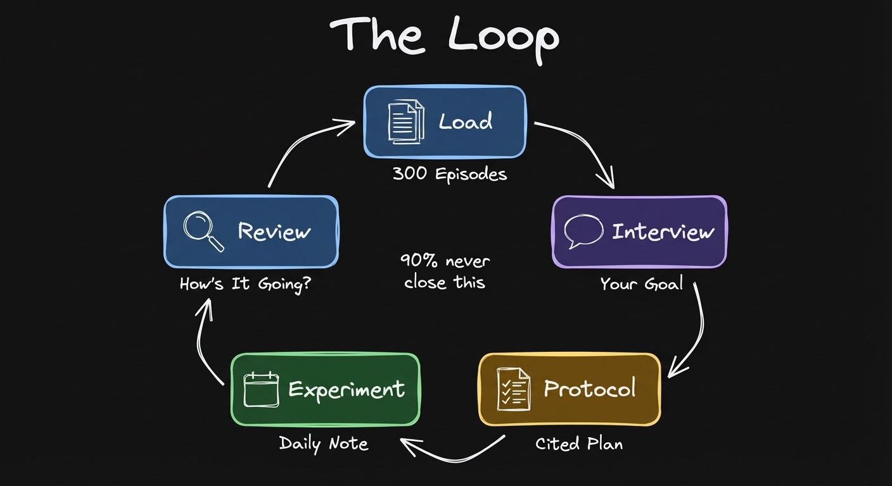
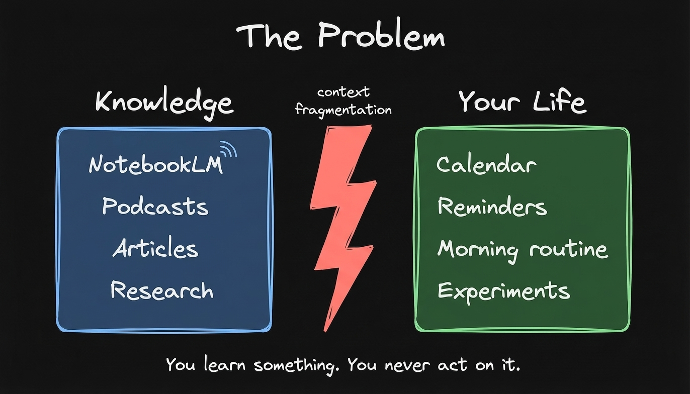
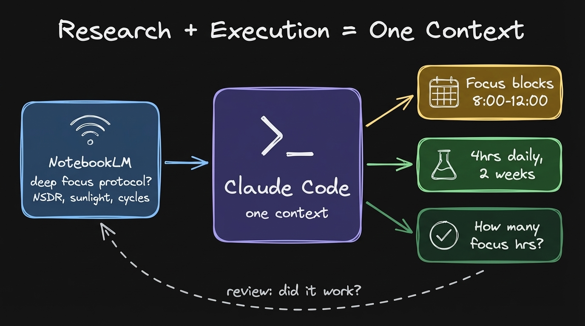
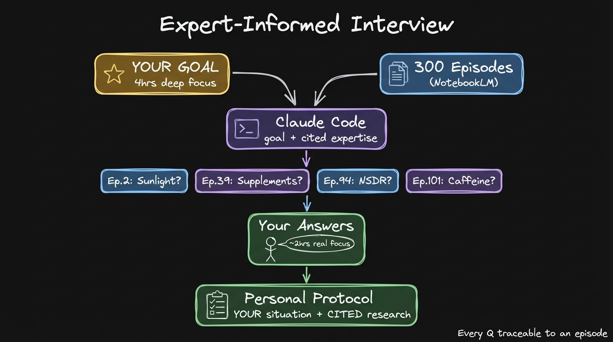
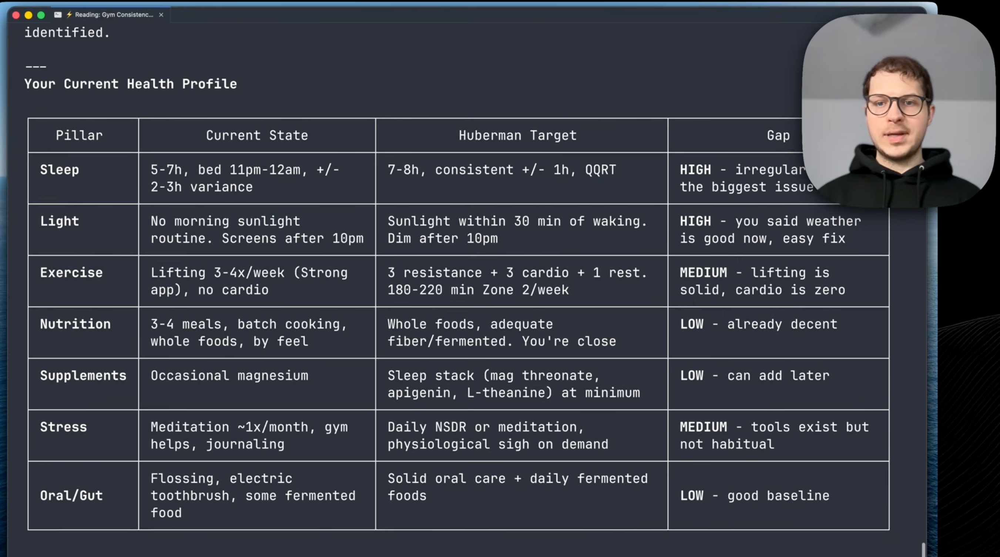
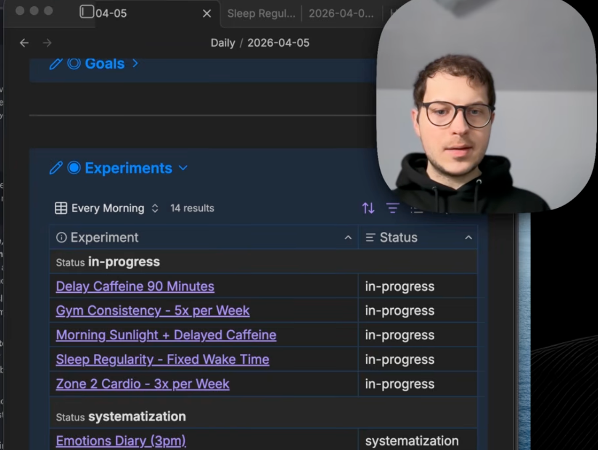
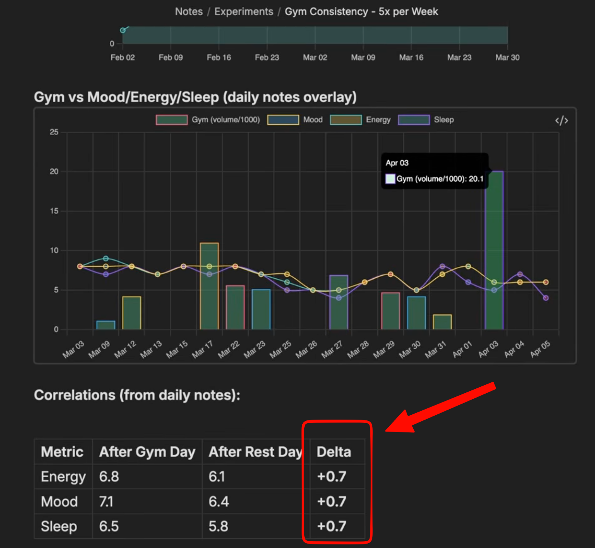
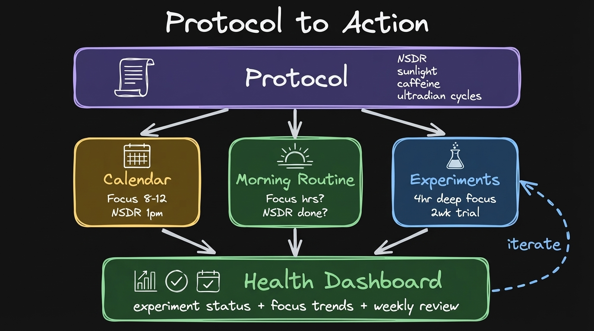
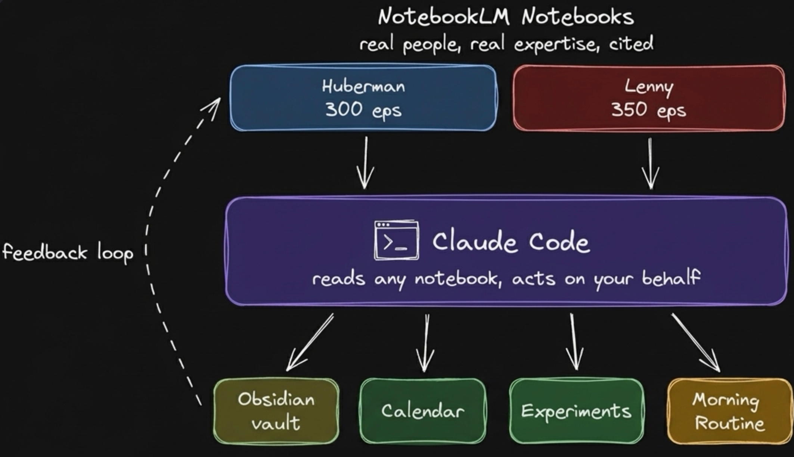

**I loaded 300 episodes from terminal. 20 minutes later I had a health protocol that asks me every morning how it's going.**

---

90% of people listen to experts and never change a single behavior. They always stay in learn mode.

You open a bunch of tabs. You find videos, articles, podcasts. The context is scattered. At some point you just kill those tabs. And you kill your intention to act on any of it.

I built a system that closes the loop. Feed expert content into NotebookLM. Connect Claude Code to it. Set a goal. Get a protocol with experiments based on your answers. Wake up earlier, go to the gym, track if it actually works. The best way to learn is by doing something. An experiment is a specific change you try for a few weeks and track if it works.

Here's the [full walkthrough](https://youtube.com/watch?v=KRpZSvtMiTI) where I set this up from scratch.

---

## Turn 300 episodes into a knowledge base

My goal: improve my focus, have more energy, go to the gym, be fit. The research part is handled by NotebookLM. You load sources and start asking questions.

The challenge is getting those sources in. You can't just go into NotebookLM and tell it to add a YouTube channel. Imagine yourself going to each YouTube video, getting a link, uploading it manually. Such a big pain.

Claude Code does it. I connected it to my notebook. I created a skill, which you can also download from the description. It listed all 53 of my notebooks.

I created a new notebook about Andrew Huberman, filtered by health topics. 400 videos on the channel. Claude helped me pick which ones are health related. Then it uploaded them.

You have all of the access to this knowledge and you don't have to watch the podcast. You can save so much time if you want to learn about a new topic.

---

## This is where everything stops

You can ask questions in NotebookLM. Where do I start with health? You get a quality answer with citations. You can click through and trace the exact citation back to the video.

This is already cool. 300 episodes of the world's top neuroscientist, and you can ask any question with cited answers back to the exact episode.

But this is where everything stops at the learning stage. You can ask questions, but they are missing the steps where we actually plan to do those experiments. You want to wake up earlier, go to the gym, act on what you learned. You need to schedule this into a calendar. You need to review what is the effect on your health. Are you achieving your goals?

These parts are completely missing. You can ask questions, but then so what? How do you act on that? You can't set a reminder from NotebookLM. You can't design an experiment. You can't track whether you followed through.

---

## Claude Code bridges the gap

This is where Claude Code comes in. I think of Claude Code as something that can help me actually act on this knowledge. It helps me manage my calendar, schedule my focus blocks, track whether I'm achieving my goals or not.

Claude Code queries the notebook with my goal. It gets cited answers from Huberman's research. Based on those, it designs interview questions across several areas: supplements, exercise, sleep optimization. Each question traces back to the source.

I told it: my goal is to improve my health, I want you to ask questions based on Andrew Huberman's episodes. It ran six queries in parallel, saved the responses into my Obsidian vault. 7 out of 8 citations were very strong matches. The citations are accurate and grounded.

Then I answered the interview questions. Claude looked up my existing fitness experiments, grabbed my data. It built a health profile: current state, target state, gap assessment. Where is high, medium, or low.

The proposed top 3 highest leverage experiments: sleep regularity (the biggest gap), morning sunlight, and adding zone 2 cardio.

---

## From protocol to action

The experiments land in my Obsidian vault as notes. Each one has a status and a frequency. My morning routine skill reads the Experiments base through Obsidian CLI, filters by status active, and surfaces them in my daily note.

The only way I don't forget about this is because Claude asks me about each one: how is this experiment going? Any observations here? Based on the observations, it schedules the next actions.

And it works. After a gym day, energy is consistently higher. The mood is also higher. The sleep quality is higher.

The dashboard becomes a place where you see and control an area of your life. Goals, experiments, action items, research. Everything at a glance. I wrote about how this [health dashboard](https://substack.com/home/post/p-193134587) works in a previous post.

---

## Any expert, any domain

My vision for NotebookLM: external knowledge across experts, across domains. If you're into product management, there is Lenny's Podcast. I loaded 200 episodes. You can chat with them in the same way.

If you want to learn about something else, you can together with Claude search for YouTube channels. It filters the videos which are relevant to your goal. NotebookLM serves as a source of verifiable truth. Claude Code can read any notebook and help you close the loop.

We move on from learning to actually acting and reviewing our results. The highest leverage right now is absorb any expert knowledge and act on it the same day.

That's the best way to learn, by doing something.

---

## Resources

**NotebookLM skill** - set up the NotebookLM skill in the next ten minutes. Load 300 podcasts of your favorite creator and ask questions.
[notebooklm-skill-artemzhutov.netlify.app](https://notebooklm-skill-artemzhutov.netlify.app/)

**Full walkthrough (18 min)** - I load 300 Huberman episodes, run a cited interview, turn it into experiments.
[Watch on YouTube](https://youtube.com/watch?v=KRpZSvtMiTI)

**Claude Code x Obsidian Lab** - You come in with your own goal. You leave with a system that does things for you. One member with zero programming experience wrote 100,000+ lines of code with autonomous task loops. Another built a `/daily` command that manages his entire family life. 5 weeks. 10 live sessions. Cohort 3 starts April 28.
[lab.artemzhutov.com](https://lab.artemzhutov.com)

---

Artem
