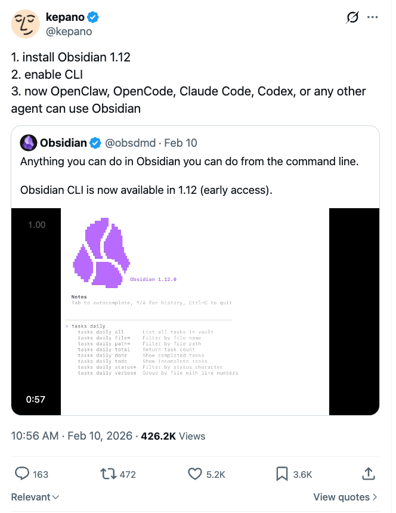
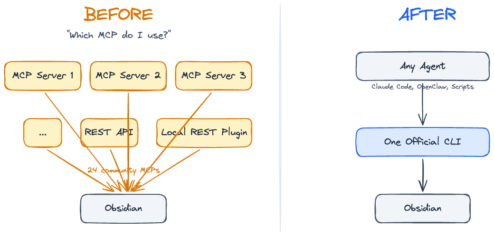
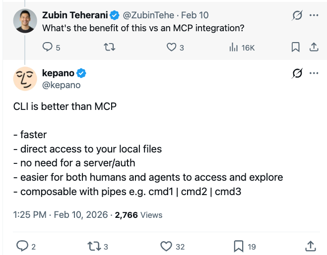
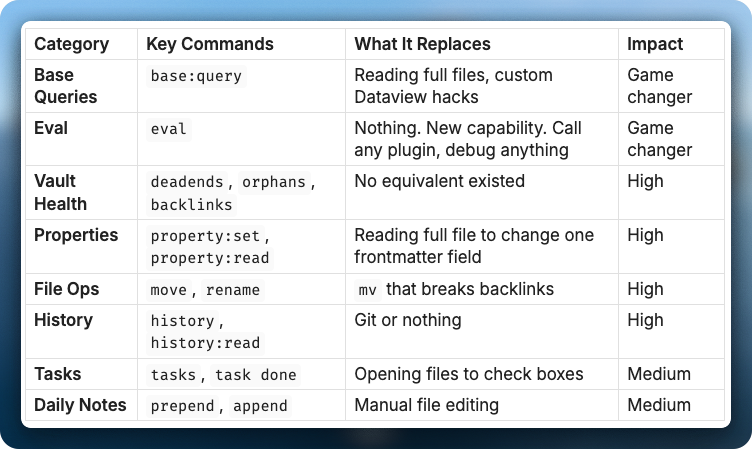
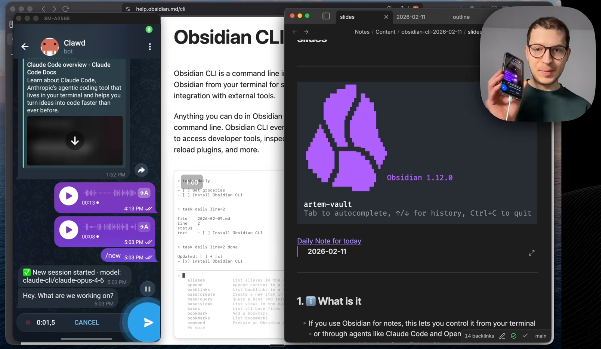
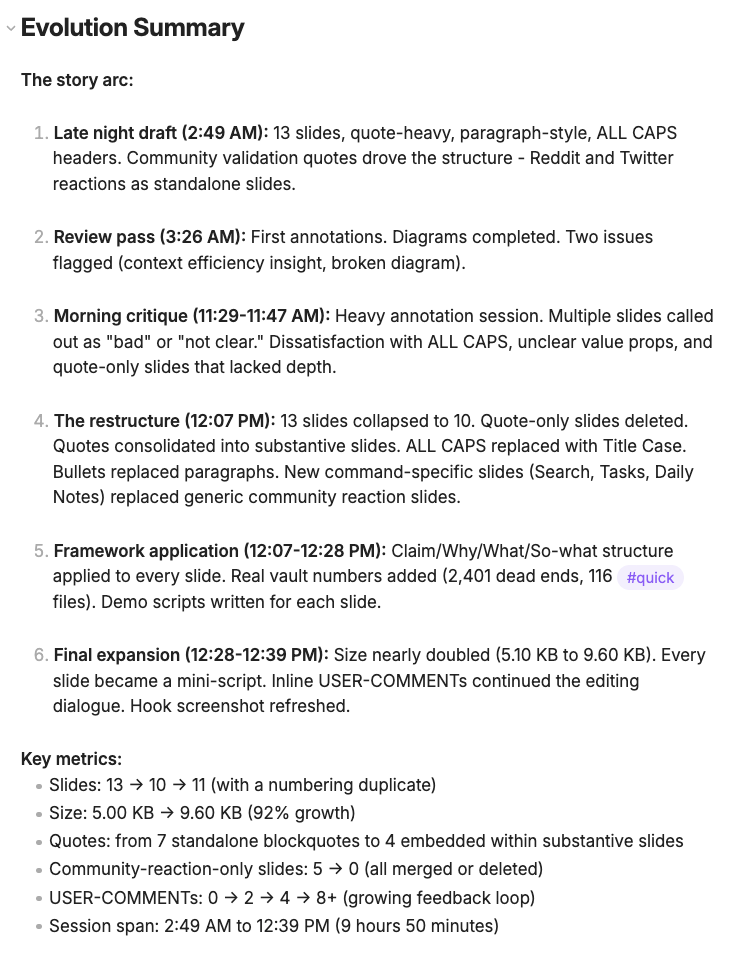
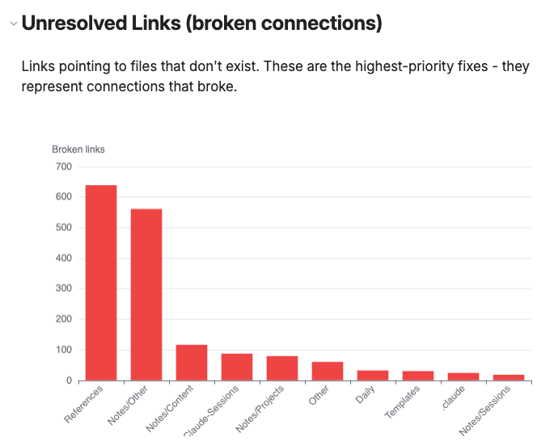
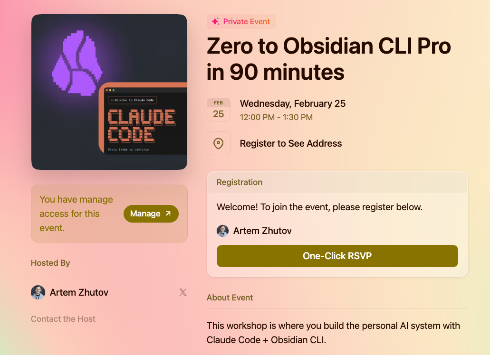

**Base queries, vault health, and why I stopped reading 70 files to check frontmatter**

---

My agent used to read 70 full files just to check their status. Now it reads frontmatter only, one command, same result. Obsidian CLI changed how I work with my vault.

I made a full walkthrough where I tested every command: [watch here](https://youtu.be/ntvZlLRjYTI). This newsletter covers what changed, why it matters, and what you can try right now.

---

## What is Obsidian CLI

Obsidian 1.12 shipped a command-line interface. 101 commands. You can now programmatically do actions in your Obsidian from the terminal.

But you won't be typing these commands. Claude Code will. Or OpenClaw. Or any other coding agent. The CLI is the bridge between AI agents and your vault.

*Kepano's announcement - install, enable, let agents in*


---

## Why CLI, Not MCP

Previously we had a bunch of MCP servers, local REST API plugins, Obsidian URI. A whole mess of infrastructure just to programmatically talk to Obsidian. Now one official CLI that unifies everything.

*Before CLI: a mess of plugins, APIs, and workarounds*


Kepano said it best:

*"CLI adds things that no plugin API could do"*


CLI is faster, has direct access to your local files, no authentication needed, more context-efficient, and you can pipe commands together. If I were to short MCP, I would do that in favor of CLI.

---

## The Commands That Actually Matter

101 commands sounds like a lot. Most you'll never touch. Here's what changes your workflow:

*8 command categories that matter out of 101*


The game changers are base queries and eval. Base queries let you talk to hundreds of files through frontmatter only. What Obsidian sees is exactly what your agent sees. You're on the same page. You control exactly what goes in and what comes out, and it's context-efficient - no wasted tokens on full file reads.

Eval lets you call any plugin programmatically from terminal. Debug any plugin. One-shot anything.

Here's what that looks like. I have a Bookmarks.base file that tracks everything I save - articles, tweets, videos. It has views: All Bookmarks, Unread, Processed, By Source. The base file itself is just YAML that defines filters and columns.

To get my unread bookmarks, one command:

```
obsidian base:query path="Templates/Bases/Bookmarks.base" view="Unread" format=md
```

Output:

```
| Title                                          | Date       | Source   | Author          |
| ---------------------------------------------- | ---------- | -------- | --------------- |
| On agentic coding, sense of urgency...         | 2026-02-12 | article  | walterra        |
| Something Big Is Happening                     | 2026-02-12 | article  | Matt Shumer     |
| Obsidian CLI Documentation                     | 2026-02-11 | article  | Obsidian        |
| The AI Vampire - Steve Yegge                   | 2026-02-11 | Medium   | Steve Yegge     |
| Distribution is the Only Moat Left             | 2026-02-10 | Twitter  | SIGKITTEN       |
| ...26 total                                    |            |          |                 |
```

26 bookmarks, structured, no file reads. My agent sees the same table I see in Obsidian, so from here it can summarize what I saved this week, find articles by topic, or mark them as read with `property:set`. The whole workflow is the same for anything - sessions, tasks, contacts, content drafts. One file with frontmatter, it auto-appears in the right base view, and any agent can query it.

Reading 100 files to check their status costs about 150,000 input tokens - $2.25 per query on Opus 4.6 pricing. One `base:query` returning the same data costs about 5,000 tokens - 7.5 cents. 30x cheaper. Every token of context you waste on file reads is a token you cannot use for actual reasoning.

If you want to set this up on your vault, I'm running a [free workshop](https://lu.ma/m5fnplqq) where we go from zero to CLI pro in 90 minutes.

---

## Phone to Vault in One Command

I use OpenClaw (Telegram bot) that uses this CLI under the hood. Send a voice note from my phone, bot runs `daily:prepend`, it appears in my daily note. My phone, my terminal, my agents - all write to the same place.

*Voice note from Telegram, transcribed and added to daily note via CLI*


It's a unified inbox for everything. It works with images too - I take a picture of my food, the agent analyzes calories and adds it to my daily note with the image embedded. I can send any link and ask Claude to research it. Voice notes, photos, links - it replaces so many apps. Just one inbox that works with audio, video, links. Unsubscribe from your voice note app.

And it works through your messenger, so Apple, Android, web - doesn't matter. Telegram, Discord, WhatsApp, anything.

---

## History: How Your Notes Evolved Over Time

Every file in Obsidian has saved versions. The CLI gives you programmatic access to all of them.

I used two commands to reconstruct how the slides for my video evolved across 44 versions over 15 hours:

```
obsidian history path="slides.md"
obsidian history:read path="slides.md" version=44
```

*44 versions of my video slides reconstructed by an agent - from skeleton to final cut*


The slides went from a 13-slide skeleton to "here's what you build with them" across 15 hours. An agent compared key versions and built the full timeline automatically.

44 versions, zero git. Any agent can do this reconstruction on any note in your vault.

---

## Vault Health

I ran `obsidian deadends` on my vault and found thousands of files with no outgoing links. `obsidian orphans` showed thousands more that nobody links to. `obsidian unresolved` found links pointing to files that don't exist.

The point is not just finding them. You can pipe this into Claude Code and say "group these by folder, figure out which ones are from the same rename, and fix them with `obsidian move`." In my case, most of the broken links in References/ were from files that got renamed. One move command fixes hundreds of those at once.

*Broken links by folder - References and Notes had the most unresolved connections*


Honestly, I am still exploring what to do with all this data. The numbers are impressive but figuring out which orphans matter and which are fine takes work. The commands exist, the data is there, and I am still building the workflow around it.

---

## How to Actually Start

**Prerequisites:**
1. Obsidian Catalyst license ($25)
2. Install Obsidian 1.12
3. Enable CLI in settings

Full docs: https://help.obsidian.md/cli

**My recommendation: don't create skills yet.** Put it into your CLAUDE.md memory. Let patterns emerge.

Over time, you'll see how you use it. If Claude Code is reading full files just to change a property, teach it: "use `obsidian property:set` instead." If it's using `mv` to move files, teach it: "use `obsidian move` to preserve backlinks."

Here's what that looks like in practice. This is from my actual CLAUDE.md:

```
Vault mutations via CLI (when Obsidian is running):
- Daily note updates -> obsidian prepend path="YYYY-MM-DD.md" content="..."
- Frontmatter -> obsidian property:set path="file.md" name="status" value="done" type=text
- Tasks -> obsidian task path="file.md" line=N done
- Move/rename -> obsidian move path="old.md" to="new.md" (auto-updates backlinks)
- Read single property -> obsidian property:read path="file.md" name="status" (context efficient)
```

You go through the initial pain once.

---

If you want to set all of this up on your vault, I'm running a [free workshop](https://lu.ma/m5fnplqq) where we go from zero to CLI pro in 90 minutes.

*Zero to Obsidian CLI Pro in 90 minutes - free workshop*


---

## Let's Discuss

What command excites you most? Have you tried the CLI yet?

Join our Discord community: https://discord.gg/g5Z4Wk2fDk

More about what I do: https://artemzhutov.com/

---

Artem
