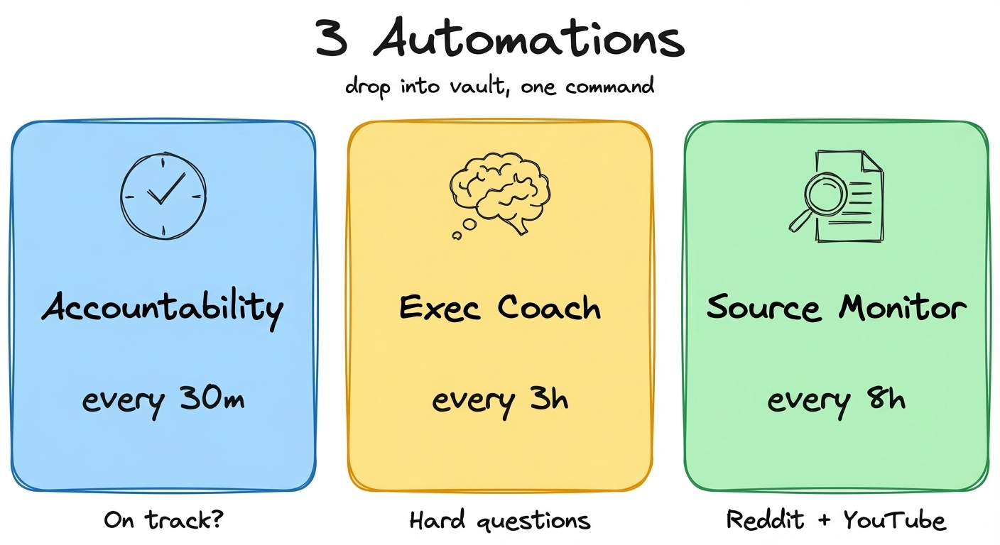
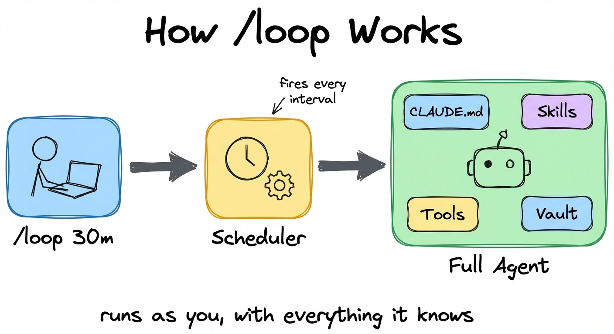
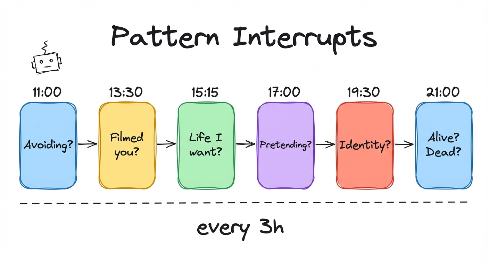
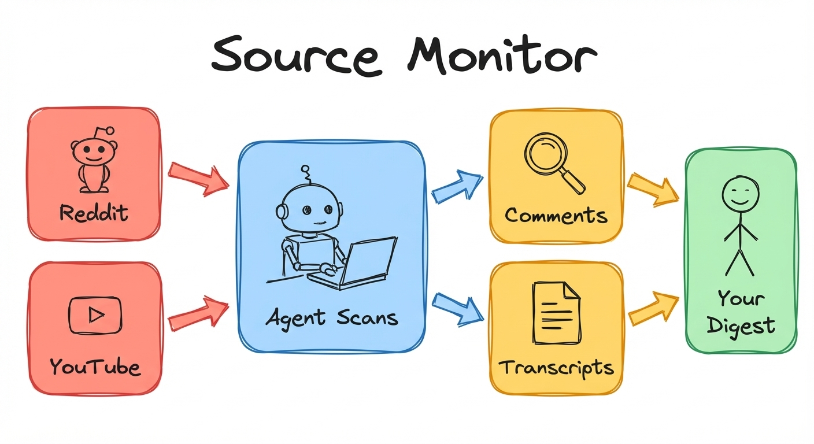
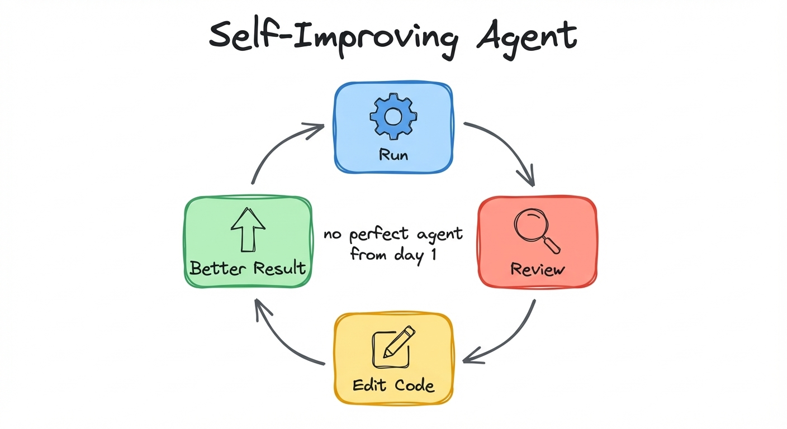
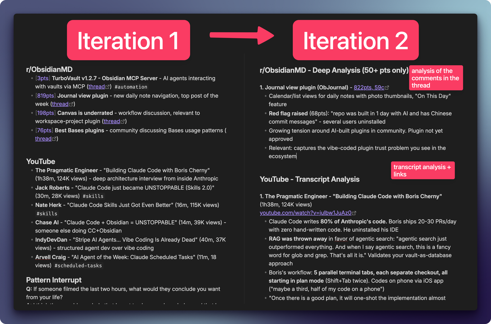
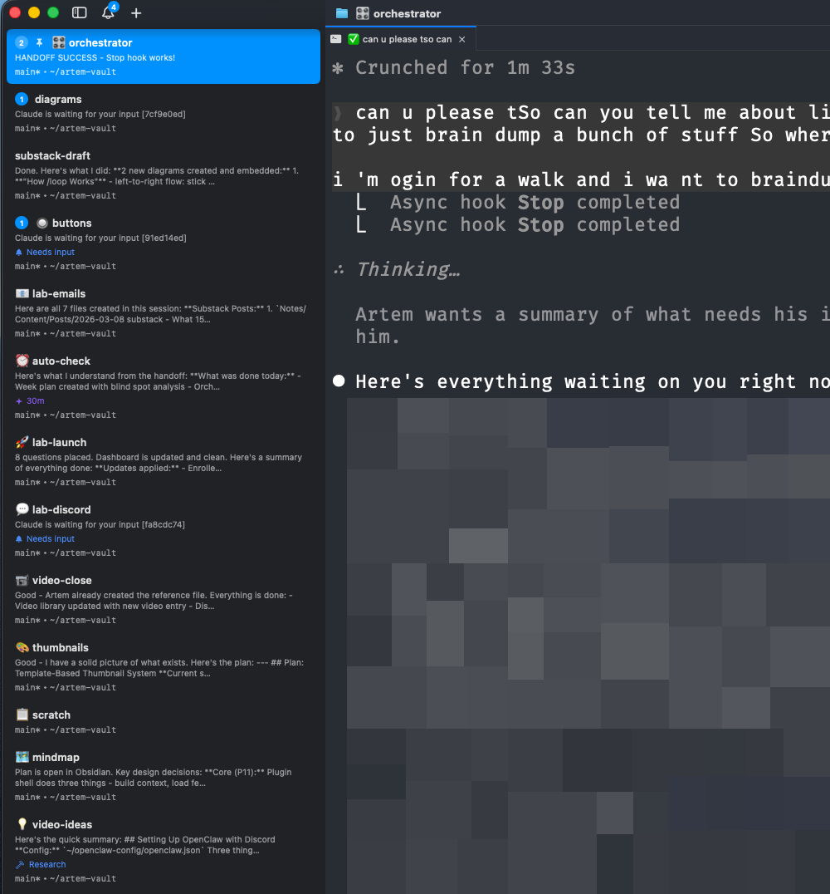
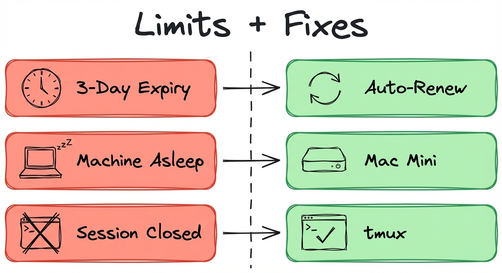
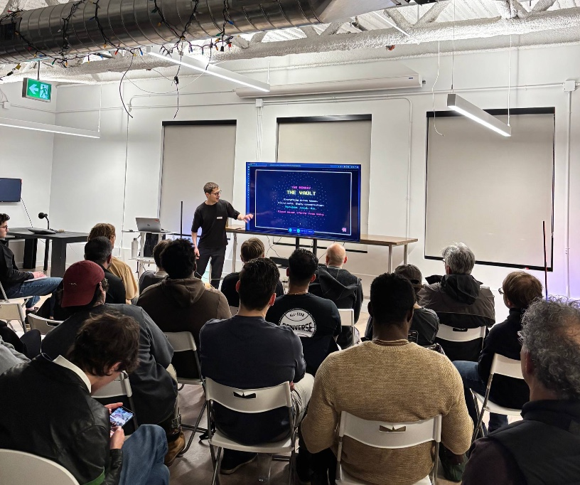

**Accountability check, executive coach, source monitor - all defined as markdown**

---

Typically what happens, I start working on something and then two hours later I don't know what's happening and how I ended here in the current situation. I plan my day in my daily note, but nobody checks if I'm following through.

I set up three agents in my Obsidian vault with intervals when they're going to fire. One is my accountability check - every 30 minutes it asks me if I'm on track on my goals. Another one is an executive coach. And the final one is a source monitor.



All 3 automation files ready to use - drop them in your vault, one command to schedule:
https://scheduled-tasks-artemzhutov.netlify.app/

In this post I walk through all three automations, how I set them up, what they actually produce, and what doesn't work yet.

Here's the full walkthrough (26 min) where I set up each one from scratch:
https://youtube.com/watch?v=fOpFgjH8IfQ

---

## How /loop Works ([watch](https://youtu.be/fOpFgjH8IfQ?t=97))

To set this up, we use this `/loop` command in Claude Code. By the way, this is also available on the desktop version.

```
/loop 30m "Read my day plan for today, my daily note, and check with me if I am on track. If I don't have anything in my daily plan, ask me what is the goal."
```

That's it. Copy-paste this into Claude Code and you have your first automation running. This is the simplest one to start with - try it.

The agent can also notify you. I have a script in my automation file that sends a macOS notification when the agent needs my attention:

```bash
osascript -e 'display notification "Off track - check your day plan" with title "[auto] accountability"'
```

Claude uses this skill called loop. I didn't create this skill. It comes with Claude Code. It schedules a cron job - basically a script which is going to run inside of this session with all of the context which we have here. Every 30 minutes it fires and reads my day plan and checks if I'm on track.

But this is not a cron job running a script. A script runs a command. A scheduled task runs a full agent. With all its tools. And that's where it gets interesting.


*You type /loop, the scheduler fires on interval, and a full agent runs with your CLAUDE.md, skills, tools, and entire vault.*

Every time the scheduled prompt fires, the agent gets your full context. Your CLAUDE.md with all your rules. Your skills. Your tools. Your entire vault. It's not running in isolation. It's running as you. With everything it knows about you.

This agent has access to all of our skills, to all of our MCP tools and connections, to all of our context within Obsidian. It can reason. It can understand. It can debug and adapt at the next run.

That's why the accountability check actually works - it can read my day plan, compare it to what I'm doing, and give me a real answer.

---

## Accountability Check ([watch](https://youtu.be/fOpFgjH8IfQ?t=636))

This one is the one that helps me stay on track. Every 30 minutes, it fires this automation to see if I'm on track with what I plan to do throughout my day.

It reminds me that you have a limited time in your life and every 30 minutes matters. It asks a hard question - isn't that the thing that matters the most right now? Or how many 30-minute blocks do you have left today?

This is especially useful if you sit and think for 15 minutes at the start of your day what you want to accomplish and then you fire this agent and tell it let's go, let's stay on track.

I was recording this video and it was firing those jobs at 12:00 p.m. I was not answering because I was busy. When I checked, it told me: "you're reading the accountability automation file instead of recording." It was prompting me to record. I'm recording. Go chill.

---

## Executive Coach: Memento Mori on a Timer ([watch](https://youtu.be/fOpFgjH8IfQ?t=793))



I use this Dan Koe framework for six interrupts throughout my day. This executive coach basically runs every three hours. It tries to ask me these questions to interrupt the patterns which I live throughout my life. And those questions are really really hard.

| Time | Question |
|------|----------|
| 11:00 | What am I avoiding right now? |
| 13:30 | If someone filmed the last 2 hours, what would they conclude? |
| 15:15 | Am I moving toward the life I hate or the life I want? |
| 17:00 | What's the most important thing I'm pretending isn't important? |
| 19:30 | What did I do today out of identity protection? |
| 21:00 | When did I feel most alive today? Most dead? |

Those questions are really refreshing if you're throughout your day and you're just into the task and you try to think - is this really what matters the most right now? I think this executive coach is something which enables this broad perspective on what's going on.

Shoutout to [Dan Koe's article](https://letters.thedankoe.com/p/how-to-fix-your-entire-life-in-1) for the framework.

Want to try it yourself? Here's a prompt you can copy-paste:

```
/loop 3h "Pick one question from this list and ask me. Rotate - don't repeat the same one twice in a row: 1) What am I avoiding right now? 2) If someone filmed the last 2 hours, what would they conclude? 3) Am I moving toward the life I hate or the life I want? 4) What's the most important thing I'm pretending isn't important? 5) What did I do today out of identity protection? 6) When did I feel most alive today? Most dead?"
```

---

## Source Monitor: Reddit + YouTube ([watch](https://youtu.be/fOpFgjH8IfQ?t=334))



I have this automation called source monitor. It tells Claude to check my sources for the relevant content about Claude Code, agents, Obsidian. Scan those Reddits using the Reddit read skill. And then also check my YouTube home feed. Do that for each source, extract the most interesting items, and notify me once we are done.

On the first iteration, I didn't like that it actually didn't read the comments and understand what's happening there. The YouTube videos had no links, no summary. So we went about doing another iteration within the same session.

On iteration two, Claude read all of the comments and extracted what the community thinks about that. Now I can go there and click and engage with the material which matters to me. I don't have to scroll Reddit or YouTube on my own. My agents just go ahead and extract what only matters to me and what would be interesting for me.

Imagine that Claude went and searched for recent videos about Claude Code - it got the transcript and gave me a summary of what matters, with takeaways from the actual source. You can make your own daily digest without going to those different websites. Just huge unlock.

And that was a prompt which we did with Claude. That's it. I told it: use my Reddit skill and use my YouTube skill to accomplish this.

---

## Self-Improving Agents ([watch](https://youtu.be/fOpFgjH8IfQ?t=1278))

Here is the concept of this self-healing agent. Let's say we have some automations like the daily digest where we parsed resources from YouTube, from Reddit. We run it and then we didn't like something or there was some error. We provide feedback. Our agent reads the logs of what went wrong. Based on this feedback and those logs, the agent goes and edits the code or our skill files and the next run produces a better result.


*Run, review, edit code, better result. You don't design the perfect agent from day one - it continuously evolves.*

This way you have this continuous loop where you don't actually try to design a perfect automation, a perfect agent from one go. It's continuously evolving and you tune it in how you want the agent to behave. You have this complete flexibility in terms of what the agents are capable of, and that makes this very flexible and just exciting.

Here's what that looks like in practice - my source monitor going from version 1 to version 2:


*Left: Iteration 1 - basic list of links with no context. Right: Iteration 2 - deep analysis with comment extraction, transcript summaries, and community sentiment.*

---

## Managing Agents: cmux + Remote Control ([watch](https://youtu.be/fOpFgjH8IfQ?t=973))

I have this terminal with a bunch of tabs and workspaces. If I try to work on something else, I create a new workspace. It's been very helpful to keep those workspaces organized. The terminal I'm using is called cmux. If you connect Claude Code to cmux - if you tell Claude how to use this terminal - it can do some quite good stuff for you. Like having an orchestrator agent that manages other Claude Code sessions. I have an auto-check workspace with all my automations running there - the orchestrator can spawn new sessions, send commands, read what's happening in any workspace.


*Each workspace is a separate Claude Code session. You can programmatically create workspaces, manage tabs within them, and send keys to any terminal - all from another agent or a script.*

We can also control those automations from our phone or from a desktop app. I can see all of my sessions appearing right there. The key is to turn on remote control in the settings. Each session which is spawned inside the terminal becomes available for remote control and you can connect to it through your Claude phone/desktop app.

And regarding notifications - I think it's very useful to add some observability. When do I need to check up on my agent? You don't check on agents. They check in with you.

---

## Limitations ([watch](https://youtu.be/fOpFgjH8IfQ?t=1348))

Those automations only work within a session. Within Claude Code, if the session is alive it's going to work. Those sessions have a three-day expiry date. They auto-expire, and to avoid this I also set up an automation - a task renewer every two days to renew automations. So they get automatically rescheduled avoiding this three-day limit.

Also the machine must be awake. If your machine is not running then it's not going to run. And there might be some issues with the token cost. If you're going to have a lot of tasks, it might not be that manageable to have all of them running. So here we need to be mindful.



If you want to make a Claude Code session persistent, you can run it inside of tmux (a terminal multiplexer), or you can set up those sessions on a Mac Mini which is always on and then it runs those automations for you.

---

## What People Are Building

I just wrapped up Demo Day for the first cohort of the [Claude Code x Obsidian Lab](https://lab.artemzhutov.com). 20 people, 6 weeks. Everybody has a completely different system. The amount of creativity surprised me.

One consultant went from never using Obsidian to 1,000 files in a month. He recorded two days shadowing a logistics company with Granola, synthesized everything in his vault, and then Claude reconstructed the entire business workflow as a Miro diagram. That's a forward deployed engineer - going on-site, capturing everything, and having an agent map out what people are actually doing and where the pain points are.

A guy running a bird-scaring product business built a full SEO keyword database inside Obsidian - thousands of keywords, no Dataview, pure Bases and frontmatter. He said: "It was so interesting how all of you think totally different than me. It changed some of my minds."

And one person built a simple markdown system with a `/daily` command - no Obsidian, just Cursor and Claude Code. He said: "I don't want to try to remember anything in my life. I just want this thing to do everything." He's gotten so much done in just the last week that it's pretty crazy.

The transformations mattered more than the tools. People who had never opened a terminal were building agent workflows. People who thought Obsidian was too complex found their own way in. The range was the whole point - from the simplest markdown system to a full Rails platform capturing screen activity, WhatsApp, LinkedIn, email, and phone calls.

I also organized offline Claude Code meetups where people presented what they built to 80+ people. If you want to organize your local meetups, shoot me a message :)


*Presenting Obsidian x Claude Code at a local Claude Code meetup*

---

## Let's Discuss

What would you schedule? What do you check manually every day that an agent could do for you?

Join our Discord community: https://discord.gg/g5Z4Wk2fDk

## Resources

**All 3 automation files** - source monitor, accountability check, executive coach. Drop into your vault, one command to schedule.
https://scheduled-tasks-artemzhutov.netlify.app/

**Full walkthrough (26 min)** - I set up each automation from scratch.
https://youtube.com/watch?v=fOpFgjH8IfQ

**Claude Code x Obsidian Lab** - Cohort 2 starts March 17. We start from scratch: setting up Obsidian, setting up Claude Code, getting everyone up to speed. Then we go beyond. You build your own skills, your own workflows, your own agent. Live, with real feedback from the group.
https://lab.artemzhutov.com

---

Artem
