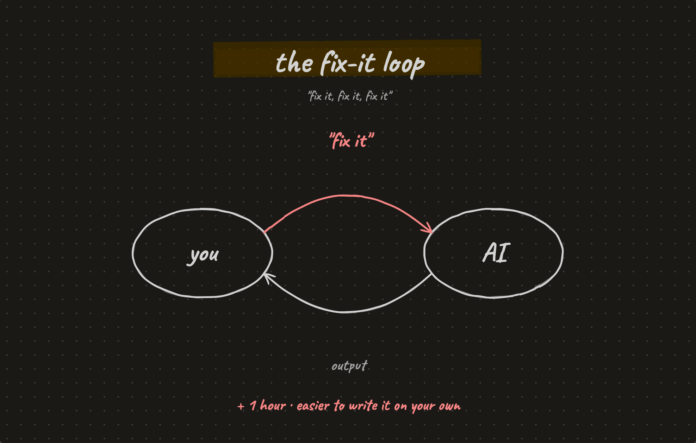
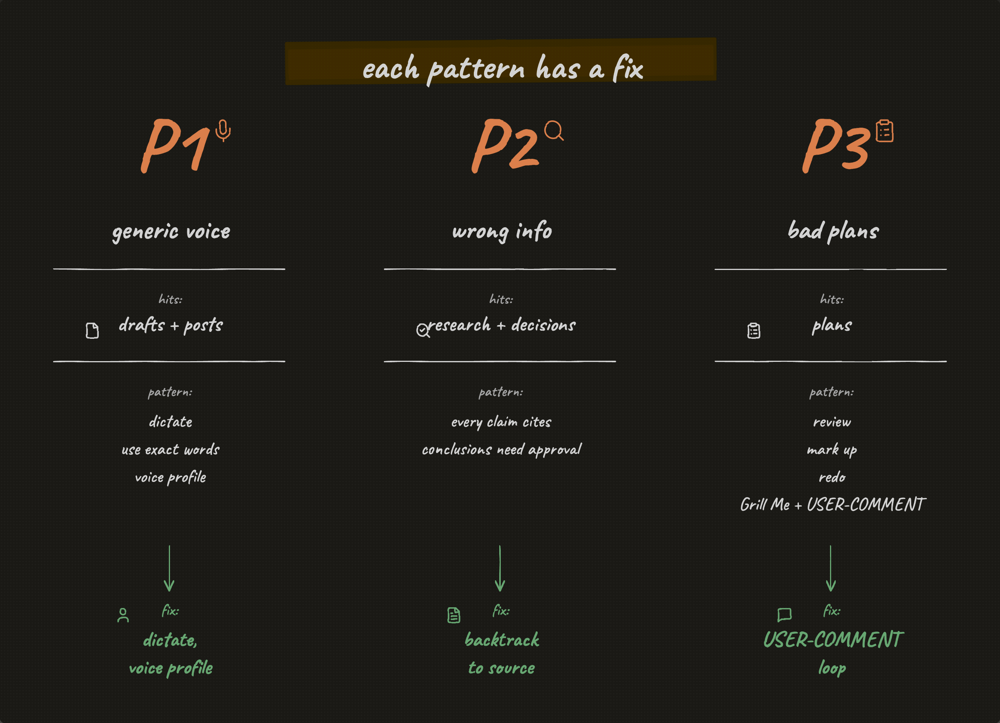
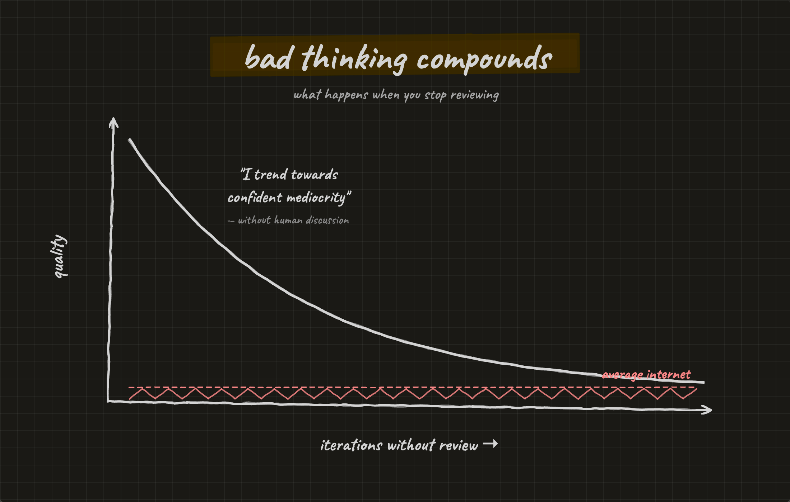
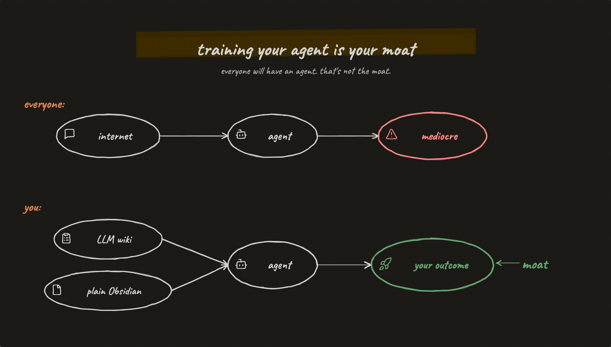
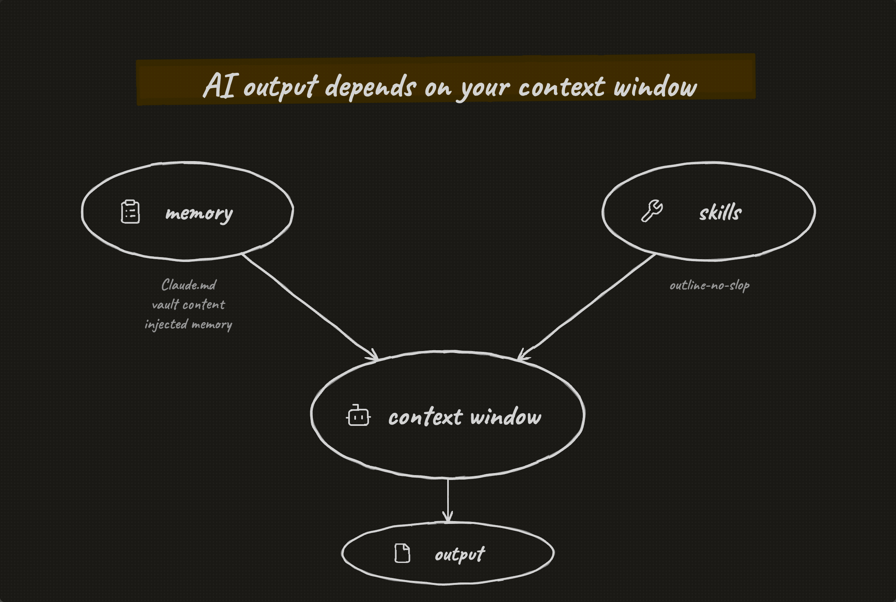
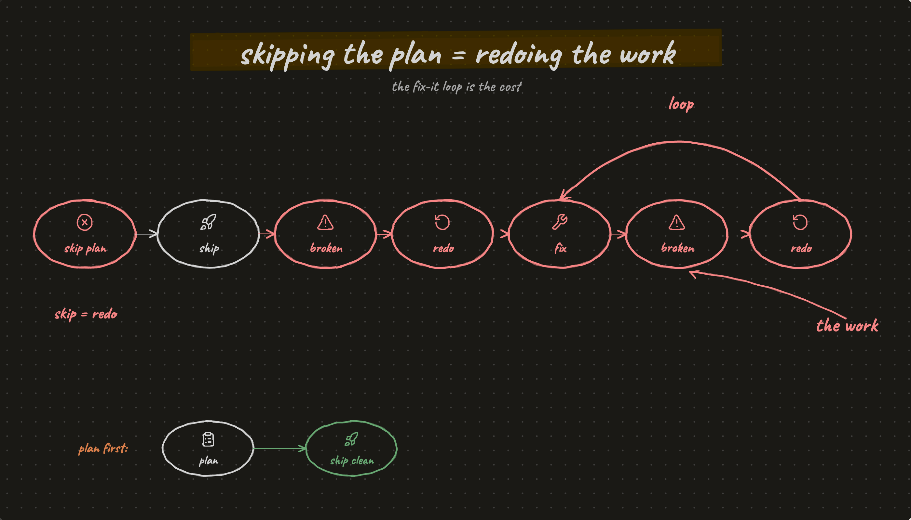

**Three patterns that stop AI slop in your Obsidian vault**

---

You ask AI to write a draft, do something for you. You read it. The output is generic. You tell it to fix it. Still generic... 1 hour later you end up rewriting it yourself.

Sound familiar?

Why do you even have a second brain if you're redoing everything?

Three techniques that actually fix this:

- Generic voice. Build your voice profile.
- Wrong information. Every claim has to backtrack to the source.
- Bad plans. USER-COMMENT loop and Grill Me for reviewing AI plans.

*Generate. Tell it to fix. Generate again. Hour later you wrote it yourself.*

https://youtube.com/watch?v=hsBIJYvBsTw

*One pattern per failure: voice profile for generic drafts, sources for wrong info, USER-COMMENT loop for bad plans.*

## Without review, your second brain becomes useless

Bad thinking compounds. On this plot is the quality of information in your obsidian vault. Here is iterations without review.

If we're just accepting everything that AI writes into our obsidian vault without reviewing first, our second brain becomes the same quality as the average internet. *It becomes useless.*

We should review what you write in your obsidian vault. Maintain the high quality, unique voice of our notes.

Without you, the agent just produces output. You happily ship it, accept it, and you end up with a slop. The agent trends towards confident mediocrity if you don't discuss your decisions.

Reviewing AI is really painful. That's a friction you should experience, to catch all of this bad thinking. Human feeling pain is a feature. It's not a bug :)

*Iterations without review pull your vault toward average internet quality. Eventually it's useless.*

## Your moat is training your agent

In the future, everyone will have an agent. Working with an agent is not enough.

Agents are trained on huge, huge amounts of information from Reddit, from internet. That's a baseline which everybody has. That's mediocre.

Everyone has access to these agents. Internet is generic. There is no moat. Everyone has it.

Your moat is that you need to train *your* agents. If you don't train your agent, if you don't take care of that, it's going to be mediocre.

Your unique advantage is having your notes, your thinking. It could be just LLM wiki, or plain obsidian. Feed that to an agent as its context. To have a great, great baseline that produces great outcomes :)

*Everyone gets the same baseline model from the internet. Your moat is what you train it on after that.*

## Output depends on the context window

From first principles, the output really depends on the context window. The next token appearing in your chat depends on all of the previous history of conversation.

How do you control the context? Two knobs. One is memory. Your CLAUDE.md, your vault content. The other is skills.

Then the three patterns map onto the three problems:

- **Generic voice.** Use your exact words. Your voice profile.
- **Wrong information.** Every claim in the research note is backed up with a citation. Backtrack to the source.
- **Bad plans.** USER-COMMENT loop: AI produces a draft of the plan, you read it, you provide comments inline, you tell it to update based on your comments, then you lock in the plan. Plus [Grill Me](https://github.com/mattpocock/skills/blob/main/grill-me/SKILL.md): you work together with Claude until you achieve a shared understanding.

*Memory is your CLAUDE.md and vault content. Skills are reusable how-tos. Two ways to shape every output.*

## The cost of skipping plans = redoing the work

If you don't slow down, if you start skipping the plans, you go into the loop of redoing the work. *Every time.* That's a huge, huge cost.

You tell the agent: I accept everything. Then something is broken. You say fix it. You don't want to understand. It does it. Fixes it. But you start going in a loop where you don't understand what's going on, what's happening.

You waste so much energy. You're unsatisfied with the result. You lose control of the agent. You lose motivation. You feel disappointed...

A couple months back, I tried to max out my Claude tokens. Run more agents, ship more. That's not the way anymore. The way now is plan first, then ship something you understand very, very deep.

*Skip the plan. Accept everything. Tell it to fix. Lose energy, lose motivation, lose control.*

## Get the system

If you're tired of redoing everything. If your obsidian vault is going generic. If you're stuck in the fix, fix, fix loop, losing motivation, feeling disappointed...

Then it's time to train your agent.

I run 5 weeks of live workshops where you build your own personal operating system with Claude code and obsidian. Your vault becomes the system that helps you do your work and achieve the best results :)

Cohort 3 starts Tuesday. 4 seats remaining (they go fast on the last day). Deadline: Mon May 4 11:59pm ET.

https://lab.artemzhutov.com

See you Tuesday <3

Artem
