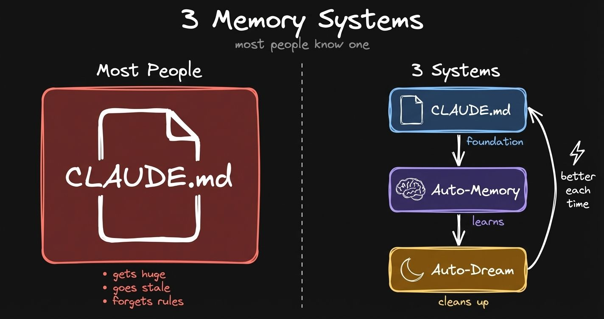
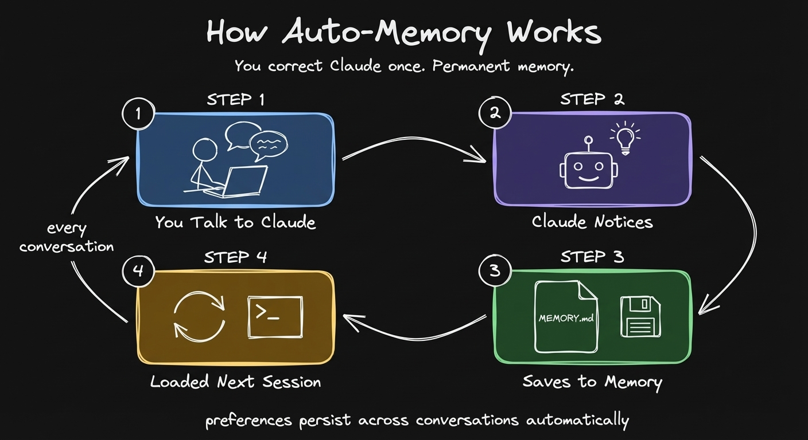
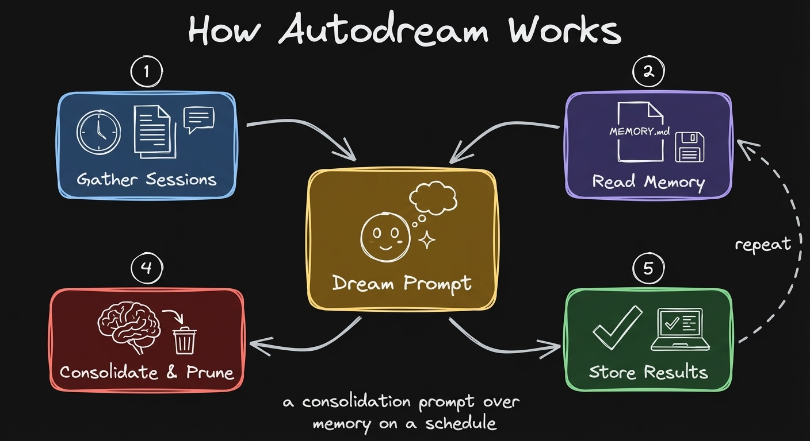
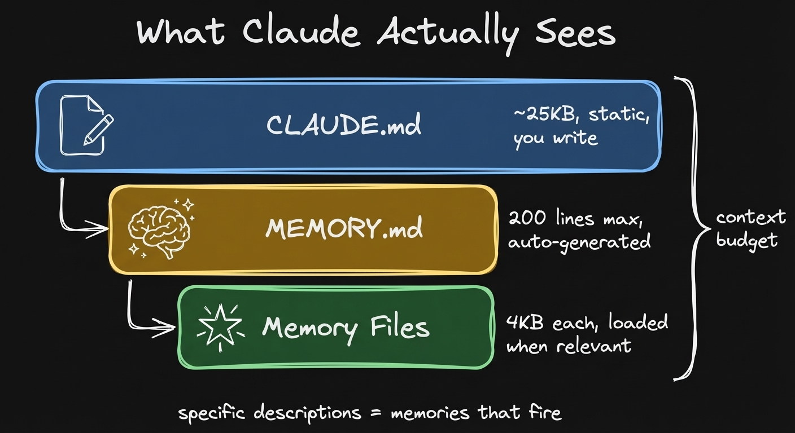
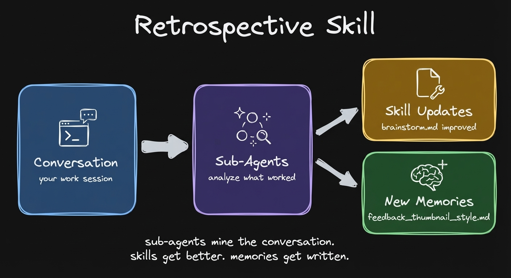
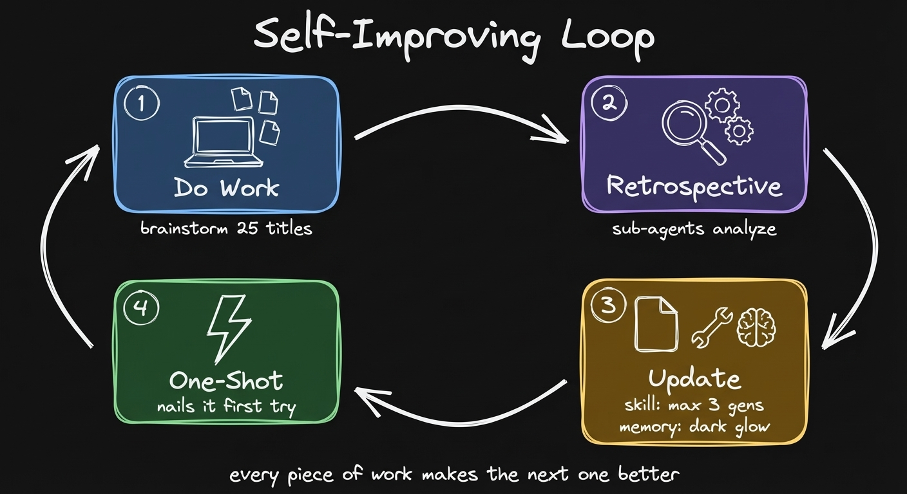
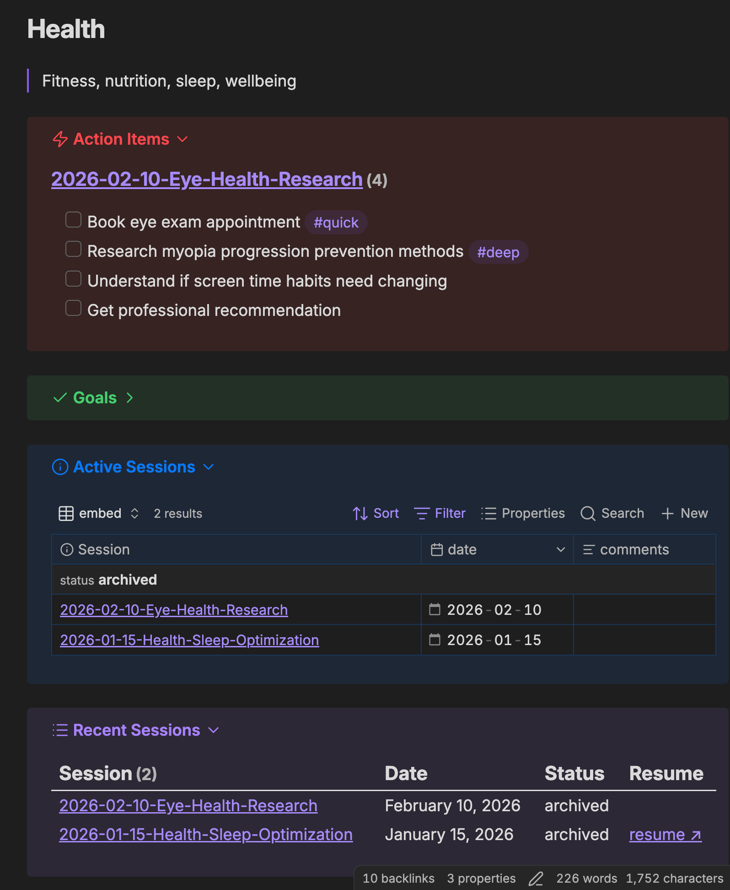
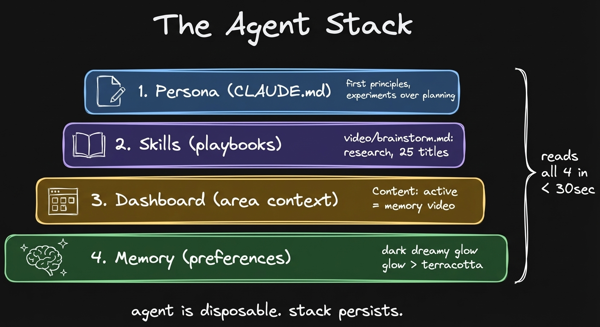
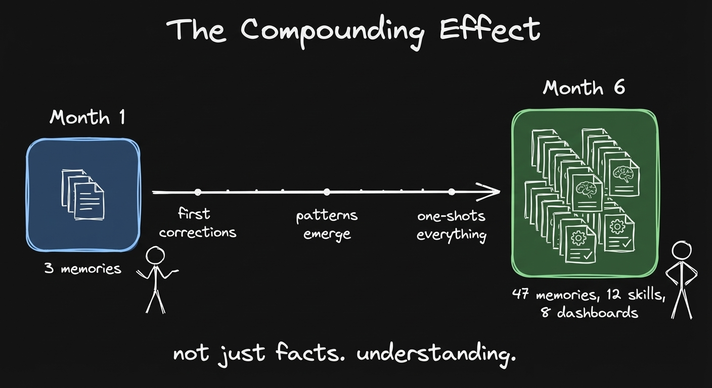

**CLAUDE.md is just the beginning. Auto-memory and auto-dream do the rest. Here's the prompt that runs every 24 hours.**

---

Every new chat, you start from zero. "I'm Artem, I work like this, here are my rules, here's my project context." Every. Single. Time.

You wrote a CLAUDE.md. You thought that was the answer. But it gets huge. Claude starts forgetting rules at the top. Your preferences evolve faster than you can update the file.

*Left: what most people do. Right: what's actually available.*

Claude Code now has three memory systems. Most people only know about the first one. The other two run in the background. You don't even notice they're there.

I reverse-engineered the dream prompt from Claude Code's source code. In this post I break down each layer, share the exact prompt, and give you a retrospective skill that turns every conversation into a learning loop.

Full video walkthrough (22 min): [It Dreams, It Remembers, It Works For You](https://youtu.be/Imdz6L6xdsA)

---

## The CLAUDE.md Problem

This is where most people start. Your CLAUDE.md. Who you are, how you work, your rules, your preferences. I'm doing the same thing. My CLAUDE.md has hard rules, file organization, how to use Obsidian CLI, writing voice, all of that.

And it's hard to manage. You add rules, you forget to remove old ones. Last time I touched CLAUDE.md was probably 2 weeks ago. Your work is evolving and CLAUDE.md can't keep up with all of that.

---

## Auto-Memory: Claude Writes Its Own Memories Now

The solution is auto-memory. Instead of maintaining this giant file called CLAUDE.md, Claude now has a single index file, MEMORY.md. Just the index of memories, different sections.

Each memory is its own file. Has a name, a description, and a type. Four types: user (who you are), feedback (corrections and confirmations), project (ongoing work), reference (pointers to external systems).

The key difference between auto-memory and CLAUDE.md: CLAUDE.md is managed by you. You write preferences there. Auto-memory is something Claude manages in the background.

Those preferences are automatically loaded in the next session. I can ask Claude about memories it has about me. It knows my patterns. Time autonomy, Pomodoro blocks, all of that.

Designed in a way that you don't even notice that it's happening and it's remembering those preferences.

And you have full control. These files are hidden by default in `~/.claude/`, but here's what I do: I symlink them into my Obsidian vault and view them in Obsidian Bases. Each individual memory file shows up as a row. You can open any one and see exactly what Claude remembers and why.

*You correct Claude once. It writes a memory file. Next session, that preference is automatically loaded.*

How to enable: Open Claude Code, run `/memory`, turn on auto-memory in settings. That's it.

---

## But Memories Go Stale Too

There is still a problem. The way you work changes. Your preferences are always evolving. What was true a month ago might not be true now.

Claude keeps collecting memories, but it doesn't know which ones are still relevant. The index file grows. That becomes again a problem.

Who cleans up?

---

## Auto-Dream: The Hidden Feature Nobody Documented

The solution to stale memories is auto-dream. A new Claude Code feature shipped last week. Still in research preview.

It's a hidden feature. There is no documentation about it.

What I did is I asked Claude Code to read its modified source code and reconstruct the prompt. It performs a dream, a reflective pass on the memory files, like a human would do.

Every 24 hours, this prompt runs in the background. It gathers your sessions, reads the current memory files and the index. The goal is to consolidate existing memories and prune the ones which are no longer relevant.

*Auto-dream runs every 24 hours. Reads your sessions, consolidates memories, prunes stale ones.*

### The Dream Prompt: 4 Phases

Here is the exact prompt I reconstructed from Claude Code's source code. [Full prompt with all constants](https://gist.github.com/ArtemXTech/01597b0183afb397d3a68683cb621c56).

Phase 1: Orient. Check what's allowed to exist. Read the index file. Understand where we are right now.

Phase 2: Gather signal. Daily logs, memories that already drifted. The most important part: transcript search. You have access to your conversations stored locally on your computer. Full trace of interaction. Based on that trace, gather what became stale, what needs updating, what are the new preferences.

Phase 3: Consolidate. We have new information. Merge it into existing memories, delete contradicting facts, convert relative dates to absolute.

Phase 4: Prune and index. Update the index file. Make sure it's under 200 lines.

How to enable: In `/memory` settings, turn on auto-dream. It runs in the background. You enable it and it just works.

---

## What Claude Actually Sees When You Start a Session

You can see the system prompt of Claude Code and how all of it works together. When you start a new Claude Code session, Claude gets: CLAUDE.md first. After that, memory. The index of all your memories, with a limit of 200 lines max.

It references those individual memory files. The memory files are not in the system prompt. This keeps your context window efficient.

*CLAUDE.md loads first, then MEMORY.md index, then individual memories are loaded on demand. You can see all of it.*

---

## Work Produces Memory: The Self-Improving Loop

The way to think about memory is that work produces memory. A conversation with Claude Code. You do some work, write a post, ship a video, finish a piece of work.

I have a skill called retrospective. It runs sub-agents to analyze my conversation with Claude, propose updates to the skills, propose new memories, and update the memory index.

Similar to auto-dream, but on a scale of one conversation, when I'm working. I get full observability and full control of what's going to be written to my memory.

The steps: first, extracting signals. Corrections I made. Things that were redone. Things that worked on first try. Then Claude proposes the findings as a table. I can review, approve, reject.

The more you use the system, the better it gets. Every piece of work, with every chat.

*Run retrospective after any piece of work. Sub-agents analyze the conversation, propose skill updates and new memories.*

You do your work. At the end of the session you run this retrospective skill. Next time when you have to record a video or do the same type of work, it's just going to be smooth. One shot.

*The full loop: work produces signal, retrospective captures it, skills and memories improve, next session is better.*

Try it yourself: It's just a prompt you copy-paste. No API keys, no setup.
https://memory-evolved-artemzhutov.netlify.app

---

## Dynamic Memory: Dashboards Per Area of Your Life

Memory alone doesn't capture the way humans operate in the real world. The real world is too complex. You have decisions to make, stuff to track. You need to keep track of progress across different areas of your life.

The way I imagine my life as different areas. I have content to post, videos to record, goals to achieve, taxes to file, plans to work on.

For each area, I create a dashboard. Here is my health dashboard. Goals, active sessions, action items, progress. All in one view.

I can read those dashboards using Obsidian CLI. I can tell Claude to read this dashboard by resolving all the queries. Now it's running all these queries and the results match exactly what we have in our dashboard.

Now we are on the same page with Claude about my health goals, my next action items. It is much more efficient than "Claude, let's just find all of my notes about something."

I do this for each part of my life. Not only health. Every project, every area.

*My health dashboard in Obsidian. Goals, active sessions, action items, progress. All in one view.*

---

## How It All Fits Together

So what does the full stack look like?

1. CLAUDE.md. Your persona, your rules, preferences. Stuff that doesn't change frequently.
2. Skills. Structured processes, playbooks. The essence of doing some action, captured as documentation. I have 150 skills accumulated over the last months of working with Claude Code.
3. Dashboards. Area context. What you're working on in each area of your life.
4. Auto-memory + auto-dream. Dynamic preferences that Claude manages and consolidates.

Any new agent reads all four layers and just works.

*CLAUDE.md + skills + dashboards + memory. Any new agent reads all four and just works.*

---

## It Gets Better the Longer You Use It

If you start using it now, you might have just a very lean CLAUDE.md. No memories, no skills. The more you use it, you work together with Claude. You do your first corrections to memory. You see how you prefer to work and you teach Claude your preferences. Then after some time, it just works.

*Month one: thin. A few memories. Month six: knows your patterns, decisions, what worked. Not just facts. Understanding.*

---

## Start Today

That data is your asset. That's your competitive advantage. You're just training your agents by doing your standard work. Every session makes it better and better.

Just start. The memory accumulates.

Two things you can use right now:

1. Retrospective skill. Run sub-agents on your own conversations to extract learnings. Copy-paste a prompt, that's it.
2. Memory observability setup. See exactly what Claude knows about you, right in Obsidian. Full control.

https://memory-evolved-artemzhutov.netlify.app

How to get started with the basics:

1. Open Claude Code. Write a CLAUDE.md with who you are and how you work.
2. Run `/memory`. Turn on auto-memory and auto-dream.
3. Just use it. Correct Claude when it gets something wrong. The memory builds itself.

Everything in this post, the memory structure, the skills, the dashboards, that's what people build in the [Claude Code x Obsidian Lab](https://lab.artemzhutov.com). In 5 weeks you walk out with a working system. 20 people across 9 countries built theirs last cohort. None of them were software developers. Cohort 3 starts April 28.

---

Artem
